# ADMM_LR

> 用ADMM[1]求解LogisticRegression的优化方法称作ADMM_LR。ADMM算法是一种求解约束问题的最优化方法，它适用广泛。相比于SGD，ADMM在精度要求不高的情况下，在少数迭代轮数时就达到一个合理的精度，但是收敛到很精确的解则需要很多次迭代。

## 1. 算法介绍

ADMM算法结合了**对偶分解法(Dual Decomposition)**和**增广拉格朗日乘子法(Augmented Lagrangians and the Method of Multipliers)**的优势，它可以在满足较弱收敛条件的情况下，分解目标函数，交替地更新变量，直至算法收敛。

ADMM算法的一般原理为：

对于以下约束优化问题，

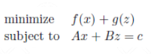

首先将其转化为不带约束的最优化问题，此处采用了增广拉格朗日乘子法的形式，包括了L2正则项，表达式如下：

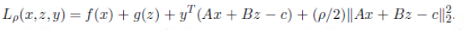

上述公式进一步改进，则目标函数为:

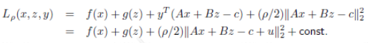

其中，u的表达式为：

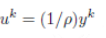

则ADMM的更新迭代步骤为:

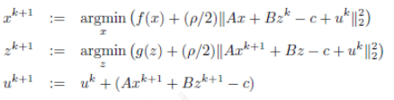

在每一步的优化过程中，可以与牛顿法等高精度算法相结合进行求解。
以上是ADMM过程的介绍，这里再针对Sparse Logistic Regression分类的优化问题，给出其目标函数的表达式：

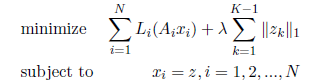

按照ADMM的一般过程迭代，直至w与z的差别小于预先确定的界限为止。

## 2. 分布式实现 on Angel

在Angel的实现上，采用ADMM—Split Across Examples的框架，将m个样本分为N个数据块，把L(w)写成N个数据块上的损失函数加和的形式，具体如下

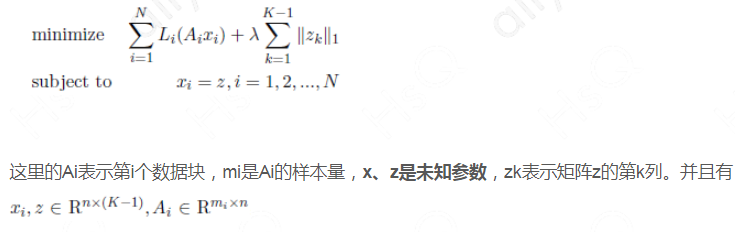

上述约束函数意味着在每个数据块上计算的权值参数都应该与z相等，因此，z属于全局模型。

ADMM在Angel上实现的一般步骤为：

1. 每个Worker从PS上将模型z pull回本地
2. 计算u，再用LBFGS本地更新x（LBFGS过程通过调用breeze.optimize.LBFGS实现）
3. 计算`中间变量的w`和`衡量模型收敛情况的t`，然后push到PS
4. 在PS端计算z，在L1正则项情况下有显式表达式，无需迭代计算

下面是在Angel上实现的原理图：

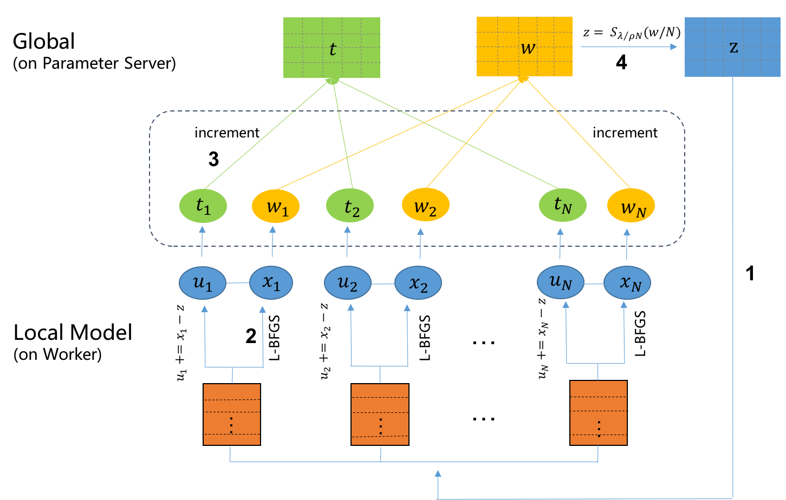


* **Local模型**

	* u模型
	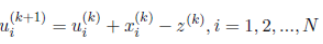	
	* x模型
	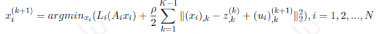

* **Global模型**：

	* z模型

	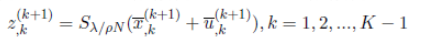

	* S函数
	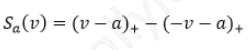

## 3. 运行 & 性能

###  **输入格式**
  * ml.feature.index.range：特征向量的维度
  * ml.model.size: 模型大小, 对于一些稀疏模型, 存在一些无效维度, 即所有样本要这一维度上的取值匀为0. ml.model.size = ml.feature.index.range - number of invalidate indices
  * ml.data.type：支持"dummy"、"libsvm"两种数据格式，具体参考[Angel数据格式](data_format.md)

### **参数说明**


* **算法参数**  
  * ml.epoch.num：迭代次数
  * ml.lr.reg.l1: L1惩罚系数
  * rho: rho
  * ml.worker.thread.num: 子模型训练并行度

* **输入输出参数**
  * angel.train.data.path：输入数据路径   
  * angel.save.model.path：训练完成后，模型的保存路径   
  * angel.log.path：log文件保存路径   

       
* **资源参数**
  * angel.workergroup.number：Worker个数   
  * angel.worker.memory.mb：Worker申请内存大小    
  * angel.worker.task.number：每个Worker上的task的个数，默认为1    
  * angel.ps.number：PS个数    
  * angel.ps.memory.mb：PS申请内存大小

###  **提交命令**

可以通过下面命令向Yarn集群提交LR算法训练任务:

```shell
./bin/angel-submit \
    --action.type train \
    --angel.app.submit.class com.tencent.angel.ml.classification.sparselr.SparseLRRunner  \
    --angel.train.data.path $input_path \
    --angel.save.model.path $model_path \
    --angel.log.path $logpath \
    --ml.epoch.num 10 \
    --ml.feature.index.range 10000 \
    --ml.data.validate.ratio 0.1 \
    --ml.data.type dummy \
    --ml.learn.rate 1 \
    --ml.learn.decay 0.1 \
    --ml.lr.reg.l1 0 \
    --angel.workergroup.number 3 \
    --angel.worker.task.number 3 \
    --angel.ps.number 1 \
    --angel.ps.memory.mb 5000 \
    --angel.job.name=angel_lr_smalldata
```

### 性能


* 训练数据

	| 数据集 | 数据集大小 | 数据数量 | 特征数量 | 任务 |
	|:------:|:----------:|:--------:|:--------:|:-------:|
	| XXX  |    350GB    |   1亿  |   5千万   | 二分类 |


* **参数配置**

    * Spark:  200 executor, 20G 内存， Driver 20G内存
    * Angel：100 worker, 10G 内存； 50 PS, 5G 内存
    
* **实验结果**

    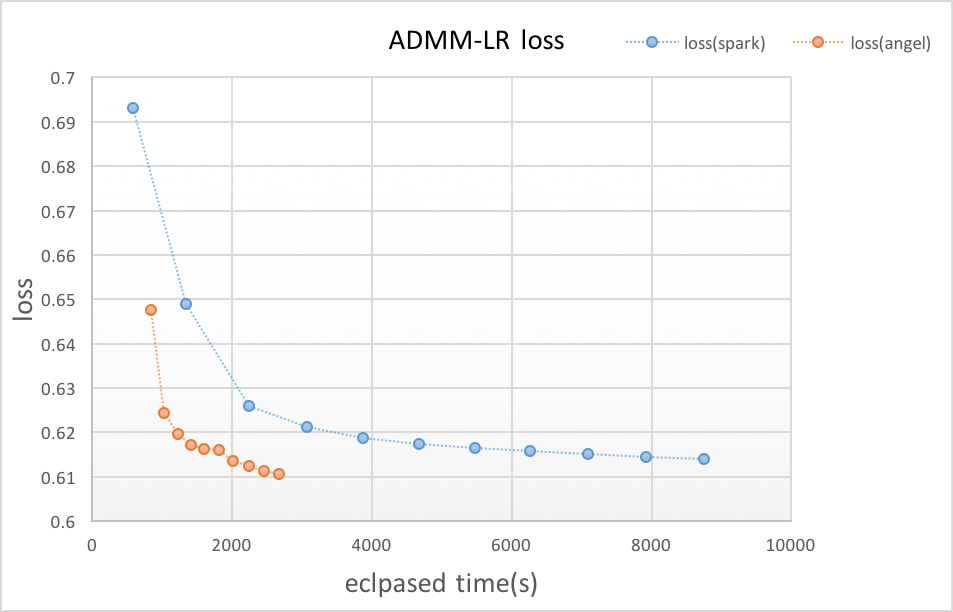


## Reference
1. Boyd S, Parikh N, Chu E, et al. [Distributed optimization and statistical learning via the alternating direction method of multipliers](https://pdfs.semanticscholar.org/905b/cb57493c8b97b216bc6786aa122e1ad608b0.pdf). Foundations and Trends® in Machine Learning, 2011, 3(1): 1-122.