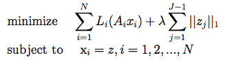
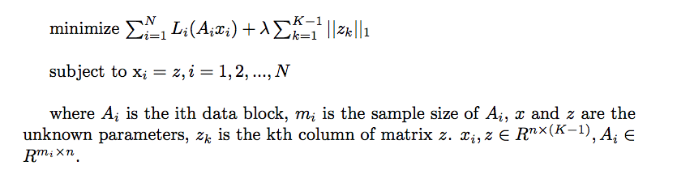
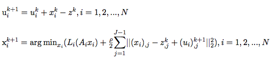
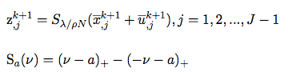

# ADMM_LR

> The optimization method for solving Logistic Regression using Alternating Direction Method of Multipliers (ADMM) [1] is referred to as ADMM_LR. ADMM is a method for solving a broad class of constraint optimization problems. Compared to SGD, ADMM converges to modest accuracy within a few tens of iterations; however, it takes ADMM much more iterations to converge to high accuracy.
 

## 1. Introduction to ADMM

ADMM can be viewed as an attempt to blend the benefits of the Dual Decomposition and the Augmented Lagrangian and the Method of Multipliers for constrained optimization. Under weak convergence condition, ADMM can decompose the objective function, separate the optimization so that variables are updated in an alternating way, until convergence is reached.

Consider the following optimization problem:


We first form the augmented Lagrangian in order to transform the optimization problem to be unconstrained, including the L2 regularization term, as following:


Further derivation of the above expression yields:


where


Thus, ADMM consists of the following iterations:


ADMM can blend in methods with high precision (e.g. Newton's method) in each iteration for better results. 

The specific objective function of the Sparse Logistic Regression is:



Following the iteration steps of ADMM until updates of w and z become smaller than their pre-determined thresholds. 

## 2. Distributed Implementation of ADMM on Angel

For implementation of ADMM on Angel, we use the framework known as ADMM—Split Across Examples, where m samples are divided into N data blocks, and L(w) is re-written as the sum of loss functions of the N data blocks:




The above constrained objective implies that x_i from each data block needs to equal z, thus z belongs to the global model.

The implementation steps of ADMM on Angel are:

1. Each worker pulls model z from PS to local
2. Calculate u, then use LBFGS to update x locally (LBFGS is implemented by calling breeze.optimize.LBFGS)
3. Calculate the `intermediate variable w` and `t for evaluating convergence`, then push to PS
4. Calculate z on PS; explicit expression is available under L1 regularization

We show the implementation chart below:


* **Local Models**
	
	

* **Global Models**

	


## 3. Execution & Performance

###  **Input Format**
  * ml.feature.index.range: the index range of features, for dense feature, it's the feature dimension, while for sparse feature, it's the max index among all samples
  * ml.data.type: supports "dummy", "libsvm" types; for details, see [Angel Data Format](data_format_en.md)

### **Parameters**

* **Algorithm Parameters**
	* ml.epoch.num: number of iterations
    * ml.num.update.per.epoch: the number of update during an epoch
    * ml.model.size: the size of model. for some sparse model, there are features that all samples are zero at those indices (invalidate indices). ml.model.size = ml.feature.index.range - number of invalidate indices
	* ml.lr.reg.l1: L1 coefficient
	* rho: rho
	* ml.worker.thread.num: number of parallel threads on each worker

* **I/O Parameters**
	  * angel.train.data.path: input path 
	  * angel.save.model.path: save path for trained model
	  * angel.log.path: save path for the log

       
* **Resource Parameters**
	* angel.workergroup.number: number of workers
	* angel.worker.memory.mb: worker's memory requested in M
	* angel.worker.task.number: number of tasks on each worker, default is 1
	* angel.ps.number: number of PS
	* angel.ps.memory.mb: PS's memory requested in M

###  **Command for Submission**

Use the following example for submitting LR trainning job to Yarn 

```shell
./bin/angel-submit \
    --action.type train \
    --angel.app.submit.class com.tencent.angel.ml.classification.sparselr.SparseLRRunner  \
    --angel.train.data.path $input_path \
    --angel.save.model.path $model_path \
    --angel.log.path $logpath \
    --ml.epoch.num 10 \
    --ml.num.update.per.epoch 10 \
    --ml.num.update.per.epoch 10000 \
    --ml.data.validate.ratio 0.1 \
    --ml.data.type dummy \
    --ml.learn.rate 1 \
    --ml.learn.decay 0.1 \
    --ml.reg.l2 0 \
    --angel.workergroup.number 3 \
    --angel.worker.task.number 3 \
    --angel.ps.number 1 \
    --angel.ps.memory.mb 5000 \
    --angel.job.name=angel_lr_smalldata
```

### Performance


* Training Data

	| Data Set | Data Size | Sample Size | Number of Features | Task |
	|:------:|:----------:|:--------:|:--------:|:-------:|
	| XXX  |    350GB    |   100M  |   50M   | Binary Classification |


* **Environment Config**

    * Spark: 200 executors, 20G memory, 20G driver memory
    * Angel: 100 workers, 10G memory; 50 PS, 5G memory
    
* **Result**

    


## Reference
1. Boyd S, Parikh N, Chu E, et al. [Distributed optimization and statistical learning via the alternating direction method of multipliers](https://pdfs.semanticscholar.org/905b/cb57493c8b97b216bc6786aa122e1ad608b0.pdf). Foundations and Trends® in Machine Learning, 2011, 3(1): 1-122.

