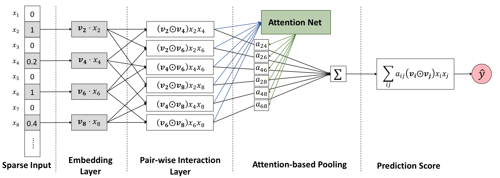
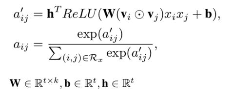

# AFM

## 1. Introduction
AFM(Attention Neural Factorization Machines) is a improved FM method, which  which learns the importance of each feature interaction from data via a neural attention network.



### 1.1 BiInteractionCrossTiled layer
BiInteractionCrossTiled is a layer that calculates each second-order feature interaction and concatenates them as a vector.

### 1.2 ParamSharedFC layer

ParamSharedFC layer is a fully connected layer with shared parameters, as explained in the following formulas, where w is the shared parameters for every feature interaction. h is another shared parameter vector for the next layer. The attention weights are calculated by applying a softmax operation on the layer's output. 



## 2. Execution & Performance
### 2.1 Network Construction by Json

```json
  {
    "data": {
      "format": "dummy",
      "indexrange": 148,
      "numfield": 13,
      "validateratio": 0.1
    },
    "model": {
      "modeltype": "T_FLOAT_SPARSE",
      "modelsize": 148
    },
    "train": {
      "epoch": 5,
      "numupdateperepoch": 10,
      "lr": 1.0,
      "decay": 0.01
    },
    "default_optimizer": "Momentum",
    "layers": [
      {
        "name": "wide",
        "type": "simpleinputlayer",
        "outputdim": 1,
        "transfunc": "identity"
      },
      {
        "name": "embedding",
        "type": "embedding",
        "numfactors": 8,
        "outputdim": 104,
        "optimizer": {
          "type": "momentum",
          "momentum": 0.9,
          "reg2": 0.01
        }
      },
      {
        "name": "biinteractioncrosstiled",
        "type": "BiInteractionCrossTiled",
        "outputdim": 624,
        "inputlayer": "embedding"
      },
      {
        "name": "paramsharedfc",
        "type": "ParamSharedFC",
        "outputdims": [
          780,
          78
        ],
        "transfuncs": [
          "relu",
          "softmax"
        ],
        "weightdims": [
          10,
          1
        ],
        "inputlayer": "biinteractioncrosstiled"
      },
      {
        "name": "weightedsum",
        "type": "WeightedSumLayer",
        "outputdim": 8,
        "inputlayers": [
          "paramsharedfc",
          "biinteractioncrosstiled"
        ]
      },
      {
        "name": "fclayer_1",
        "type": "FCLayer",
        "outputdims": [1],
        "transfuncs": ["identity"],
        "inputlayer": "weightedsum"
      },
      {
        "name": "sumPooling",
        "type": "SumPooling",
        "outputdim": 1,
        "inputlayers": [
          "wide",
          "fclayer_1"
        ]
      },
      {
        "name": "simplelosslayer",
        "type": "losslayer",
        "lossfunc": "logloss",
        "inputlayer": "sumPooling"
      }
    ]
  }
```

### Submit Command
```shell

#fill out the following paths

export HADOOP_HOME=your_hadoop_home
input_path=your_hdfs_path/data
model_path=your_hdfs_path/model
log_path=your_hdfs_path/log
ANGEL_HOME=your_path_to_angel
jsonconf=your_path_to_jsons/afm.json

$ANGEL_HOME/bin/angel-submit \
     -Dangel.am.log.level=INFO \
     -Dangel.ps.log.level=INFO \
     -Dangel.worker.log.level=INFO \
     -Dangel.app.submit.class=com.tencent.angel.ml.core.graphsubmit.GraphRunner \
     -Dml.model.class.name=com.tencent.angel.ml.core.graphsubmit.AngelModel \
     -Dml.data.label.trans.class="PosNegTrans" \
     -Dml.data.label.trans.threshold=0.5 \
     -Dangel.train.data.path=$input_path \
     -Dangel.save.model.path=$model_path \
     -Dangel.log.path=$log_path \
     -Daction.type=train \
     -Dangel.workergroup.number=30 \
     -Dangel.worker.memory.gb=30 \
     -Dangel.worker.task.number=1 \
     -Dangel.ps.number=5 \
     -Dangel.ps.memory.gb=10 \
     -Dangel.job.name=$jobname \
     -Dangel.output.path.deleteonexist=true \
     -Dangel.worker.env="LD_PRELOAD=./libopenblas.so" \
     -Dangel.psagent.cache.sync.timeinterval.ms=100 \
     -Dangel.task.data.storage.level=memory \
     -Dangel.ml.conf=$ANGEL_HOME/$jsonconf \
     -Dml.optimizer.json.provider=com.tencent.angel.ml.core.PSOptimizerProvider
```

### Performance
* data：criteo.kaggle2014.train.svm.field
* resource：
	* Angel：executor：30，30G memory，1task； ps：5，10G memory
* Time of 1 epochs:
	* Angel：200min

