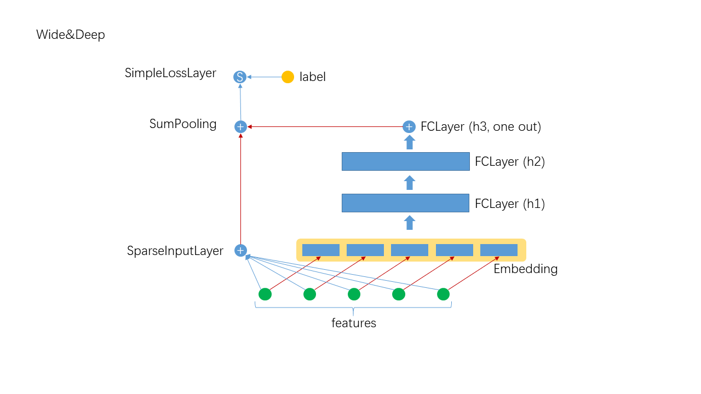

# Deep And Wide

## 1. Algorithm Introduction
The Deep and Wide algorithm directly extracts the results of Embedding into the DNN to further extract high-order feature intersections, and finally it combines the first-order features with the higher-order features for prediction. The framework is as follows:


### 1.1 The layers in Deep and Wide
- SimpleInputLayer: sparse data input layer, which optimizes sparse high-dimensional data, is essentially a FCLayer.
- Embedding: implicit embedding layer, if the feature is not one-hot, multiplied by the eigenvalue.
- FCLayer: the most common layer in DNN, linear transformation followed by transfer function.
- SumPooling: adding multiple input data to element-wise, requiring the input have the same shape.
- SimpleLossLayer: loss layer, different loss functions can be specified

### 1.3 Network Construction

```scala
  override def buildNetwork(): Unit = {
    val wide = new SimpleInputLayer("input", 1, new Identity(),
      JsonUtils.getOptimizerByLayerType(jsonAst, "SparseInputLayer"))

    val embeddingParams = JsonUtils.getLayerParamsByLayerType(jsonAst, "Embedding")
      .asInstanceOf[EmbeddingParams]
    val embedding = new Embedding("embedding", embeddingParams.outputDim, embeddingParams.numFactors,
      embeddingParams.optimizer.build()
    )

    val hiddenLayer = JsonUtils.getFCLayer(jsonAst, embedding)

    val join = new SumPooling("sumPooling", 1, Array[Layer](wide, hiddenLayer))

    new SimpleLossLayer("simpleLossLayer", join, lossFunc)
  }
```

## 2. Operation
### 2.1 The description of Json configuration file

When Deep and wide have more parameters, they need to be specified in the form of a Json configuration file(see [Json description](../basic/json_conf_en.md) for a complete description of the Json configuration file), A typical example is as follows:(see [data](https://github.com/Angel-ML/angel/tree/master/data/census))

```json
{
  "data": {
    "format": "dummy",
    "indexrange": 148,
    "numfield": 13,
    "validateratio": 0.1
  },
  "model": {
    "modeltype": "T_DOUBLE_SPARSE_LONGKEY",
    "modelsize": 148
  },
  "train": {
    "epoch": 10,
    "numupdateperepoch": 10,
    "lr": 0.1,
    "decay": 0.8
  },
  "default_optimizer": {
    "type": "momentum",
    "momentum": 0.9,
    "reg2": 0.01
  },
  "layers": [
    {
      "name": "wide",
      "type": "simpleinputlayer",
      "outputdim": 1,
      "transfunc": "identity"
    },
    {
      "name": "embedding",
      "type": "embedding",
      "numfactors": 8,
      "outputdim": 104
    },
    {
      "name": "fclayer",
      "type": "FCLayer",
      "inputlayer": "embedding",
      "outputdims": [
        100,
        100,
        1
      ],
      "transfuncs": [
        "relu",
        "relu",
        "identity"
      ]
    },
    {
      "name": "sumPooling",
      "type": "SumPooling",
      "outputdim": 1,
      "inputlayers": [
        "wide",
        "fclayer"
      ]
    },
    {
      "name": "simplelosslayer",
      "type": "simplelosslayer",
      "lossfunc": "logloss",
      "inputlayer": "sumPooling"
    }
  ]
}
```

### 2.2 The description of submitting script

```shell
runner="com.tencent.angel.ml.core.graphsubmit.GraphRunner"
modelClass="com.tencent.angel.ml.core.graphsubmit.AngelModel"

$ANGEL_HOME/bin/angel-submit \
    --angel.job.name DeepFM \
    --action.type train \
    --angel.app.submit.class $runner \
    --ml.model.class.name $modelClass \
    --angel.train.data.path $input_path \
    --angel.save.model.path $model_path \
    --angel.log.path $log_path \
    --angel.workergroup.number $workerNumber \
    --angel.worker.memory.gb $workerMemory  \
    --angel.worker.task.number $taskNumber \
    --angel.ps.number $PSNumber \
    --angel.ps.memory.gb $PSMemory \
    --angel.output.path.deleteonexist true \
    --angel.task.data.storage.level $storageLevel \
    --angel.task.memorystorage.max.gb $taskMemory \
    --angel.worker.env "LD_PRELOAD=./libopenblas.so" \
    --angel.ml.conf $daw_json_path \
    --ml.optimizer.json.provider com.tencent.angel.ml.core.PSOptimizerProvider
```

For the deep learning model, its data, training and network configuration should be specified in Json file first.
Resources such as: worker,ps depend on detail dataset.