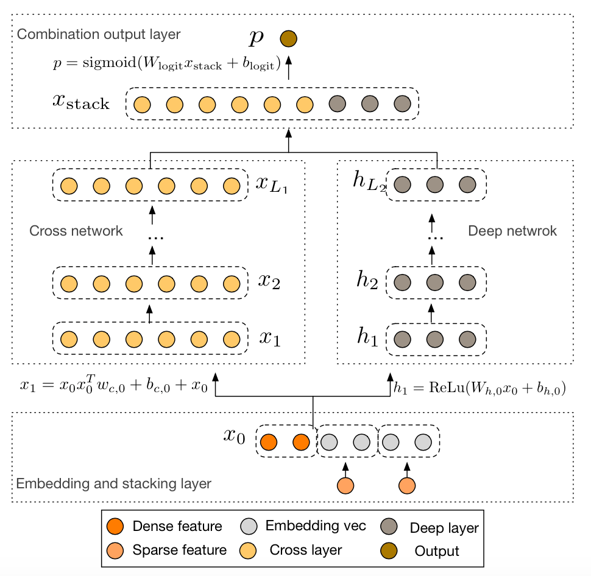
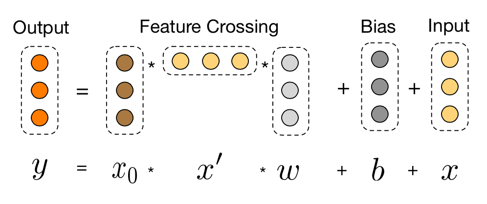

# DCN

## 1. Introduction
DCN(Deep & Cross Network) explicitly applies feature crossing at each layer, requires no manual feature engineering, and adds negligible extra complexity to the DNN model.



### 1.1 Cross Layer

DCN is combined of two parts: cross network and deep network. The deep network is a simple dnn, stacked by several fully connected layers. The Cross network, in other hands, is stacked by  several cross layers. Each cross layer has two inputs: the original embedding layer and the output of the last cross layer. The calculating method is as follows.



### 1.3 Combination

Outputs of deep network and cross network are simply concatenated.

## 2. Execution & Performance
### 2.1 Network Construction by Json

```json
  {
    "data": {
      "format": "dummy",
      "indexrange": 148,
      "numfield": 13,
      "validateratio": 0.1
    },
    "model": {
      "modeltype": "T_FLOAT_SPARSE",
      "modelsize": 148
    },
    "train": {
      "epoch": 15,
      "numupdateperepoch": 10,
      "lr": 0.01,
      "decayclass": "WarmRestarts",
      "decayalpha": 0.05
    },
    "default_optimizer": "adam",
    "layers": [
      {
        "name": "embedding",
        "type": "embedding",
        "numfactors": 8,
        "outputdim": 104,
        "optimizer": {
          "type": "momentum",
          "momentum": 0.9,
          "reg2": 0.01
        }
      },
      {
        "name": "deep",
        "type": "FCLayer",
        "outputdims": [
          400,
          104
  
        ],
        "transfuncs": [
          "relu",
          "identity"
        ],
        "inputlayer": "embedding"
      },
      {
        "name": "cross1",
        "type": "CrossLayer",
        "outputdim": 104,
        "inputlayers": [
          "embedding",
          "embedding"
        ]
      },
      {
        "name": "cross2",
        "type": "CrossLayer",
        "outputdim": 104,
        "inputlayers": [
          "embedding",
          "cross1"
        ]
      },
      {
        "name": "concat",
        "type": "ConcatLayer",
        "outputdim": 208,
        "inputlayers": [
          "deep",
          "cross2"
        ]
      },
      {
        "name": "lr",
        "type": "FCLayer",
        "outputdims": [
          1
        ],
        "transfuncs": [
          "identity"
        ],
        "inputlayer": "concat"
      },
      {
        "name": "simplelosslayer",
        "type": "losslayer",
        "lossfunc": "logloss",
        "inputlayer": "lr"
      }
    ]
  }
```

### Submit Command
```shell

#fill out the following paths

export HADOOP_HOME=your_hadoop_home
input_path=your_hdfs_path/data
model_path=your_hdfs_path/model
log_path=your_hdfs_path/log
ANGEL_HOME=your_path_to_angel
jsonconf=your_path_to_jsons/dcn.json

$ANGEL_HOME/bin/angel-submit \
     -Dangel.am.log.level=INFO \
     -Dangel.ps.log.level=INFO \
     -Dangel.worker.log.level=INFO \
     -Dangel.app.submit.class=com.tencent.angel.ml.core.graphsubmit.GraphRunner \
     -Dml.model.class.name=com.tencent.angel.ml.core.graphsubmit.AngelModel \
     -Dml.data.label.trans.class="PosNegTrans" \
     -Dml.data.label.trans.threshold=0.5 \
     -Dangel.train.data.path=$input_path \
     -Dangel.save.model.path=$model_path \
     -Dangel.log.path=$log_path \
     -Daction.type=train \
     -Dangel.workergroup.number=30 \
     -Dangel.worker.memory.gb=30 \
     -Dangel.worker.task.number=1 \
     -Dangel.ps.number=5 \
     -Dangel.ps.memory.gb=10 \
     -Dangel.job.name=$jobname \
     -Dangel.output.path.deleteonexist=true \
     -Dangel.worker.env="LD_PRELOAD=./libopenblas.so" \
     -Dangel.psagent.cache.sync.timeinterval.ms=100 \
     -Dangel.task.data.storage.level=memory \
     -Dangel.ml.conf=$ANGEL_HOME/$jsonconf \
     -Dml.optimizer.json.provider=com.tencent.angel.ml.core.PSOptimizerProvider
```

### Performance
* data：criteo.kaggle2014.train.svm.field
* resource：
	* Angel：executor：30，30G memory，1task； ps：5，10G memory
* Time of 1 epochs:
	* Angel：28min

