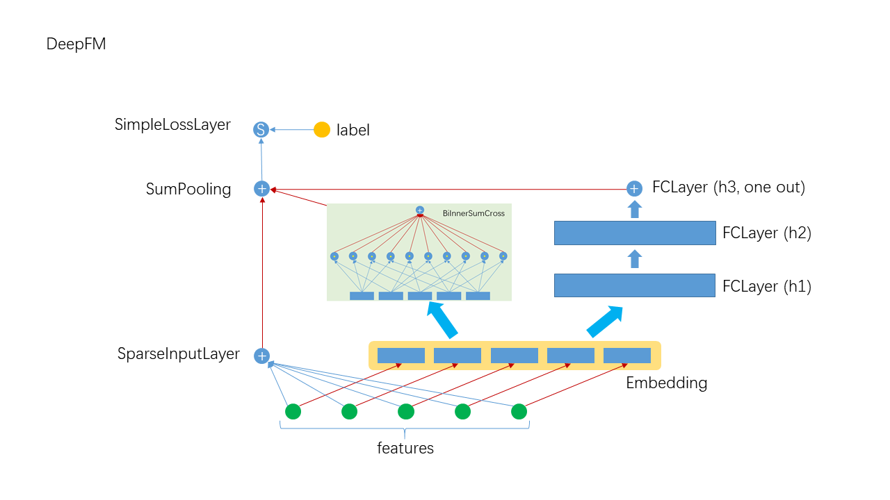

# DeepFM

## 1. 算法介绍
DeepFM算法是在FM(Factorization machine)的基础上加入深度层构成. 与PNN, NFM算法相比, 它保留了FM的二阶隐式特征交叉的同时又用深度网络来获取高阶特征交叉. 其构架如下:



### 1.1 Embedding与BiInnerSumCross层的说明
与传统的FM实现不同, 这里采用Embedding与BiInnerSumCross结合的方式实现二阶隐式交叉, 传统的FM二次交叉项的表达式如下:

^T(x_j\bold{v}_j)-\sum_i(x_i\bold{v}_i)^T(x_i\bold{v}_i)\))

在实现中, 用Embedding的方式存储, 调用Embedding的`calOutput`后, 将计算后一起输出, 所以一个样本的Embedding output结果为:

=(\bold{u}_1,\bold{u}_2,\bold{u}_3,\cdots,\bold{u}_k))

原始的二次交叉项的结为可重新表达为:

^T(\sum_j\bold{u}_j)-\sum_i\bold{u}_i^T\bold{u}_i\))

以上即是BiInnerSumCross的前向计算公式, 用Scala代码实现为:
```scala
val sumVector = VFactory.denseDoubleVector(mat.getSubDim)

(0 until batchSize).foreach { row =>
    val partitions = mat.getRow(row).getPartitions
    partitions.foreach { vectorOuter =>
    data(row) -= vectorOuter.dot(vectorOuter)
    sumVector.iadd(vectorOuter)
    }
    data(row) += sumVector.dot(sumVector)
    data(row) /= 2
    sumVector.clear()
}
```

### 1.2 其它层说明
- SparseInputLayer: 稀疏数据输入层, 对稀疏高维数据做了特别优化, 本质上是一个FCLayer
- FCLayer: DNN中最常见的层, 线性变换后接传递函数
- SumPooling: 将多个输入的数据做element-wise的加和, 要求输入具本相同的shape
- SimpleLossLayer: 损失层, 可以指定不同的损失函数

### 1.3 网络构建
```scala
  override def buildNetwork(): Unit = {
    ensureJsonAst()

    val wide = new SparseInputLayer("input", 1, new Identity(),
      JsonUtils.getOptimizerByLayerType(jsonAst, "SparseInputLayer")
    )

    val embeddingParams = JsonUtils.getLayerParamsByLayerType(jsonAst, "Embedding")
      .asInstanceOf[EmbeddingParams]
    val embedding = new Embedding("embedding", embeddingParams.outputDim,
      embeddingParams.numFactors, embeddingParams.optimizer.build()
    )

    val innerSumCross = new BiInnerSumCross("innerSumPooling", embedding)

    val mlpLayer = JsonUtils.getFCLayer(jsonAst, embedding)

    val join = new SumPooling("sumPooling", 1, Array[Layer](wide, innerSumCross, mlpLayer))

    new SimpleLossLayer("simpleLossLayer", join, lossFunc)
  }
```

## 2. 运行与性能
### 2.1 Json配置文件说明
DeepFM的参数较多, 需要用Json配置文件的方式指定(关于Json配置文件的完整说明请参考[Json说明]()), 一个典型的例子如下:
```json
{
  "data": {
    "format": "dummy",
    "indexrange": 148,
    "numfield": 13,
    "validateratio": 0.1,
    "sampleratio": 0.2
  },
  "model": {
    "modeltype": "T_DOUBLE_SPARSE_LONGKEY",
    "modelsize": 148
  },
  "train": {
    "epoch": 10,
    "numupdateperepoch": 10,
    "lr": 0.5,
    "decay": 0.01
  },
  "default_optimizer": "Momentum",
  "layers": [
    {
      "name": "wide",
      "type": "sparseinputlayer",
      "outputdim": 1,
      "transfunc": "identity"
    },
    {
      "name": "embedding",
      "type": "embedding",
      "numfactors": 8,
      "outputdim": 104,
      "optimizer": {
        "type": "momentum",
        "momentum": 0.9,
        "reg2": 0.01
      }
    },
    {
      "name": "fclayer",
      "type": "FCLayer",
      "outputdims": [
        100,
        100,
        1
      ],
      "transfuncs": [
        "relu",
        "relu",
        "identity"
      ],
      "inputlayer": "embedding"
    },
    {
      "name": "biinnersumcross",
      "type": "BiInnerSumCross",
      "inputlayer": "embedding",
      "outputdim": 1
    },
    {
      "name": "sumPooling",
      "type": "SumPooling",
      "outputdim": 1,
      "inputlayers": [
        "wide",
        "biinnersumcross",
        "fclayer"
      ]
    },
    {
      "name": "simplelosslayer",
      "type": "simplelosslayer",
      "lossfunc": "logloss",
      "inputlayer": "sumPooling"
    }
  ]
}
```

### 2.2 提交脚本说明
```shell
runner="com.tencent.angel.ml.core.graphsubmit.GraphRunner"
modelClass="com.tencent.angel.ml.classification.DeepFM"

$ANGEL_HOME/bin/angel-submit \
    --angel.job.name DeepFM \
    --action.type train \
    --angel.app.submit.class $runner \
    --ml.model.class.name $modelClass \
    --angel.train.data.path $input_path \
    --angel.workergroup.number $workerNumber \
    --angel.worker.memory.gb $workerMemory  \
    --angel.ps.number $PSNumber \
    --angel.ps.memory.gb $PSMemory \  
    --angel.task.data.storage.level $storageLevel \
    --angel.task.memorystorage.max.gb $taskMemory
```

对深度学习模型, 其数据, 训练和网络的配置请优先使用Json文件指定.


