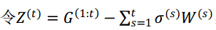
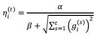
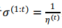

# FTRL LR SPARK

>FTRL是一种在线学习的优化算法，FTRL LR SPARK算法就是在求解LR的过程中通过FTRL进行优化同时在spark on angel上实现。鉴于实际应用中数据集的维度往往很大且为了符合模型稀疏性的特点，本算法采用稀疏方式实现，即数据的格式为标准的libsvm格式，且模型以"index:value"的方式表达。为了满足在线学习的要求，本算法以kafka为消息发送机制，使用时需要填写kafka的配置信息。


## 1. 算法介绍

 FTRL算法那综合考虑了FOBOS和 RDA两种算法的优势，既能同FOBOS保证比较高的精度，又能在损失一定精度的情况下产生更好的稀疏性。其特征权重的更新公式为：


其中，



,G函数表示损失函数的梯度

针对特征权重的各个维度将其拆解成N个独立的标量最小化问题,则下面就是w的更新公式：


如果对每一维度的学习率单独考虑，则在FTRL中，维度i的学习率是这样的：



由于,则在w的更新公式中


下面是google给出的带有L1和L2正则项的基于FTRL优化的逻辑回归算法的工程实现：


下图为本算法在spark on angel上的训练框架图：


## 2. 运行 & 性能

###  **输入格式**
  * dim：输入数据的维度 
  * 说明：消息格式仅支持标准的"libsvm"数据格式

### **参数说明**

* **算法参数**  
  * alpha：w更新公式中的alpha 
  * beta: w更新公式中的beta
  * lambda1: w更新公式中的lambda1
  * lambda2: w更新公式中的lambda2

* **输入输出参数**
  * checkPointPath：streaming流数据的checkpoint路径   
  * modelPath：每批数据训练完后模型的保存路径 
  * zkQuorum:Zookeeper的配置信息，格式：hostname:port
  * topic:kafka的topic信息
  * group:kafka的group信息
  * streamingWindow：控制spark streaming流中每批数据的持续时间

* **资源参数**
  * num-executors：executor个数   
  * executor-cores：executor的核数    
  * executor-memory：executor的内存    
  * driver-memory：driver端内存    
  * spark.ps.instances:Angel PS节点数
  * spark.ps.cores:每个PS节点的Core数
  * spark.ps.memory：每个PS节点的Memory大小

###  **提交命令**

可以通过下面命令向Yarn集群提交LR算法训练任务:

```shell
./bin/spark-submit \
--master yarn-cluster \
--conf spark.yarn.allocation.am.maxMemory=55g \
--conf spark.yarn.allocation.executor.maxMemory=55g \
--conf spark.ps.jars=$SONA_ANGEL_JARS \
--conf spark.ps.instances=2 \
--conf spark.ps.cores=2 \
--conf spark.ps.memory=10g \
--jars $SONA_SPARK_JARS \
--name "spark-on-angel-sparse-ftrl" \
--driver-memory 1g \
--num-executors 5 \
--executor-cores 2 \
--executor-memory 2g \
--class com.tencent.angel.spark.ml.classification.SparseLRWithFTRL \
spark-on-angel-mllib-2.1.0.jar \
partitionNum:3 \
actionType:train \
sampleRate:1.0 \
modelPath:$modelPath \
checkPointPath:$checkpoint \
group:$group \
zkquorum:$zkquorum \
topic:$topic
```

