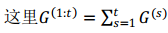
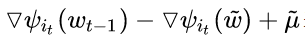
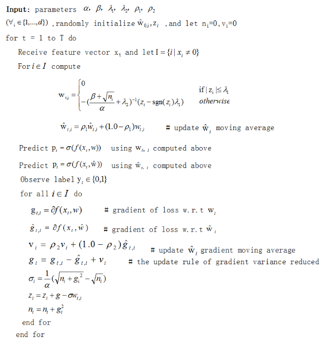
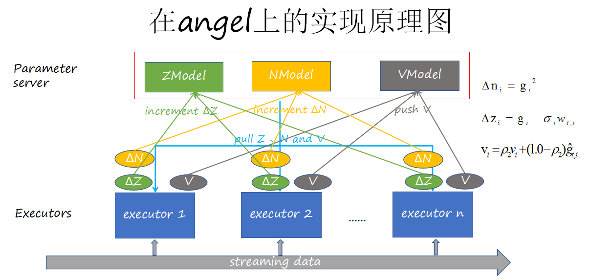

# [Spark Streaming on Angel] FTRL

>随着近几年online learning的火热发展，FTRL这种优化算法不光更能适应海量数据的要求，同时还能比较轻松的学习到一个有效且稀疏的模型，自问世以来在学术界和工业界都倍受关注和好评。基于此，我们在Spark on Angel平台实现了在线与离线方式的以FTRL进行优化的分布式LR算法。下面介绍该算法的原理与使用。


## 1. 算法介绍

 `FTRL`算法兼顾了`FOBOS`和`RDA`两种算法的优势，既能同FOBOS保证比较高的精度，又能在损失一定精度的情况下产生更好的稀疏性。
 
该算法的特征权重的更新公式为：


其中

* G函数表示损失函数的梯度



* w的更新公式（针对特征权重的各个维度将其拆解成N个独立的标量最小化问题）


* 如果对每一维度的学习率单独考虑，w的更新公式：


## 2.分布式实现

Google给出的带有L1和L2正则项的基于FTRL优化的逻辑回归算法的工程实现


为了加快收敛速度，算法还提供了基于SVRG的方差约减FTRL算法，即在梯度更新时对梯度进行方差约减。

* SVRG的一般过程为：



为此，算法在损失函数的梯度g处增加了一步基于SVRG的更新，同时为了符合SVRG算法的原理，增加了两个参数rho1，rho2,近似计算每个阶段的权重和梯度。给出基于SVRG算法的FTRL算法（后文简称"FTRL_VRG"）的一般过程：



参考实现，结合Spark Streaming和Angel的特点，FTRL的分布式实现的框架图如下：


FTRL_VRG的分布式实现框架图如下：



## 3. 运行 & 性能

提供了两种数据接入方式:**在线与离线**方式

**<在线方式>**

### **说明**
在线方式以kafka为消息发送机制，使用时需要填写kafka的配置信息。优化方式包括FTRL和FTRL_VRG两种

###  **输入格式**
* dim：输入数据的维度,特征ID默认从0开始计数
* isOneHot:数据格式是否为One-Hot,若是则为true
* 数据格式说明：消息格式仅支持标准的["libsvm"](./data_format.md)数据格式或者["Dummy"](./data_format.md)格式

### **参数说明**

* **算法参数**  
	* alpha：w更新公式中的alpha 
	* beta: w更新公式中的beta
	* lambda1: w更新公式中的lambda1
	* lambda2: w更新公式中的lambda2
	* rho1:FTRL_VRG中的权重更新系数
	* rho2:FTRL_VRG中的梯度更新系数

* **输入输出参数**
	 * checkPointPath：streaming流数据的checkpoint路径   
	 * zkQuorum:Zookeeper的配置信息，格式："hostname:port"
	 * topic:kafka的topic信息
	 * group:kafka的group信息
	 * receiverNum:kafka receiver的个数
	 * streamingWindow：控制spark streaming流中每批数据的持续时间
	 * modelPath：训练时模型的保存路
	 * logPath:每个batch的平均loss输出路径
	 * partitionNum：streaming中的分区数
	 * optMethod:选择采用ftrl还是ftrlVRG进行优化
	 * isIncrementLearn:是否增量学习
	 * batch2Save:间隔多少个batch对模型进行一次保存


* **资源参数**
	* num-executors：executor个数   
	* executor-cores：executor的核数    
	* executor-memory：executor的内存    
	* driver-memory：driver端内存    
	* spark.ps.instances:Angel PS节点数
	* spark.ps.cores:每个PS节点的Core数
	* spark.ps.memory：每个PS节点的Memory大小

###  **提交命令**

可以通过下面命令向Yarn集群提交FTRL_SparseLR算法的训练任务:

```shell
./bin/spark-submit \
--master yarn-cluster \
    --conf spark.hadoop.angel.ps.ha.replication.number=2 \
    --conf fs.default.name=$defaultFS \
    --conf spark.yarn.allocation.am.maxMemory=55g \
    --conf spark.yarn.allocation.executor.maxMemory=55g \
    --conf spark.ps.jars=$SONA_ANGEL_JARS \
    --conf spark.ps.instances=20 \
    --conf spark.ps.cores=2 \
    --conf spark.ps.memory=6g \
    --jars $SONA_SPARK_JARS \
    --name $name \
    --driver-memory 5g \
    --num-executors 10 \
    --executor-cores 2 \
    --executor-memory 12g \
    --class com.tencent.angel.spark.ml.online_learning.FTRLRunner \
    spark-on-angel-mllib-2.2.0.jar \
    partitionNum:10 \
    modelPath:$modelPath \
    checkPointPath:$checkPointPath \
    logPath:$logPath \
    group:$group \
    master:$master \
    topic:$topic \
    rho1:0.2 \
    rho2:0.2 \
    alpha:0.1 \
	isIncrementLearn:false \
    lambda1:0.3 \
    lambda2:0.3 \
    dim:175835 \
    streamingWindow:10 \
    receiverNum:10 \
    batch2Save:10 \
    optMethod:ftrlVRG


```

**<离线方式>**

### **说明**
离线方式的输入数据储存在HDFS上。优化方式为FTRL

###  **输入格式**
* dim：输入数据的维度,特征ID默认从0开始计数，-1表示系统自行统计
* 数据格式说明：数据格式仅支持标准的["libsvm"](./data_format.md)数据格式或者["Dummy"](./data_format.md)格式

### **参数说明**

* **算法参数**  
	* alpha：w更新公式中的alpha 
	* beta: w更新公式中的beta
	* lambda1: w更新公式中的lambda1
	* lambda2: w更新公式中的lambda2

* **输入输出参数**
	 
	 * input:训练数据路径 
	 * modelPath：训练时模型的保存路径
	 * logPath:每个batch的平均loss输出路径
	 * partitionNum：streaming中的分区数
	 * sampleRate:样本采样率
	 * validateFaction：验证集的采样率
	 * epoch:整个数据集的迭代轮数
	 * batchSize:每个批处理的样本量


* **资源参数**
	* num-executors：executor个数   
	* executor-cores：executor的核数    
	* executor-memory：executor的内存    
	* driver-memory：driver端内存    
	* spark.ps.instances:Angel PS节点数
	* spark.ps.cores:每个PS节点的Core数
	* spark.ps.memory：每个PS节点的Memory大小

###  **提交命令**

可以通过下面命令向Yarn集群提交FTRL_SparseLR算法的训练任务:

```shell
./bin/spark-submit \
--master yarn-cluster \
    --conf spark.hadoop.angel.ps.ha.replication.number=2 \
    --conf fs.default.name=$defaultFS \
    --conf spark.yarn.allocation.am.maxMemory=55g \
    --conf spark.yarn.allocation.executor.maxMemory=55g \
    --conf spark.ps.jars=$SONA_ANGEL_JARS \
    --conf spark.ps.instances=20 \
    --conf spark.ps.cores=2 \
    --conf spark.ps.memory=6g \
    --jars $SONA_SPARK_JARS \
    --name $name \
    --driver-memory 5g \
    --num-executors 10 \
    --executor-cores 2 \
    --executor-memory 12g \
    --class com.tencent.angel.spark.ml.online_learning.FTRLRunner \
    spark-on-angel-mllib-2.2.0.jar \
    input:$input
    partitionNum:10 \
    modelPath:$modelPath \
    alpha:0.1 \
    beta:1.0 \
    lambda1:0.3 \
    lambda2:0.3 \
    dim:175835 \
    epoch:2 \
    batchSize:1000 


```