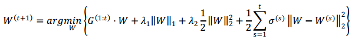
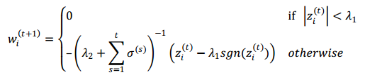
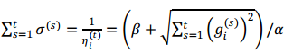
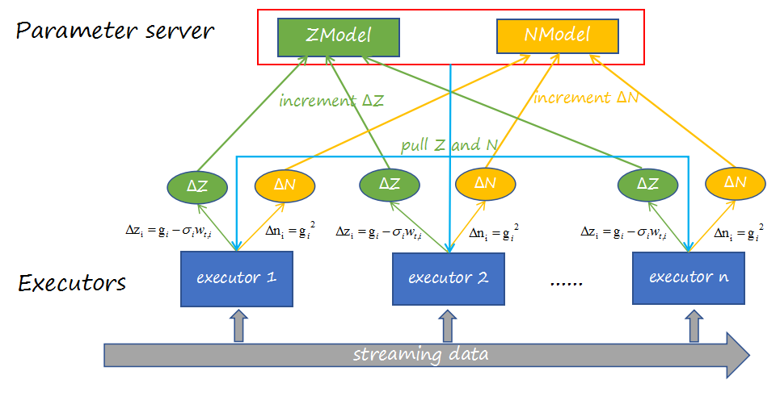

# [Spark Streaming on Angel] FTRL

>FTRL is a common online-learning optimization method with demonstrated good result in practice. Traditionally implemented in Storm, FTRL is widely used for online models of CTR prediction. In practice, chances are data are high-dimensional and sparse solution is desired. In this case, implementing FTRL in Spark Streaming on Angel can actually achieve better result with robust performance in just a few lines of code.


## 1. Introduction to FTRL

`FTRL` blends the benefits of `FOBOS` and `RDA`: it guarantees comparatively high precision as FOBOS does, and can yield better sparcity in result with a reasonably loss in precision.

The equation for updating weights of features by FTRL is:



where

* G function is the gradient of the loss function:

	

* w's updating is separated to N independent scalar minimization problems, depending on the specific dimension:

	

* considering individual learning rate for each dimension, w's updating equation becomes:

	


## 2. Distributed Implementation

Google has provided the implementation of Logistic Regression with L1/L2 terms using FTRL:


Integrating the characteristics of Spark Streaming and Angel into above reference, the distributed implementation has the following framework:




## 3. Execution & Performance


###  **Input Format**
* dim: dimension of the input data
* Only supports the standard ["libsvm"](./data_format_en.md) format for message
* Uses kafka messaging mechanism, thus kafka needs to be configured

### **Parameters**

* **Algorithm Parameters**
	* alpha: alpha in w's updating equation
	* beta: beta in w's updating equation
	* lambda1: lambda1 in w's updating equation
	* lambda2: lambda2 in w's updating equation

* **I/O Parameters**
	 * checkPointPath: checkpoint path for the data stream
	 * modelPath: save path for model (trained by each batch)
	 * actionType: "train" and "predict"
	 * sampleRate: input rate for samples used for "predict"
	 * zkQuorum: configuration for Zookeeper with format: "hostname:port"
	 * topic: kafka topic
	 * group: kafka group
	 * streamingWindow: size of spark streaming batch

* **Resource Parameters**
	* num-executors: number of executors
	* executor-cores: number of executor cores
	* executor-memory: executor memory
	* driver-memory: driver memory
	* spark.ps.instances: number of Angel PS nodes
	* spark.ps.cores: number of cores in each PS node
	* spark.ps.memory: PS node memory

###  **Submission Command**

Submit the FTRL_SparseLR training job to Yarn using the following sample command:

```shell
./bin/spark-submit \
--master yarn-cluster \
--conf spark.yarn.allocation.am.maxMemory=55g \
--conf spark.yarn.allocation.executor.maxMemory=55g \
--conf spark.ps.jars=$SONA_ANGEL_JARS \
--conf spark.ps.instances=2 \
--conf spark.ps.cores=2 \
--conf spark.ps.memory=10g \
--jars $SONA_SPARK_JARS \
--name "spark-on-angel-sparse-ftrl" \
--driver-memory 1g \
--num-executors 5 \
--executor-cores 2 \
--executor-memory 2g \
--class com.tencent.angel.spark.ml.classification.SparseLRWithFTRL \
spark-on-angel-mllib-2.1.0.jar \
partitionNum:3 \
actionType:train \
sampleRate:1.0 \
modelPath:$modelPath \
checkPointPath:$checkpoint \
group:$group \
zkquorum:$zkquorum \
topic:$topic
```
