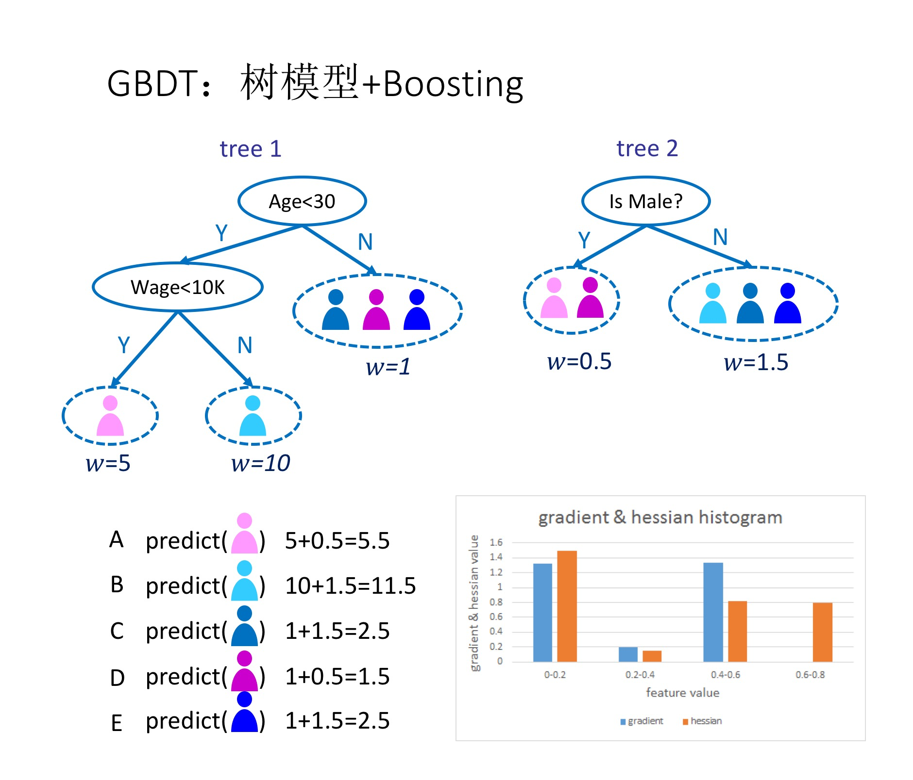
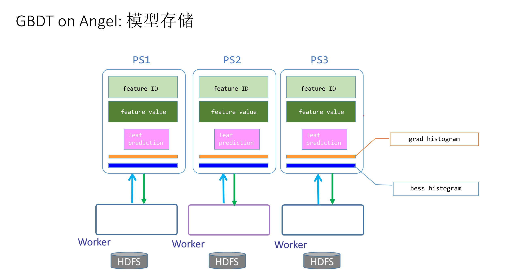
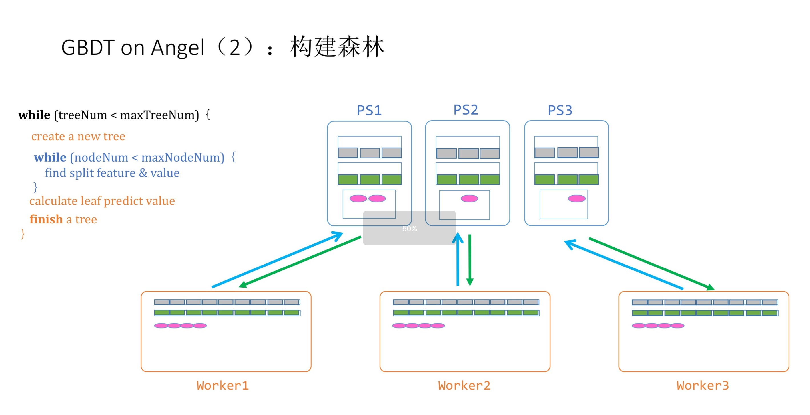
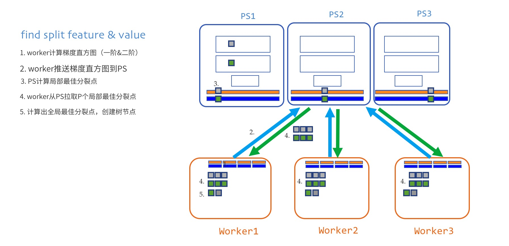

# GBDT on Angel

> **GBDT (Gradient Boosting Decision Tree)** is a machine-learning algorithm that produces an ensemble of weak learners (decision trees) for a prediction task. It is a powerful method in solving classification and regression problems.

## 1. Introduction 

Figure 1 shows an example GBDT for modeling consumers' purchasing potential. The procedure takes the following steps:

1. Tree 1's root node splits by age to the left internal node (age<30) and the right leaf node, whose output value is 1
2. The left internal node further splits by wage, into its left leaf node (<10K) with output 5, and right leaf node with output 10
3. The fitted Tree 1 generates predictions for all five instances (in this example, customers), A through E, as 5, 10, 1, 1, 1, respectively
4. Based on the result of Tree 1, we build Tree 2, whose root node splits by gender into the left leaf node (female) with output 0.5, and the right leaf node (male) with output 1.5
5. The output of Tree 2 is then added to the output of Tree 1; for example, for customer A, the predicted value becomes 5+0.5=5.5
6. Iterate the above tree learning to optimize prediction accuracy 

## 2. Distributed Implementation on Angel

---
### 1. Parameter Storage

As shown in Figure 2，in order to optimize for performance, we need to store the following parameter matrices on the parameter server (PS):

* ID of the split feature for each tree node (Feature ID)
* Split point of the feature  (Feature Value)
* Output value for each leaf (leaf-prediction)
* Overall gradient histogram (grad histogram)
* Overall hessian histogram (hess histogram)

All the above parameter matrices will be repetitively updated and passed around in the GBDT fitting process.

### 2. Overall Process

GBDT's implementation procedure takes the following steps:

1. **Compute candidate split point:** Scan the training data, enumerate splits on all features to propose candidate split; common methods include Quantile Sketch.
2. **Build decision tree:** Worker creates a new decision tree, initializes tree structure, calculates the gradient matrix and the hessian matrix, initializes a queue of tree nodes and adds the root node in the queue.
3. **Find the best split (split point and split node):** This is elaborated in the next section.
4. **Calculate and combine leaf-node predictions:** Worker calculates leaf-node outputs and pushes to PS.
5. **Complete the deicision tree and go to Step 2**. 

The above steps are iterated until all trees are built. Once training is done, we compute the performance metrics (such as accuracy/error) and output the trained model.

The next section is dedicated to details for Step 3, finding the best split (split point and split node) -- a challenging key step.

### 3. Best Split Point and Split Node

Finding the best split is the most challenging and important step in GBDT, and is exactly where PS is to the point. The procedure takes the following steps: 

1. **Compute the histograms:** Retrieve a tree node from the queue; worker computes a local gradient histogram and hessian histogram, and sends to PS through the interface of updating histograms. 

2. **Synchronize and merge histograms:** Worker pushes local histograms to PS through the right interface; but before this, each local histogram is partitioned to P parts, and each part is sent to its corresponding PS node. A PS node, upon receiving local histograms from the workers, determines which tree node to process, and adds it to the corresponding overall histograms. 

3. **Find the best split point:** Worker requests best split points from all PS nodes through the right interface for requesting best split point from PS, compares the gain in objective function for each of the P candidates, and chooses the best split point that maximizes the gain.

4. **Split node:**  PS returns the split feature, split point, and objective function gain to worker; worker creates leaf nodes based on the best split and devides training data to the leaf nodes. If the tree depth is yet smaller than the maximum depth, the two leaf nodes are then added to the queue. 

From the above logic, we can see how PS and Angel are well-suited to model updating and synchronization at scale for GBDT. More specifically, the perks are:

1. **Massively complex models:** The gradient/hessian histograms used by GBDT increase in size with number of features, and can be prohibitively large for single-thread computing with big data; Angel, on the other hand, partitions the histograms to be stored by multiple PS nodes, thus can avoid the single-point bottleneck for parameter merging for complex models.

2. **Two-stage tree-splitting algorithm:** Best split can be searched in parallel on multiple PS nodes, and only locally best split needs to be returned to worker, thus communication cost is almost neglegible. 

Overall, Angel PS's advantage as stated above is demonstrated by GBDT's performance on the platform: it is drastically improved when compared to Spark, and also slightly improved when compared to MPI XGBoost.
 

## 4. Execution & Performance

### Input Format

* Data format is set in "ml.data.type". GBDT on Angel supports "libsvm" and "dummy" formats. For details, see [Angel Data Format](data_format_en.md)

* Feature vector's dimension is set in "ml.feature.num". 

### Parameters

* Algorithm Parameters  
	* ml.gbdt.tree.num: number of trees
	* ml.gbdt.tree.depth: maximum tree depth
	* ml.gbdt.split.num: maximum size of grad/hess histograms for each feature
	* ml.learn.rate: learning rate
	* ml.validate.ratio: proportion of data used for validation (no validation when set to 0)
	* ml.gbdt.sample.ratio: proportion of features selected for training; default is 1
	* ml.gbdt.server.split: if true, use two-stage tree splitting; default is true
	* ml.compress.bytes: low-precision compression; the size of each floating point can set to [1,8]

* I/O Parameters
	* angel.train.data.path: input path for train
	* angel.predict.data.path: input path for predict
	* ml.feature.index.range: number of features
	* ml.model.size: the size of model. for some sparse model, there are features that all samples are zero at those indices (invalidate indices). ml.model.size = ml.feature.index.range - number of invalidate indices
	* ml.data.type: [Angel Data Format](data_format_en.md), can be "dummy" or "libsvm"
	* angel.save.model.path: save path for trained model
    * angel.predict.out.path: output path for predict
	* angel.log.path: save path for the log

* Resource Parameters
	* angel.workergroup.number: number of workers
	* angel.worker.memory.gb: worker's memory requested in G
	* angel.worker.task.number: number of tasks on each worker; default is 1
	* angel.ps.number: number of PS
	* angel.ps.memory.gb: PS's memory requested in G

### Performance

We compare Angel and XGBoost using Tencent's internal data:

* Training data

|   Data Set  | Data Set Size | Sample Size | Sample Dimension (Number of Features) |          Task         |
|:-----------:|:-------------:|:-----------:|:-------------------------------------:|:---------------------:|
| UserGender1 |      24GB     |    12.5M    |                 2.57K                 | binary classification |
| UserGender2 |     145GB     |     120M    |                  330K                 | binary classification |

Task is to classify user's gender. The dataset **UserGender1** is 24GB，including 12.5M training samples, each of which has 2570 features. **UserGender2** is 145GB, including 120M samples, each of which has 330K features. Both data sets are sparse. 

* **Experimental Environment**

	The experiment was run on Tencent's Gaia cluster (Yarn), and each instance has the following configuration:

	* CPU: 2680 * 2
	* Memory: 256 GB
	* Network: 10G * 2
	* Disk: 4T * 12 (SATA)

* **Variable Setting**

	Angel and XGBoost used the following setting:

	  * Number of trees: 20
	  * Maximum tree depth: 7
	  * Histogram size: 10
	  * Learning rate: 0.1 for XGboost, 0.2 for Angel
	  * Number of workers: 50
	  * Number of PS: 10
	  * Worker node memory: 2GB (UserGender1), 10GB (UserGender2)

* **Result**

	| System   | Dataset      | Total Training Time |Training Time per Tree| Testset Error |
	|:------:|:-----------:|:----------:|:--------:|:----------:|
    | XGBoost| UserGender1 | 36min 48s  |  110s    |  0.155008  |
	| Angel  | UserGender1 | 25min 22s  |   76s    |  0.154160  |
	| XGBoost| UserGender2 | 2h 25min   |  435s    |  0.232039  |
	| Angel  | UserGender2 | 58min 39s  |  175s    |  0.243316  |
