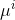

# KMeans

> KMeans是一种简单的聚类算法，将数据集划分为多个簇，K为簇的个数。传统的KMeans算法，有一定的性能瓶颈，通过PS实现的KMeans，在准确率一致的情况下，性能更佳。

## 1. 算法介绍

每个样本被划分到距离最近的簇。每个簇所有样本的几何中心为这个簇的簇心，样本到簇心的距离为样本到簇的距离。Kmeans算法一般以迭代的方式训练，如下所示：  

   

其中：代表第i个样本，代表与第i个样本距离最近的簇，代表第j个簇的簇心。


## Mini-batch KMeans
"Web-Scale K-Means Clustering"[1]提出一种在朴素KMeans算法基础上改进的KMeans算法，用mini-batch方法训练，每次迭代选择一个mini-batch的样本更新簇心，如下所示：


## 2. 分布式实现 on Angel

### 模型存储
Angel实现的KMeans算法将K个簇心以及每个簇心的样本计数存储在ParameterServer上，其中K个簇心用一个K×N维的矩阵表示，簇心的样本计数用一个K×1的向量表示，K为簇心的个数，N为数据的维度，即特征的个数。

### 模型更新
KMeans on Angel以迭代的方式训练，每次训练使用上文提到的mini-batch KMeans算法更新簇心。

### 算法逻辑
KMeans on Angel的算法流程如下图所示：

  


## 3. 运行 & 性能

### 参数

* 输入格式 
  
  * ml.data.type：支持"dense"、"libsvm"、"dummy"三种数据格式，具体参考:[Angel数据格式](data_format.md)

* 输入输出参数
  * ml.feature.index.range：特征向量的维度
  * ml.data.type: 支持"dummy"、"libsvm"两种数据格式
  * angel.train.data.path：训练数据的输入路径
  * angel.predict.data.path：预测数据的输入路径
  * angel.save.model.path：训练完成后，模型的保存路径
  * angel.predict.out.path：预测结果存储路径
  * angel.log.path：log文件保存路径

* 算法参数
  * ml.epoch.num: 迭代次数
  * ml.minibatch.size：每次迭代选择mini-batch的样本个数
  * ml.kmeans.center.num：K值，即簇的个数
  * ml.kmeans.c：学习速率参数

* 资源参数
  * angel.workergroup.number：Worker个数   
  * angel.worker.memory.mb：Worker申请内存大小    
  * angel.worker.task.number：每个Worker上的task的个数，默认为1    
  * angel.ps.number：PS个数    
  * angel.ps.memory.mb：PS申请内存大小   

* 提交命令
	*向Yarn集群提交Kmeans算法训练任务:

	```java
    ./bin/angel-submit \
        --action.type=train \
        --angel.app.submit.class=com.tencent.angel.ml.clustering.kmeans.KMeansRunner  \
        --ml.model.class.name=com.tencent.angel.ml.clustering.kmeans.KMeansModel \
        --angel.train.data.path=$traindata \
        --angel.save.model.path=$modelout \
        --angel.output.path.deleteonexist=true \
        --angel.log.path=$logpath \
        --ml.data.type=libsvm \
        --ml.model.type=T_DOUBLE_DENSE \
        --ml.kmeans.center.num=10 \
        --ml.kmeans.c=0.15 \
        --ml.epoch.num=100 \
        --ml.feature.index.range=3072 \
        --angel.workergroup.number=4 \
        --angel.worker.memory.mb=5000  \
        --angel.worker.task.number=1 \
        --angel.ps.number=4 \
        --angel.ps.memory.mb=5000 \
        --angel.job.name=kmeans
	```

	*向Yarn集群提交Kmeans算法预测任务:
	
	```java
    ./bin/angel-submit \
        --action.type=predict \
        --angel.app.submit.class=com.tencent.angel.ml.clustering.kmeans.KMeansRunner  \
        --ml.model.class.name=com.tencent.angel.ml.clustering.kmeans.KMeansModel \
        --angel.predict.data.path=$predictdata \
        --angel.load.model.path=$modelout \
        --angel.predict.out.path=$predictout \
        --angel.output.path.deleteonexist=true \
        --angel.log.path=$logpath \
        --ml.data.type=libsvm \
        --ml.model.type=T_DOUBLE_DENSE \
        --ml.kmeans.center.num=10 \
        --ml.feature.index.range=3072 \
        --angel.workergroup.number=4 \
        --angel.worker.memory.mb=5000  \
        --angel.worker.task.number=1 \
        --angel.ps.number=4 \
        --angel.ps.memory.mb=5000 \
        --angel.psagent.cache.sync.timeinterval.ms=500 \
        --angel.job.name=kmeans_predict
	```

### 性能
* 数据：街景号码图像数据集，3×10^3 特征，7×10^4 样本
* 资源：
	* Angel：executor：4个，5G内存，1个task；ps：4个，5G内存
* 迭代100次时间：
	* Angel：45min

## 4. 参考文献
[1] Sculley D. Web-scale k-means clustering[C]// International Conference on World Wide Web, WWW 2010, Raleigh, North         	Carolina, Usa, April. DBLP, 2010:1177-1178.
