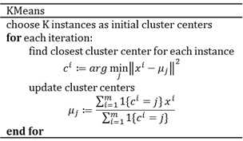
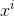
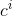
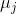
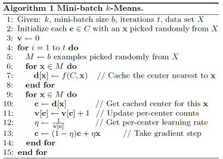
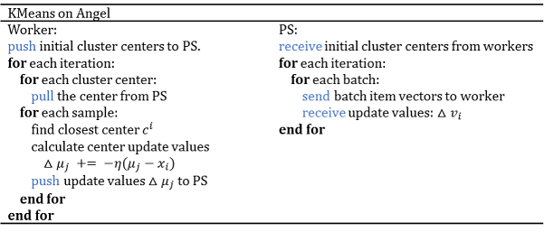

# KMeans

> KMeans is a method that aims to cluster data in K groups of equal variance. The conventional KMeans algorithm has performance bottleneck; when implemented with PS，however, KMeans achieves the same level of accuracy with better performance.

## 1. Introduction 

The KMeans algorithm assigns each data point to its *nearest* cluster, where the *distance* is measured between the data point and the cluster's *centroid*. In general, Kmeans algorithm is implemented in an iterative way as shown below:  

   

where,  is the ith sample and  is its nearest cluster;  is the centroid of the ith cluster. 

## Mini-batch KMeans
"Web-Scale K-Means Clustering" proposes a improved KMeans algorithm to address the latency, scalability and sparsity requirements in user-facing web applications, using mini-batch optimization for training. As shown below:

## 2. Distributed Implementation on Angel

### Model Storage
KMeans on Angel stores the K centroids on ParameterServer，using a K×N matrix representation, where K is the number of clusters and N is the data dimension，i.e. number of features. 

### Model Updating
KMeans on Angel is trained in an iterative fashion; during each iteration, the centroids are updated by mini-batch. 

### Algorithm
KMeans on Angel algorithm:
 
  

## 3. Execution & Performance

### Input Format

* Data format is set in "ml.data.type", which supports "libsvm" and "dummy" formats. For details, see [Angel Data Format](data_format_en.md)

### Parameters
* IO Parameters
  * angel.train.data.path: input path for train
  * angel.predict.data.path：input path for predict
  * ml.feature.index.range: number of features
  * ml.data.type: [Angel Data Format](data_format_en.md), can be "dummy" or "libsvm"
  * angel.save.model.path: save path for trained model
  *	angel.predict.out.path：output path for predict
  * angel.log.path: save path for the log
* Algorithm Parameters
  * ml.kmeans.center.num: K, number of clusters
  * ml.kmeans.sample.ratio.perbath: sample ratio for mini-batch
  * ml.kmeans.c：learning rate

### Performance
