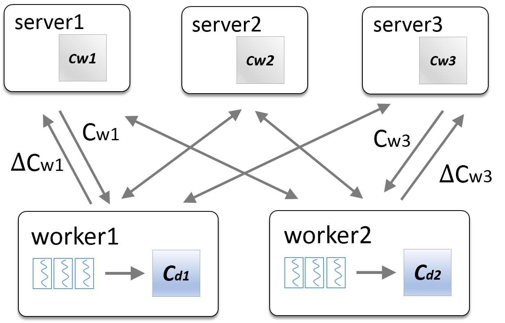

# LDA*（Latent Dirichlet Allocation）

> LDA是一种常见的主题模型算法。简单来说它是一个贝叶斯概率生成模型，用于对文档集进行降维或者潜在语义分析。


## 1. 算法介绍

### 整体说明
给定一个语料库,
该语料库由一系列文档构成。
每个文档
则由一个序列的词构成，)。
语料库中的词整体构成了一个词汇表。
LDA模型需要人为指定模型的话题个数，这里用来表示。
在LDA模型中，每个文档被表示成了一个
维的话题分布，，
而每个话题
则被表示成一个
维的词分布。

LDA模型对每个文档的生成过程进行了建模。
在文档
的生成过程中，LDA首先从狄利克雷分布)中采样出
一个
维的话题分布，
这里的是狄利克雷分布
的超参数。
对于文档中的每个词
，
LDA模型首先从多项分布)
中采样出该词的话题，
然后再从多项分布)
中采样出单词。

### Gibbs Sampling
求解LDA模型的过程通常使用Gibbs Sampling方法，
通过采样出大量符合后验分布的样本,
从而对每个文档的话题分布和话题的词分布进行估计估计。
目前对LDA的Gibbs Sampling方法有大概6中，包括 Collapsed Gibbs Sampling(CGS), SparseLDA, 
AliasLDA, F+LDA, LightLDA和WarpLDA。
我们通过实验和分析, 认为F+LDA比较适合用于在Angel上进行LDA模型的训练。

### Collapsed Gibbs Sampling
如果我们使用来表示所有词的话题，
用
来表示维度为的话题-词矩阵，
用来表示所有文档的话题分布矩阵。
那LDA模型的训练过程则是在给定观测变量和超参数的条件下，
求解隐变量)的后验概率分布。
CGS通过分布之间共轭的性质将通过积分积掉，从而CGS只用迭代地采样每个
词的话题。
采样的条件概率公式如下：

\propto\frac{C_{wk}^{\neg%20dn}+\beta}{C_{k}^{\neg%20dn}+V\beta}~(C_{dk}^{\neg%20dn}+\alpha))


### F+LDA
F+LDA通过将概率公式进行了分解成两部分
和。
利用矩阵的稀疏性，从而在采样时可以只用访问非零的部分，降低了算法的复杂度。
对于另一个部分，F+LDA采用F+树来进行查找，可以将复杂度降低到O(logK)。
从而F+LDA的复杂度为)，
是文档-话题矩阵中非零元素的个数。

## 2. 分布式训练 on Angel

在Angel中进行LDA模型的训练，整体的框架如下图所示。
对于LDA模型中的两个较大的矩阵和
，
我们将C_d矩阵划分到不同的worker上，将C_w矩阵划分到不同的server上。
在每一轮迭代中，worker从server上拉取C_w矩阵，从而进行话题的采样，在迭代结束时将对C_w矩阵
的更新发送回server节点。



## 3. 运行 & 性能

### 输入格式

输入数据分为多行，每行是一个文档，每个文档由文档id和一系列的词id构成，文档id和词id之间由'\t'符合相隔，词id之间由空格隔开

```
	doc_id '\t' wid_0 wid_1 ... wid_n 
```

### 参数

* 数据参数
  * angel.train.data.path: 输入数据路径
  * angel.save.model.path: 模型保存路径
* 算法参数
  * ml.epoch.num: 算法迭代次数
  * ml.lda.word.num：词个数
  * ml.lda.topic.num：话题个数
  * ml.worker.thread.num：worker内部并行度
  * ml.lda.alpha: alpha
  * ml.lda.beta: beta
  * save.doc.topic: 是否存储文档-话题矩阵
  * save.word.topic: 是否存储词-话题矩阵

### 性能

* **测试数据**
	 * PubMED 数据集

* **资源**
	* worker：20个
	* ps：20个

* **Angel vs Spark**: 迭代100次的训练时间
	* Angel：15min
	* Spark：>300min


## Reference

1. Lele Yu, Bin Cui, Ce Zhang, Yingxia Shao. [LDA*: A Robust and Large-scale Topic Modeling System](http://www.vldb.org/pvldb/vol10/p1406-yu.pdf). VLDB, 2017
