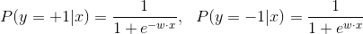
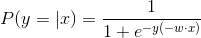
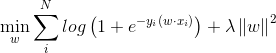
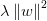
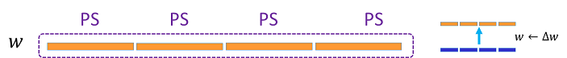
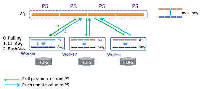
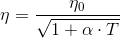

# LR (Logistic Regression)

> Logistic Regression is a regression model where the dependent variable is categorical, thus also a classification model. It is simple but effective, widely used in a variety of applications such as the traditional advertising recommender system.   

## 1. Introduction

Logistic regression is a simple classification method. It assumes that the probability mass of class label y conditional on data point x, P(y|x), takes the logistic form:    

  

Combining the two expressions above, we get:

  


The objective function of logistic regression is a weighted sum of log loss and L2 penalty:     

  

where  is the regularization term using the L2 norm. 

## 2. Distributed Implementation on Angel
### 1. Model Storage
LR algorithm can be abstracted as a 1×N PSModel, denoted by w, as shown in the following figure:


### 2. Algorithm Logic
Angel MLLib provides LR algorithm trained with the mini-batch gradient descent method. 

* Worker:    
In each iteration, worker pulls the up-to-date w from PS, updates the model parameters, △w, using the mini-batch gradient descent optimization method, and push △w back to PS. 
* PS:    
In each iteration, PS receives △w from all workers, add their average to w，obtaining a new model.    
  * Flow:      
  
  * Algorithm:
  


* Decaying learning rate    
The learning rate decays along iterations as , where:
	* α is the decay rate 
	* T is the iteration/epoch

* Model Type
The LR algorithm supports three types of models: DoubleDense, DoubleSparse, DoubleSparseLongKey. Use `ml.lr.model.type` to configure. 
	* DoubleDense
		* Parameters: -- ml.lr.model.type: T_DOUBLE_DENSE
		* Description: DoubleDense type model is suitable for dense data; model saved as array to save space; quick access and high performance
	* DoubleSparse
		* Parameters: -- ml.lr.model.type：T_DOUBLE_SPARSE
		* Description: DoubleSparse type model is suitable for sparse data; model saved as map, where K is feature ID and V is feature value; range of K same as range of Int
	* DoubleSparseLongKey
		* Parameters: -- ml.lr.model.type：T_DOUBLE_SPARSE_LONGKEY
		* DoubleSparseLongKey type model is suitable for highly sparse data; model saved as map, where K is feature ID and V is feature value; range of K same as range of Long

## 3. Execution & Performance

### Input Format

* Data fromat is set in "ml.data.type", supporting "libsvm" and "dummy" types. For details, see [Angel Data Format](data_format_en.md)
* Feature vector's dimension is set in "ml.feature.index.range"


###  Parameters
* Algorithm Parameters 
  * ml.epoch.num: number of iterations/epochs
  * ml.model.size: the size of model. for some sparse model, there are features that all samples are zero at those indices (invalidate indices). ml.model.size = ml.feature.index.range - number of invalidate indices 
  * ml.batch.sample.ratio: sampling rate for each iteration   
  * ml.num.update.per.epoch: number update in each iteration    
  * ml.data.validate.ratio: proportion of data used for validation, no validation when set to 0    
  * ml.learn.rate: initial learning rate
  * ml.learn.decay: decay rate of the learning rate
  * ml.lr.reg.l2: coefficient of the L2 penalty

* I/O Parameters
  * angel.train.data.path: input path for train
  * angel.predict.data.path: input path for predict
  * ml.feature.num: number of features
  * ml.data.type: [Angel Data Format](data_format_en.md), supporting "dummy" and "libsvm"    
  * angel.save.model.path: save path for trained model
  * angel.predict.out.path: output path for predict
  * angel.log.path: save path for the log   
   
* Resource Parameters
  * angel.workergroup.number: number of workers  
  * angel.worker.memory.mb: worker's memory requested in G   
  * angel.worker.task.number: number of tasks on each worker, default is 1   
  * angel.ps.number: number of PS 
  * angel.ps.memory.mb: PS's memory requested in G   

### **Output** 

###  **Submit Command**    

* **Training Job**

```java
./bin/angel-submit \
    --action.type train \
    --angel.app.submit.class com.tencent.angel.ml.classification.lr.LRRunner  \
    --angel.train.data.path $input_path \
    --angel.save.model.path $model_path \
    --angel.log.path $logpath \
    --ml.epoch.num 10 \
    --ml.num.update.per.epoch 10 \
    --ml.feature.index.range 10000 \
    --ml.data.validate.ratio 0.1 \
    --ml.data.type dummy \
    --ml.learn.rate 1 \
    --ml.learn.decay 0.1 \
    --ml.lr.reg.l2 0 \
    --angel.workergroup.number 3 \
    --angel.worker.task.number 3 \
    --angel.ps.number 1 \
    --angel.ps.memory.mb 5000 \
    --angel.job.name=angel_lr_smalldata
```

* **Prediction Job**

```java
./bin/angel-submit \
    --action.type predict \
    --angel.app.submit.class com.tencent.angel.ml.classification.lr.LRRunner  \
    --angel.load.model.path $model_path \
    --angel.predict.out.path $predict_path \
    --angel.train.data.path $input_path \
    --angel.workergroup.number 3 \
    --ml.data.type dummy \
    --angel.worker.memory.mb 8000  \
    --angel.worker.task.number 3 \
    --angel.ps.number 1 \
    --angel.ps.memory.mb 5000 \
    --angel.job.name angel_lr_predict
```

### Performance
* Data: internal video recommendation, 5×10^7 features, 8×10^7 data points
* Resources:
	* Spark: executor: 50, 14G memory, 4 cores; driver: 5, 5G memory 
	* Angel: executor: 50, 10G memory, 4 tasks; ps: 20, 5G memory
* Time of 100 epochs:
	* Angel: 20min
	* Spark: 145min


