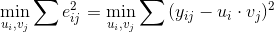
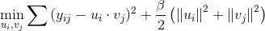
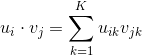
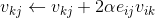

# Matrix Factorization

> Matrix Factorization is a commonly used method in recommender systems, which decomposes the user-item matrix into a product of the user matrix and item matrix.

## 1. Introduction

Matrix Factorization is a commonly used method in recommender systems, which decomposes the user-item matrix into a product of the user matrix and item matrix.

The user-item rating matrix (abbreviated as rating matrix) is a representation of data for recommender systems, where each row in the matrix corresponds to a user, each column corresponds to an item, and each element corresponds to the user's rating for that item (shown in the figure below). Usually, any single user is likely to have rated only a small subset of a large number of items, thus the rating matrix is sparse (i.e. most elements are zero). MF algorithm factorizes this sparse matrix into the feature-user matrix (the user matrix), and the feature-item matrix (the item matrix).
 


Assuming there are M users and N items in the data. We denote the M×N rating matrix by Y, where y_{ij} is the ith user's rating for the jth item. MF algorithm factorizes the rating matrix Y into the product of the user matrix U and item matrix V. U is M×k, where the ith row represents the user u_i, a k-dimensional feature vector. V is k×N, where the jth column represents the item v_j, also a k-dimensional vector. The number of features, k, is a parameter of MF. We use the product of u_i and v_j as the predicted rating for the jth item by the ith user, and denote it by y_{ij}, as shown below:


## Gradient Descent Matrix Factorization

The error between the predicted value of user i's explicit rating for item j (y_{ij}) and the true value is denoted by e_{ij}, i.e. e_{ij}=y{ij}-u_i \cdot v_j. The goal of MF algorithm is to minimize the discrepancy of the predicted ratings from the true ratings:



We add the L2 penalty to help prevent over-fitting:



where

     

We use gradient descent to minimize the objective, and update u_i and v_j by: 

    




## 2. Distributed Implementation on Angel
---
### Model Storage
* The item matrix is stored on PS and the user matrix is stored on worker; PS and worker just need to send the item matrix, not the user matrix.
* As can be seen from the user vector's updating equation, calculating user vector only requires this particular user's ratings, which is independent from other users. So we partition the user matrix(U) by users to be stored on multiple workers. Each worker only calculates the feature vectors for users loaded by this one, as U-part, whose dimension is the number of loaded users × k.

### Model Computation
Angel uses gradient descent to train the MF model, and incorporates the following algorithm design to reduce the amount of computation and network communication, as well as improve the efficiency. 

* Item vector's calculating only requires ratings for itself. A worker can only compute the gradient for items that have ratings with its training data, and output 0 for no rating items. Therefore, in each iteration, the worker just needs to pull a subset of items with ratings by its stored users. We denote the subset of items pulled by worker as V-sub, a sub-matrix of the item matrix.    

* When items number and k are both large, V-sub can still be too large for a single worker's memory. As the item vectors are updated independently, we may update V-sub in batches. Each iteration consists of multiple batches, where each batch pulls a sub-matrix of V-sub, updates the user matrix on the worker, and pushes the delta of item vectors back to the PS.  


### Algorithm Logic

The algorithm logic of Matrix Factorization on Angel is shown below: 


## 3. Execution & Performance

---

### Data Format

MF training data format

```
	User ID, Item ID:Rating, …, Item ID:Rating
```
	
A row contains all ratings from a user, as shown below:


* User 0's ratings for Item 1, Item 66, Item 99, and Item 1001 are 4, 2, 4, 1, respectively
* User 1's rating for Item 77 is 3

### Parameters
* IO Parameters
  * angel.train.data.path: input path
  * angel.save.modelPath: save path for the item matrix
  * ml.mf.user.model.output.path: save path for the user matrix
  * angel.log.path: save path for the log
* Algorithm Parameters
  * ml.mf.rank：dimension of user/item feature vectors
  * ml.mf.item.num: number of items
  * ml.mf.lambda: regularization coefficient
  * ml.mf.eta: learning rate
  * ml.mf.row.batch.num: number of batches for each iteration


### Submit Command

```
./bin/angel-submit \
  --angel.app.submit.class com.tencent.angel.ml.matrixfactorization.MatrixFactorizationRunner \
  --action.type train \
  --angel.train.data.path $input_path \
  --angel.save.model.path $model_path \
  --ml.mf.user.model.output.path $usermodelpath \
  --angel.log.path $logpath \
  --angel.worker.memory.mb 10000 \
  --angel.ps.memory.mb 8000 \
  --angel.worker.task.number 1 \
  --angel.ps.number 2 \
  --angel.workergroup.number 5 \
  --ml.mf.item.num 17771 \
  --ml.mf.row.batch.num 3 \
  --ml.mf.rank 200 \
  --ml.epoch.num 5 \
  --ml.mf.lambda 0.01 \
  --ml.mf.eta 0.00005 \
```

### Performance
