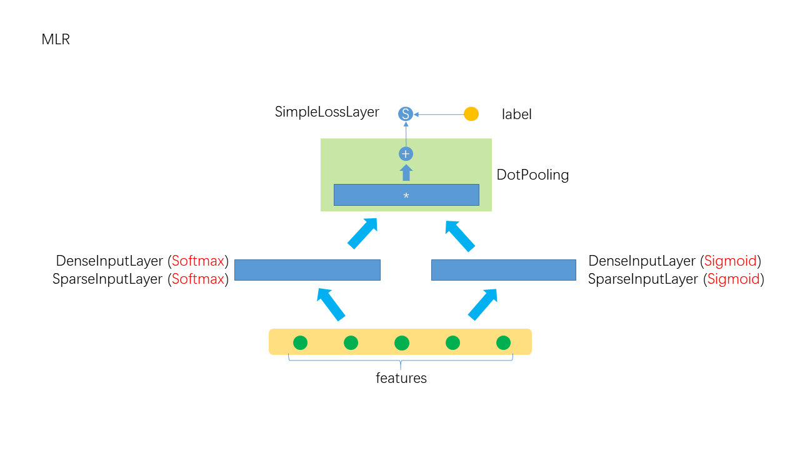

# MLR
## 1. 算法介绍
### 模型
MLR是一个分区域的线性模型，广泛应用于广告ctr预估。MLR采用分治策略：首先将特征空间划分为多个局域区间，然后在每个局域区间拟合一个线性模型，输出结果是多个线性模型的加权和，这两步以最小化损失函数为目标，同时学习得到。算法详细参见：Large Scale Piece-wise Linear Model (LS-PLM)。
MLR算法有三个明显的优点：
1. 非线性：选择足够多的划分区域，MLR算法可以拟合任意复杂的非线性函数。
2. 扩展性：与LR算法相似，MLR算法对海量样本，超高维度模型都有很好的扩展性。
3. 稀疏性：带，正则项的MLR算法可以得到很好的稀疏性

### 公式

=g(\sum_{j=1}^m\sigma(u_j^Tx)\eta(yw_j^Tx)))

其中：) 是划分函数，
是拟合函数
)的参数。对于一个给定样本x，我们的预测函模型
)有两部分，第一部分
)把特征空间划分为m个区域，第二部分
)给出每个区域的预测值。函数
)确保模型满足概率函数的定义。

MLR算法模型使用softmax作为划分函数
)，sigmoid函数作为拟合函数
)，并且：
=x)，得到MLR的模型如下：

=\sum_{i=1}^m%20\frac{\exp(u_i^T%20x)}{\sum_{j=1}^m%20\exp(u_j^Tx)}\cdot\frac{1}{1+\exp(-w_i^Tx)})

MLR模型的示意图如下,



可从两个角度理解这个模型:
- 可将MLR看成一个带门(threshold)三层神经网络, 有隐含层中有k个sigmoid神经元, 每个神经元的输出一有一个门, softmax的输出值就是门的开关.
- 可将MLR看成组合模型(ensemble model), 由k个简单的sigmoid模型组合, softmax的输出值就是组合系数

在很多情况下, 需要对一部分数据建立子模型, 然后用多个模型分别预测. MLR用softmax对数据进行划分(soft划分), 用一个统一的模型来预测. MLR的另个好处是可以做特征组合, 一部分特征对于sigmoid是"活动"有, 另一部分特征对softmax是"活动"的, 将它们乘起来相当于在低层做特征组合.

注: 由于sigmoid模型的输出值在0\~1之间, softmax的输出值在0\~1之间且归一化,所以组合后的值也在0~1之间(当所有的sigmoid取值为1时,取得最大值,当然在其它情况下也能取得最大值,组合后的和为1), 可看成一种概率.

## 2. 分布式实现 on Angel
### 梯度下降法
对于，模型可以统一形式：

&=\sum^m_{i=1}\frac{exp(u_i^Tx)}{\sum_{j=1}^m%20exp(u_j^Tx)}\cdot\frac{1}{1+exp(-yw_i^Tx)}\\\\\\\\%20&=\sum^m_{i=1}\frac{exp(u_i^Tx)}{\sum_{j=1}^m%20exp(u_j^Tx)}\cdot\sigma(yw_i^Tx)\\\\\\\\%20&=\sum^m_{i=1}P_{softmax}^i(x)P_{sigmoid}^i(y|x)\end{array})

对于样本(x, y)，利用cross entropy损失函数为：

=-\ln{P(y|x)})

注: 正常情况下cross entropy表现为=y\log{P(y|x)}+(1-y)\log{(1-P(y|x))}), 其中)的意义是给定, y=1时的概率, 如果)表示给定x时y的概率(即y不仅是y=1的概率), cross entropy的表现形式为:=-\ln{P(y|x)})

这样, 对单个样本求导有,

&=-\ln{P(y|x)}=-\ln\frac{1}{\sum_{j=1}^m%20e^{u_j^Tx}}\sum_{i=1}^m{e^{u_i^Tx}}\sum(yw_i^Tx)\\\\\\\\%20&=\ln\sum_{j=1}^m%20e^{u_j^Tx}-\ln(\Sigma_{i=1}^m%20e^{u_i^Tx}\sigma(yw_i^Tx))\end{array})

梯度：

x}{\Sigma_{i=1}^m%20e^{u_i^Tx}\sigma(yw_i^Tx)}=(P_{softmax}^k(x)-\frac{P_{softmax}^k(x)P_{sigmoid}^k(y|x)}{P(y|x)})x\\\\\\\\%20\triangledown_{w_k}l&=\frac{ye^{u_k^Tx}\sigma(yw_k^Tx)(\sigma(yw_k^Tx)-1)x}{\Sigma_{i=1}^m%20e^{u_i^Tx}\sigma(yw_i^Tx)}=\frac{P_{softmax}^k(x)P_{sigmoid}^k(y|x)}{P(y|x)}(P_{sigmoid}^k(y|x)-1)yx\end{array})

### 基于Angel的实现
* 模型存储：
    * MLR算法的模型参数有：softmax函数参数：，sigmoid函数参数：。其中、为N维向量，N为数据的维度，即特征个数。用两个m*N维的矩阵分别表示softmax矩阵、sigmodi矩阵。
    * 用两个m*1维度的矩阵，分别表示softmax函数、sigmoid函数的截断值。
    
* 模型计算：    
    * 用梯度下降法训练MLR模型，算法以迭代的方式进行。每次迭代开始，worker从PS上拉最新的模型参数，并用自己的训练数据计算出梯度，将梯度推送给PS。
    * PS接收到所有worker推送的梯度值，取平均，更新PSModel。

## 3. 运行
### 输入格式

数据的格式通过“ml.data.type”参数设置；数据特征的个数，即特征向量的维度通过参数“ml.feature.num”设置。

MLR on Angel支持“libsvm”、“dummy”两种数据格式，分别如下所示：

* **dummy格式**

每行文本表示一个样本，每个样本的格式为"y index1 index2 index3 ..."。其中：index特征的ID；训练数据的y为样本的类别，可以取1、-1两个值；预测数据的y为样本的ID值。比如，属于正类的样本[2.0, 3.1, 0.0, 0.0, -1, 2.2]的文本表示为“1 0 1 4 5”，其中“1”为类别，“0 1 4 5”表示特征向量的第0、1、4、5个维度的值不为0。同理，属于负类的样本[2.0, 0.0, 0.1, 0.0, 0.0, 0.0]被表示为“-1 0 2”。

 * **libsvm格式**

每行文本表示一个样本，每个样本的格式为"y index1:value1 index2:value1 index3:value3 ..."。其中：index为特征的ID,value为对应的特征值；训练数据的y为样本的类别，可以取1、-1两个值；预测数据的y为样本的ID值。比如，属于正类的样本[2.0, 3.1, 0.0, 0.0, -1, 2.2]的文本表示为“1 0:2.0 1:3.1 4:-1 5:2.2”，其中“1”为类别，"0:2.0"表示第0个特征的值为2.0。同理，属于负类的样本[2.0, 0.0, 0.1, 0.0, 0.0, 0.0]被表示为“-1 0:2.0 2：0.1”。

###  参数
* 算法参数  
  * ml.epoch.num：迭代次数   
  * ml.batch.sample.ratio：每次迭代的样本采样率   
  * ml.num.update.per.epoch：每次迭代(epoch)参数的更新次数
  * ml.data.validate.ratio：每次validation的样本比率，设为0时不做validation
  * ml.learn.rate：初始学习速率   
  * ml.learn.decay：学习速率衰减系数   
  * ml.mlr.reg.l2：L2惩罚项系数
  * ml.mlr.rank：区域个数，对应于模型公式中的m
  * ml.mlr.v.init：模型初始化参数，高斯分布的标准差值

* 输入输出参数
  * angel.train.data.path：训练数据的输入路径
  * angel.predict.data.path：预测数据的输入路径
  * ml.feature.index.range：数据特征个数
  * ml.data.type：数据格式，支持"dummy"、"libsvm"    
  * angel.save.model.path：训练完成后，模型的保存路径
  *	angel.predict.out.path：预测结果存储路径
  * angel.log.path：log文件保存路径   

* 资源参数
  * angel.workergroup.number：Worker个数   
  * angel.worker.memory.mb：Worker申请内存大小    
  * angel.worker.task.number：每个Worker上的task的个数，默认为1    
  * angel.ps.number：PS个数    
  * angel.ps.memory.mb：PS申请内存大小   


* 提交命令
你可以通过下面命令向Yarn集群提交LR算法训练任务:
```java
./bin/angel-submit \
    --action.type train \
    --angel.app.submit.class com.tencent.angel.ml.classification.mlr.MLRRunner  \
    --angel.train.data.path $input_path \
    --angel.save.model.path $model_path \
    --angel.log.path $logpath \
    --ml.epoch.num 10 \
    --ml.num.update.per.epoch 10 \
    --ml.feature.index.range 10000 \
    --ml.data.validate.ratio 0.1 \
    --ml.data.type dummy \
    --ml.learn.rate 1 \
    --ml.learn.decay 0.1 \
    --ml.mlr.reg.l2 0 \
    --ml.mlr.rank 5 \
    --ml.mlr.v.init 0.00000001 \ 
    --angel.workergroup.number 3 \
    --angel.worker.task.number 3 \
    --angel.ps.number 1 \
    --angel.ps.memory.mb 5000 \
    --angel.job.name=angel_lr_smalldata
```


[1]Learning Piece-wise Linear Models from Large Scale Data for Ad Click Prediction
