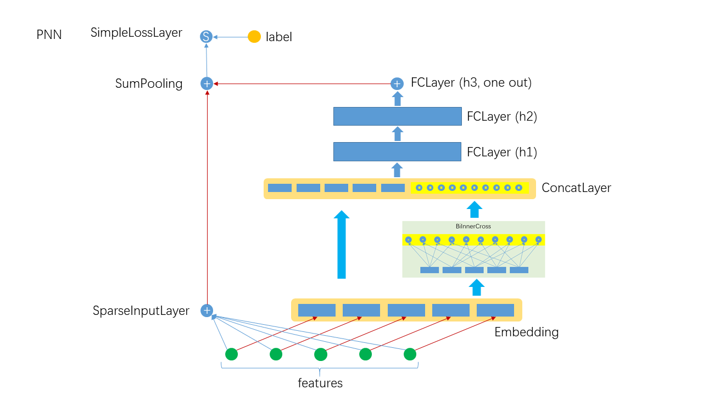

# PNN

## 1. 算法介绍
FNN(Product-Based Neural Networks)算法是在Embedding的基础上, 对Embedding
的结果进行两两内积或外积, 然后将内/外积结果与原始的Embedding结果拼接起来, 输入DNN进一步提取高阶特特交叉. 值得注意的是, PNN并没有放弃一阶特征, 最后将一阶特征与高阶特征组合起来进行预测, 其构架如下:



注: 目前Angel只实现了内积形式的PNN.

### 1.1 BiInnerCross层的说明
在实现中, 用Embedding的方式存储$\bold{v}_i$, 调用Embedding的`calOutput`后, 将$x_i\bold{v}_i$计算后一起输出, 所以一个样本的Embedding output结果为:

=(\bold{u}_1,\bold{u}_2,\bold{u}_3,\cdots,\bold{u}_k))

对Embedding特征两两做内积有:

)

以上即是BiInnerCross的前向计算方式, 用Scala代码实现为:
```scala
(0 until batchSize).foreach { row =>
    val partitions = mat.getRow(row).getPartitions
    var opIdx = 0
    partitions.zipWithIndex.foreach { case (vector_outter, cidx_outter) =>
    if (cidx_outter != partitions.length - 1) {
        ((cidx_outter + 1) until partitions.length).foreach { cidx_inner =>
        data(row * outputDim + opIdx) = vector_outter.dot(partitions(cidx_inner))
        opIdx += 1
        }
    }
    }
}
```
BiInnerCross与BiInnerSumCross的区别在于后者将两两内积的结果加和起来输出为一个标向, 前者没有加和起来, 输出是一个向量. 对于BiInnerCross, 输出的维数为为field的个数, 与Embedding向量的维数无关.

### 1.2 其它层说明
- SparseInputLayer: 稀疏数据与输入层, 对稀疏高维数据做了特别优化, 本质上是一个FCLayer
- Embedding: 隐式嵌入层, 如果特征非one-hot, 则乘以特征值
- FCLayer: DNN中最常见的层, 线性变换后接传递函数
- SumPooling: 将多个输入的数据做element-wise的加和, 要求输入具本相同的shape
- SimpleLossLayer: 损失层, 可以指定不同的损失函数

### 1.3 网络构建
```scala
  override def buildNetwork(): Unit = {
    val wide = new SparseInputLayer("input", 1, new Identity(),
      JsonUtils.getOptimizerByLayerType(jsonAst, "SparseInputLayer"))

    val embeddingParams = JsonUtils.getLayerParamsByLayerType(jsonAst, "Embedding")
      .asInstanceOf[EmbeddingParams]
    val embedding = new Embedding("embedding", embeddingParams.outputDim, embeddingParams.numFactors,
      embeddingParams.optimizer.build()
    )

    val crossOutputDim = numFields * (numFields - 1) / 2
    val innerCross = new BiInnerCross("innerPooling", crossOutputDim, embedding)

    val concatOutputDim = embeddingParams.outputDim + crossOutputDim
    val concatLayer = new ConcatLayer("concatMatrix", concatOutputDim, Array[Layer](embedding, innerCross))

    val hiddenLayers = JsonUtils.getFCLayer(jsonAst, concatLayer)

    val join = new SumPooling("sumPooling", 1, Array[Layer](wide, hiddenLayers))

    new SimpleLossLayer("simpleLossLayer", join, lossFunc)
  }
```

## 2. 运行与性能
### 2.1 Json配置文件说明
PNN的参数较多, 需要用Json配置文件的方式指定(关于Json配置文件的完整说明请参考[Json说明]()), 一个典型的例子如下:
```json
{
  "data": {
    "format": "dummy",
    "indexrange": 148,
    "numfield": 13,
    "validateratio": 0.1
  },
  "model": {
    "modeltype": "T_FLOAT_SPARSE_LONGKEY",
    "modelsize": 148
  },
  "train": {
    "epoch": 10,
    "numupdateperepoch": 10,
    "lr": 0.01,
    "decay": 0.1
  },
  "default_optimizer": "Momentum",
  "layers": [
    {
      "name": "wide",
      "type": "sparseinputlayer",
      "outputdim": 1,
      "transfunc": "identity"
    },
    {
      "name": "embedding",
      "type": "embedding",
      "numfactors": 8,
      "outputdim": 104,
      "optimizer": {
        "type": "momentum",
        "momentum": 0.9,
        "reg2": 0.01
      }
    },
    {
      "name": "biInnerCross",
      "type": "BiInnerCross",
      "outputdim": 78,
      "inputlayer": "embedding"
    },
    {
      "name": "concatlayer",
      "type": "ConcatLayer",
      "outputdim": 182,
      "inputlayers": [
        "embedding",
        "biInnerCross"
      ]
    },
    {
      "name": "fclayer",
      "type": "FCLayer",
      "outputdims": [
        200,
        200,
        1
      ],
      "transfuncs": [
        "relu",
        "relu",
        "identity"
      ],
      "inputlayer": "concatlayer"
    },
    {
      "name": "sumPooling",
      "type": "SumPooling",
      "outputdim": 1,
      "inputlayers": [
        "wide",
        "fclayer"
      ]
    },
    {
      "name": "simplelosslayer",
      "type": "simplelosslayer",
      "lossfunc": "logloss",
      "inputlayer": "sumPooling"
    }
  ]
}

```

### 2.2 提交脚本说明
```shell
runner="com.tencent.angel.ml.core.graphsubmit.GraphRunner"
modelClass="com.tencent.angel.ml.classification.ProductNeuralNetwork"

$ANGEL_HOME/bin/angel-submit \
    --angel.job.name DeepFM \
    --action.type train \
    --angel.app.submit.class $runner \
    --ml.model.class.name $modelClass \
    --angel.train.data.path $input_path \
    --angel.workergroup.number $workerNumber \
    --angel.worker.memory.gb $workerMemory  \
    --angel.ps.number $PSNumber \
    --angel.ps.memory.gb $PSMemory \  
    --angel.task.data.storage.level $storageLevel \
    --angel.task.memorystorage.max.gb $taskMemory
```

对深度学习模型, 其数据, 训练和网络的配置请优先使用Json文件指定.


