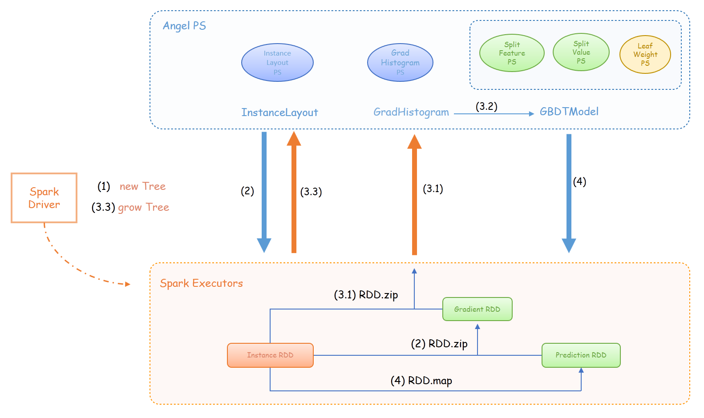

# [Spark on Angel] GBDT

GBDT(Gradient Boosting Decision Tree)的相关原理部分可以参考[](../gbdt_on_angel.md)

## 1. GBDT在Spark on Angel上的实现

Spark中的RDD
- `instance: RDD[(Id, Instance)]`：保存着训练样本的RDD，在算法循环迭代过程中，该RDD不会重新生成
- `gradient: RDD[(Id, (Gradient, Hessian)))]`：保存每个样本对应的一阶、二阶梯度值，每棵树会生成新的RDD
- `prediction: RDD[(Id, Prediction)]`：保存每个样本在当前模型下的预测值，每棵树会生成新的RDD

Angel PS上的PSMatrix
- `instanceLayout`：保存`instance` RDD每个partition的样本落地哪个树节点的信息
- `gradHistogram`：保存树的每个叶子节点的梯度直方图
- `gbtModel`：包含三个矩阵，分别是树节点的分离的特征ID、特征值，以及叶子节点的权重
  + 每棵树中，每个节点分裂的特征ID
  + 每棵树中，每个节点分裂的特征值
  + 叶子节点的权重

GBDT的伪代码如下所示：
  ```scala
  val instance: RDD[(Id, Instance)]
  var gradient: RDD[(Id, (Gradient, Hessian)))]
  var prediction: RDD[(Id, Prediction)]
  val instanceLayout, gradHistogram, gbtModel: PSMatrix
  sparkcontext.broadcast(createSketch(instance))
  While (treeNum < maxTreeNum) {
    (1) val tree = new Tree()
    // Calculate instance gradient
    (2) gradient = calcGrad(instance, prediction, instanceLayout)
    While (tree.depth < maxDepth) {
  	   // Build gradient histogram
       (3.1) gradHistogram.push(buildHist(instance, gradient, instanceLayout))
       // Find best split with PS function
       (3.2) gbtModel.update(findSplit(gradHist))
       (3.3) growTree(tree, gbtModel); layout.update(tree)
     }
     (4) prediction = updatePrediction(instance, gbtModel)
  }
  ```



## 2 算法参数

- 数据参数
  + classNum：训练数据类别数
  + validateFraction：验证集比例，范围：0~1.0
  + partitionNum：训练数据RDD的分区数

- 算法参数
  + maxTreeNum：最大树棵数
  + maxDepth：树的最大深度
  + splitNum：每个特征的分位点数
  + featureSampleRate：参与每棵树训练的特征比例
  + learningRate：学习率
  + regLambda：L2正则系数
  + regAlpha：L1正则系数
  + loss：损失函数类型

## 3 算法Benchmark
// TODO
