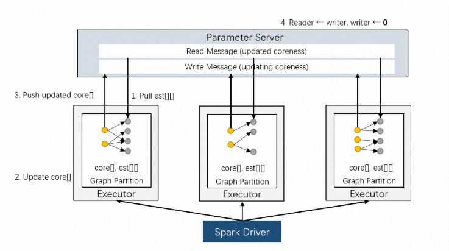

# K-CORE

> K-CORE(k-degenerate-graph)算法是重要的网络节点特征, 在复杂网络领域有广泛的应用。

## 1. 算法介绍
我们基于Spark On Angel实现了大规模网络的k-core计算，根据K-Core的算法原理可知计算一个节点的coreness值需要扫描其所有邻居的coreness值。如果我们将节点的coreness值存储在参数服务器上，在每轮迭代中，我们就需要将节点的所有邻居的coreness都从参数服务器拉取下来。为了利用迭代的稀疏性 （随着迭代的进行，大部分节点的coreness不会改变），我们将节点的coreness存储在Spark Executor端，在参数服务器端只存储变化的节点的coreness值。



在计算K-Core时需要储存与图中的边一一对应的可变数据（est[][]，每个节点的邻居的coreness估计值数组），我们将它与邻接表一起储存在Executor中。K-Core的具体实现架构如上图所示。PS端存储两个节点向量reader和writer，其中reader对应在上一轮迭代更新过的节点的coreness，writer对应这一轮迭代中正在更新的节点coreness；Executor端除了存储邻接表以外，还需存储子图每个节点及其邻居节点对应的coreness。具体计算流程如下：

1. Executor从reader拉取est[][]中可更新的节点coreness，对其进行更新；
2. 对Executor中的每个节点，计算其对应est[]的h-index，更新该节点的coreness估计值；
3. 将经过步骤2更新了的coreness推送到writer上；
4. 所有Executor结束步骤1-3的计算之后，PS端的writer即为下一轮的新的reader，同时将writer重置。

## 2. 运行

### 算法IO参数

- input： hdfs路径，输入网络数据，每行两个长整形id表示的节点，以空白符或者逗号分隔，表示一条边
- output： hdfs路径， 输出节点对应的coreness， 每行一条数据，表示节点对应的coreness值，以tap符分割
- sep: 输入数据分隔符，支持：空格，逗号，tab，默认为空格
- srcIndex： 源节点索引，默认为0
- dstIndex： 目标节点索引，默认为1

### 算法参数
- batchSize：节点更新batch的大小
- partitionNum： 输入数据分区数
- psPartitionNum： ps分区数
- useBalancePartition：是否使用均衡分区，默认为false
- balancePartitionPercent：均衡分区度，默认为0.7


### 任务提交示例
进入angel环境bin目录下
```
input=hdfs://my-hdfs/data
output=hdfs://my-hdfs/model

source ./spark-on-angel-env.sh
$SPARK_HOME/bin/spark-submit \
  --master yarn-cluster\
  --conf spark.ps.instances=1 \
  --conf spark.ps.cores=1 \
  --conf spark.ps.jars=$SONA_ANGEL_JARS \
  --conf spark.ps.memory=10g \
  --name "kcore angel" \
  --jars $SONA_SPARK_JARS  \
  --driver-memory 5g \
  --num-executors 1 \
  --executor-cores 4 \
  --executor-memory 10g \
  --class com.tencent.angel.spark.examples.cluster.KCoreExample \
  ../lib/spark-on-angel-examples-3.1.0.jar
  input:$input output:$output sep:" " batchSize:1000 partitionNum:2 psPartitionNum：2 useBalancePartition:false 
```