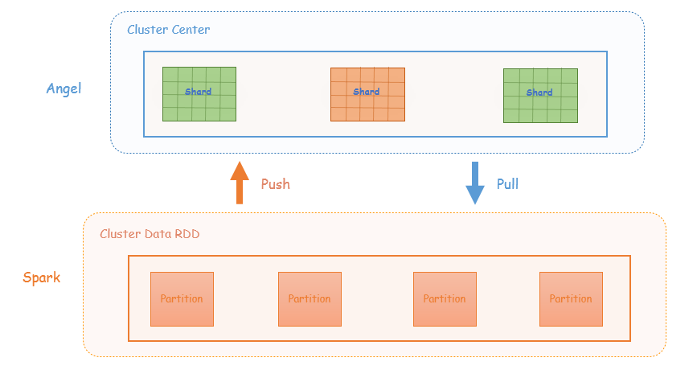

# [Spark on Angel] KMeans

## 1 KMeans原理
Spark on Angel中的KMeans算法是基于Spark mllib的KMeans算法升级成Angel PS的方式实现。

Spark mllib KMeans的原理部分可以参考[Spark  MLlib](https://spark.apache.org/docs/2.1.1/ml-clustering.html#k-means)

## 2 KMeans的Spark on Angel实现
KMeans算法在每轮迭代过程中，需要不断更新聚类中心。
Spark的实现方式是每轮迭代时，将聚类中心broadcast到每个Executor，计算得到新的聚类中心后，Driver将新的聚类中心collect到回来；再broadcast出去，重复下一轮迭代。
当数据维度高、聚类中心数据多时，这些聚类中心数据量会非常大，Driver单点broadcast和collect的效率会很低下。

Spark on Angel将频繁更新的聚类中心分布式地保存在Angel PS上，通过Push、Pull的方式更新和获取聚类中心。

下图是KMeans在Spark on Angel上的实现框架

