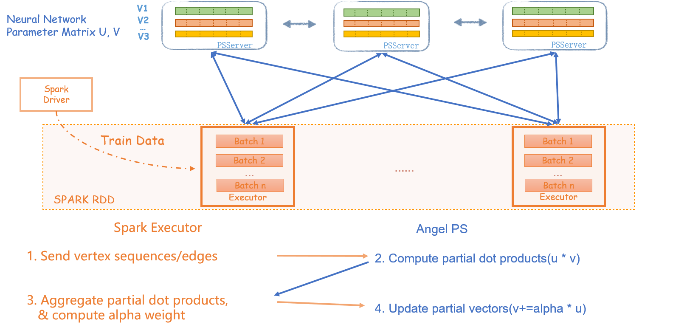

# LINE

>LINE(Large-scale Information Network Embedding)算法，是Network Embedding领域著名的算法之一，将图数据嵌入到向量空间，从达到用针对向量类型数据的机器学习算法来处理图数据的目的

## 1. 算法介绍

LINE算法是一个网络表示学习算法，也可以认为是针对图数据的预处理算法。算法的输入是一个网络拓扑，输出每个节点的向量表示。LINE算法本身在于分别优化两个目标函数：

\inE}w_{ij}\logp_1(v_i,v_j))

\inE}w_{ij}\logp_2(v_j|v_i))

其中，刻画了节点之间的一阶相似性(直接连边)，刻画了节点之间的二阶相似性(相似邻居)。换句话说，

  - 如果两个节点之间有连边，那么在嵌入的向量空间中两个节点也要靠近
  - 如果两个节点的邻居是相似的，那么在嵌入的向量空间中，两个节点也要靠近

更详细的细节请参考论文[[1]](https://arxiv.org/abs/1503.03578)

## 2. 分布式实现

LINE算法的实现参考了Yahoo的论文[[2]](https://arxiv.org/abs/1606.08495), 将Embedding向量按维度拆分到多个PS上，节点之间的点积运算可以在每个PS内部进行局部运算，之后再拉取到spark端合并。Spark端计算每个节点的梯度，推送到每个PS去更新每个节点对应的向量维度。

## 3. 运行

### 算法IO参数
  - input： hdfs路径，无向图，节点需要从0开始连续编号，以空白符或者逗号分隔，比如：
          0	2
          2	1
          3	1
          3	2
          4	1
  - modelPath： hdfs路径， 最终的模型保存路径为 modelPath/epoch_checkpoint_x,其中x代表第x轮epoch
  - modelCPInterval： 每隔多少轮epoch保存一次模型
### 算法参数
  - vectorDim： 嵌入的向量空间维度，即为embedding向量和context的向量维度(意味着同样的参数下，二阶优化占用的模型空间为一阶优化的两倍)
  - negSample： 算法采样的是负采样优化，表示每个pair使用的负采样节点数
  - learningRate： 学习率很影响该算法的结果，太高很容易引起模型跑飞的问题，如果发现结果量级太大，请降低该参数
  - BatchSize： 每个mini batch的大小
  - maxEpoch： 样本使用的轮数，每轮结束之后样本会shuffle一遍
  - Order： 优化阶数，1或者2

### 常见问题
  - 在差不多10min的时候，任务挂掉： 很可能的原因是angel申请不到资源！由于LINE基于Spark On Angel开发，实际上涉及到Spark和Angel两个系统，它们的向Yarn申请资源是独立进行的。 在Spark任务拉起之后，由Spark向Yarn提交Angel的任务，如果不能在给定时间内申请到资源，就会报超时错误，任务挂掉！ 解决方案是： 1）确认资源池有足够的资源 2） 添加spakr conf: spark.hadoop.angel.am.appstate.timeout.ms=xxx 调大超时时间，默认值为600000，也就是10分钟
  - 如何估算我需要配置多少Angel资源： 为了保证Angel不挂掉，需要配置模型大小两倍左右的内存。 模型大小的计算公式为： 节点数 * Embedding特征的维度 * order * 4 Byte，比如说1kw节点、100维、2阶的配置下，模型大小差不多有60G大小，那么配置instances=4, memory=30就差不多了。 另外，在可能的情况下，ps数目越小，数据传输的量会越小，但是单个ps的压力会越大，需要一定的权衡。
  - Spark的资源配置： 同样主要考虑内存问题，最好能存下2倍的输入数据。 如果内存紧张，1倍也是可以接受的，但是相对会慢一点。 比如说100亿的边集大概有600G大小， 50G * 20 的配置是足够的。 在资源实在紧张的情况下， 尝试加大分区数目！
