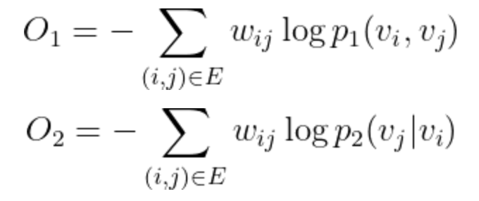

# LINE

>LINE(Large-scale Information Network Embedding)算法，是Network Embedding领域著名的算法之一，将图数据嵌入到向量空间，从达到用针对向量类型数据的机器学习算法来处理图数据的目的

## 1. 算法介绍

LINE算法是一个网络表示学习算法，也可以认为是针对图数据的预处理算法。算法的输入是一个网络拓扑，输出每个节点的向量表示。LINE算法本身在于分别优化两个目标函数：



其中，刻画了节点之间的一阶相似性(直接连边)，刻画了节点之间的二阶相似性(相似邻居)。换句话说，

  - 如果两个节点之间有连边，那么在嵌入的向量空间中两个节点也要靠近
  - 如果两个节点的邻居是相似的，那么在嵌入的向量空间中，两个节点也要靠近

更详细的细节请参考论文[[1]](https://arxiv.org/abs/1503.03578)

## 2. 运行

### 算法IO参数
  - input: 图的边表hdfs路径，无向图，以空白符或者逗号分隔，比如不带权重的边数据如下(带权重的话第三列输入边的权重值):  
          0	2  
          2	1  
          3	1  
          3	2  
          4	1
  - output: 结果保存hdfs路径, 最终的embedding结果保存路径为 output/CP_x, 其中x代表第x轮, 结果保存的格式分隔符可通过配置项指定：
            
            spark.hadoop.angel.line.keyvalue.sep=(可支持space、comma、tab、bar、colon等，默认是colon)
            
            spark.hadoop.angel.line.feature.sep=(可支持space、comma、tab、bar、colon等，默认是colon)
  - saveContextEmbedding: 二阶line训练时选择是否保存context embedding，保存该embedding可用于增量训练    
  - extraInputEmbeddingPath: 从外部加载预训练的节点input embedding向量做初始化用做增量训练，数据格式默认为: 节点id：embedding向量(向量用空格分隔，如 123:0.1 0.2 0.1)，分隔符可通过配置项指定
                             
            spark.hadoop.angel.line.keyvalue.sep=(可支持space、comma、tab、bar、colon等，默认是colon)
                             
            spark.hadoop.angel.line.feature.sep=(可支持space、comma、tab、bar、colon等，默认是colon)   
  - extraContextEmbeddingPath: 从外部加载预训练的节点context embedding向量做初始化用做增量训练，仅二阶line生效，数据格式默认为: 节点id：embedding向量(向量用空格分隔，如 123:0.1 0.2 0.1)，分隔符可通过配置项指定
                              
            spark.hadoop.angel.line.keyvalue.sep=(可支持space、comma、tab、bar、colon等，默认是colon)
                              
            spark.hadoop.angel.line.feature.sep=(可支持space、comma、tab、bar、colon等，默认是colon)   
  - saveModelInterval：每隔多少个epoch保存一次模型
  - checkpointInterval：每隔多少个epoch写一次checkpoint
  
### 算法参数
  - embedding: 嵌入的向量空间维度，即为embedding向量和context的向量维度(意味着同样的参数下，二阶优化占用的模型空间为一阶优化的两倍)
  - negative: 算法采样的是负采样优化，表示每个pair使用的负采样节点数
  - epoch：总的迭代轮数
  - stepSize: 学习率很影响该算法的结果，太高很容易引起模型跑飞的问题，如果发现结果量级太大，请降低该参数
  - batchSize: 每个mini batch的大小，一般选择1000~10000
  - psPartitionNum: 模型分区个数，最好是parameter server个数的整数倍，让每个ps承载的分区数量相等，让每个PS负载尽量均衡, 数据量大的话推荐500以上
  - dataPartitionNum: 输入数据的partition数，一般设为spark executor个数乘以executor core数的3-4倍
  - remapping: 是否需要对节点进行重新编码，取值true或者false(LINE目前只能支持节点ID属于一个连续的整数空间(int 范围内)，最好在运行LINE之前做好ID的映射。如果设置为true，首先会做一次ID的映射并输出一个映射文件)
  - order: 使用的是一阶相似度还是二阶相似度(1或者2), 默认为2
  - sep: 边数据列分隔符(space、comma和tab可选), 默认为space
  - isWeight: 边是否带权重
  
### 资源配置建议

  - Angel PS个数和内存大小: 为了保证Angel不挂掉，需要配置模型大小两倍左右的内存。LINE模型大小的计算公式为：节点数 * Embedding特征的维度 * order * 4 Byte，比如说1kw节点、100维、2阶的配置下，模型大小差不多有8G大小，那么配置instances=4, memory=4就差不多了。另外LINE算法的瓶颈主要在通信，因此ps的数量最好能与worker数量对等，最好不要少于1：3，这样ps通信压力不会太大。
  - Spark的资源配置: num-executors与executor-memory的乘积是executors总的配置内存，最好能存下2倍的输入数据。 如果内存紧张，1倍也是可以接受的，但是相对会慢一点。 比如说100亿的边集大概有600G大小， 50G * 20 的配置是足够的。

### 任务提交示例
进入angel环境bin目录下
```
input=hdfs://my-hdfs/data
output=hdfs://my-hdfs/model

source ./spark-on-angel-env.sh
$SPARK_HOME/bin/spark-submit \
  --master yarn-cluster\
  --conf spark.ps.instances=1 \
  --conf spark.ps.cores=1 \
  --conf spark.ps.jars=$SONA_ANGEL_JARS \
  --conf spark.ps.memory=10g \
  --jars $SONA_SPARK_JARS  \
  --driver-memory 5g \
  --num-executors 1 \
  --executor-cores 4 \
  --executor-memory 10g \
  --class com.tencent.angel.spark.examples.cluster.LINEExample \
  ../lib/spark-on-angel-examples-3.2.0.jar \
  input:$input output:$output embedding:128 negative:5 epoch:10 stepSize:0.01 batchSize:1000 psPartitionNum:10 remapping:false order:2
```

### 常见问题
  - 在差不多10min的时候，任务挂掉: 很可能的原因是angel ps申请不到资源！由于LINE基于Spark On Angel开发，实际上涉及到Spark和Angel两个系统，它们的向Yarn申请资源是独立进行的。 在Spark任务拉起之后，由Spark向Yarn提交Angel的任务，如果不能在给定时间内申请到资源，就会报超时错误，任务挂掉！ 解决方案是： 1）确认资源池有足够的资源 2） 添加spakr conf: spark.hadoop.angel.am.appstate.timeout.ms=xxx 调大超时时间，默认值为600000，也就是10分钟
  - 如何估算我需要配置多少Angel资源: 参考资源配置建议章节 
