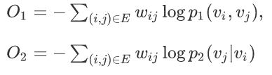

# LINE

> LINE (Large-scale Information Network Embedding) algorithm is one of the well-known algorithms in the field of Network Embedding. It embeds graph data into vector space as to use vertor-based machine learning algorithm to handle graph datas.

## Algorithm Introduction

The LINE algorithm is a network representation learning algorithm(also be considered as a preprocessing algorithm for graph data). The algorithm recieve a network as input and, produces the vector representation for each node. The LINE algorithm  mainly focuses on optimizing two objective functions:



where, p_1 characterizes the first-order similarity between nodes (direct edge), and p_2 depicts the second-order similarity between nodes (similar neighbors). in other words,

  - If there are joints between two nodes, then the two nodes are also close in the embedded vector space
  - If the neighbors of two nodes are similar, then in the embedded vector space, the two nodes are also close

For more details, please refer to the paper [[1]](https://arxiv.org/abs/1503.03578)

## Running

### Algorithm IO parameters

  - input: hdfs path, undirected graph, nodes need to be consecutively numbered starting from 0, separated by white space or comma, for example:
        0	2
        2	1
        3	1
        3	2
        4	1
  - output: hdfs path, the final model save path is output/CP_x, where x represents the xth round epoch
  - saveModelInterval: save the model every few rounds of epoch
  - checkpointInterval: write the model checkpoint every few rounds of epoch

### Algorithm parameters

  - embedding: The vector space dimension of the embedding vector and the vector dimension of the context (meaning that the model space occupied by the second-order optimization is twice the first-order optimization under the same parameters)
  - negative: The algorithm samples negative sampling optimization, indicating the number of negative sampling nodes used by each pair
  - stepSize: The learning rate affects the results of the algorithm
  - batchSize: the size of each mini batch
  - epoch: the number of rounds used by the sample, the sample will be shuffled after each round
  - order: Optimize the order, 1 or 2
  - remapping: Remapping the node id or not, true or false
  - psPartitionNum：The number of model partitions is preferably an integer multiple of the number of parameter servers, so that the number of partitions carried by each ps is equal, and the load of each PS is balanced as much as possible. If the amount of data is large, more than 500 is recommended.
  - dataPartitionNum：The number of input data partitions is generally set to 3-4 times the number of spark executors times the number of executor cores
  - sep：Data column separator (space, comma and tab are optional), the default is space
  
### Resource parameters

  - Angel PS number and memory: The product of ps.instance and ps.memory is the total configuration memory of ps. In order to ensure that Angel does not hang, you need to configure the memory about twice the size of the data storage on ps. For LINE, the calculation formula of the model size is: number of nodes * dimension of Embedding feature * order * 4 Byte, for example, 1kw node, 100-dimensional, 2nd order configuration, the model size is almost 60G, then configure instances = 4, memory = 30 is almost the same. In addition, when possible, the smaller the number of ps, the smaller the amount of data transmission, but the pressure of a single ps will be greater, requiring certain trade-offs.
  - Spark resource configuration: The product of num-executors and executor-memory is the total configuration memory of executors, and it is best to store twice the input data. If the memory is tight, 1 times is also acceptable, but relatively slower. For example, a 10 billion edge set is about 600G in size, and a 50G * 20 configuration is sufficient. In a situation where resources are really tight, try to increase the number of partitions!
  
### Submitting scripts
```
input=hdfs://my-hdfs/data
output=hdfs://my-hdfs/model

source ./bin/spark-on-angel-env.sh
$SPARK_HOME/bin/spark-submit \
  --master yarn-cluster\
  --conf spark.ps.instances=1 \
  --conf spark.ps.cores=1 \
  --conf spark.ps.jars=$SONA_ANGEL_JARS \
  --conf spark.ps.memory=10g \
  --name "kcore angel" \
  --jars $SONA_SPARK_JARS  \
  --driver-memory 5g \
  --num-executors 1 \
  --executor-cores 4 \
  --executor-memory 10g \
  --class com.tencent.angel.spark.examples.cluster.LINEExample \
  ../lib/spark-on-angel-examples-3.1.0.jar
  input:$input output:$output embedding:128 negative:5 epoch:10 stepSize:0.01 batchSize:1000 numParts:10 remapping:false order:2
```

### FAQ
  - At about 10 minutes, the task hangs: The most likely reason is that Angel cannot apply for resources! Since LINE is developed based on Spark On Angel, it actually involves two systems, Spark and Angel, and their application for resources from Yarn is carried out independently. After the Spark task is started, Spark submits the Angel task to Yarn. If the resource cannot be applied for within a given time, a timeout error will be reported and the task will hang! The solution is: 1) Confirm that the resource pool has sufficient resources 2) Add spakr conf: spark.hadoop.angel.am.appstate.timeout.ms = xxx to increase the timeout time, the default value is 600000, which is 10 minutes