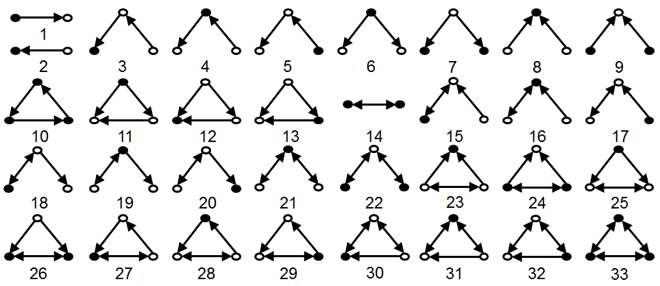
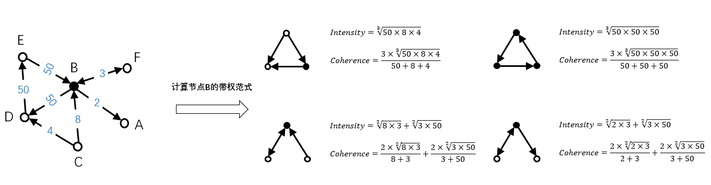

# Motif counting
## 1. 算法介绍
Motif范式特征是针对有向图中的三元组从点边位置和方向上呈现的不同形式构造的特征。如下右图所示，我们为二元/三元组一共定义了33种范式特征。在计算时，会输出每个节点对应的33种范式结构出现的次数，如 12 1:1, 2:11, 3:4 表示id为12的节点共存在1/2/3三种范式结构，每种结构分别出现了1/11/4 次。



对于边带权的有向图，范式结构出现的次数会有一个权重的加权，目前定义了两种加权方式：强度Intensity和一致性Coherence，强度表示范式中所有边权重的几何平均值，一致性表示范式中所有边权重的几何平均值与算数平均值的比值，具体计算方式如下图。在目前版本中，我们只实现了基于强度Intensity的计算。



## 2. 运行
#### 算法IO参数

- input：输入，hdfs路径，有向图，可带权。每行表示一条边： srcId 分隔符 dstId 分隔符 weight(可选)
- isWeighted: 边是否带权
- output: 输出，hdfs路径。每行表示一个顶点及其对应的33维motif特征：nodeId tab motifs，其中motifs是一个string，表示范式类别及其出现的次数，如 '1:1, 2:11, 3:4' 表示该节点共存在1/2/3三种范式结构，每种结构分别出现了1/11/4 次。
- sep: 分隔符，输入中每条边的起始顶点、目标顶点之间的分隔符: `tab`, `空格`等

#### 算法参数

- partitionNum：数据分区数，spark rdd数据的分区数量
- psPartitionNum：参数服务器上模型的分区数量
- batchSize: 向ps push邻接表的batch大小，一般设置为1000，可按申请的executor内存大小调节
- pullBatchSize: 从ps pull邻接表并计算motif的batch大小，一般设置为1000，可按申请的executor内存大小调节
- storageLevel：RDD存储级别，`DISK_ONLY`/`MEMORY_ONLY`/`MEMORY_AND_DISK`

#### 资源参数

- ps个数和内存大小：ps.instance与ps.memory的乘积是ps总的配置内存。为了保证Angel不挂掉，需要配置ps上数据存储量大小两倍左右的内存。对于Motif来说，ps上放置的主要是节点及其邻居（可能带权），可按照边规模估算所需大小。
- Spark的资源配置：num-executors与executor-memory的乘积是executors总的配置内存，最好能存下2倍的输入数据。 如果内存紧张，1倍也是可以接受的，但是相对会慢一点。 比如说100亿的边集大概有160G大小， 20G * 20 的配置是足够的。 在资源实在紧张的情况下， 尝试加大分区数目！

#### 任务提交示例

```
input=hdfs://my-hdfs/data
output=hdfs://my-hdfs/output

source ./spark-on-angel-env.sh
$SPARK_HOME/bin/spark-submit \
  --master yarn-cluster\
  --conf spark.ps.instances=1 \
  --conf spark.ps.cores=1 \
  --conf spark.ps.jars=$SONA_ANGEL_JARS \
  --conf spark.ps.memory=10g \
  --name "hindex angel" \
  --jars $SONA_SPARK_JARS  \
  --driver-memory 5g \
  --num-executors 1 \
  --executor-cores 4 \
  --executor-memory 10g \
  --class org.apache.spark.angel.examples.graph.MotifExample \
  ../lib/spark-on-angel-examples-3.2.0.jar
  input:$input output:$output sep:tab storageLevel:MEMORY_ONLY useBalancePartition:true \
  partitionNum:4 psPartitionNum:1
```

#### 常见问题
- 在差不多10min的时候，任务挂掉： 很可能的原因是angel申请不到资源！由于HIndex基于Spark On Angel开发，实际上涉及到Spark和Angel两个系统，在向Yarn申请资源时是独立进行的。 在Spark任务拉起之后，由Spark向Yarn提交Angel的任务，如果不能在给定时间内申请到资源，就会报超时错误，任务挂掉！ 解决方案是： 1）确认资源池有足够的资源 2） 添加spakr conf: spark.hadoop.angel.am.appstate.timeout.ms=xxx 调大超时时间，默认值为600000，也就是10分钟

