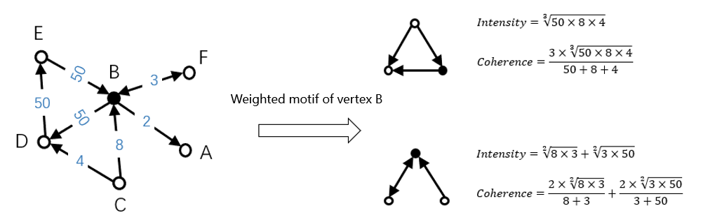

# Motif counting
## 1. Algorithm Introduction
Generally speaking, a motif type represents how a node is related to other nodes by distinguishing location and direction. The following figure shows the total 33 motif types, considering the computation complexity, we only consider motifs related to at most 3 nodes. After the number of each motif is obtained, a 33-d feature is formed. The motif feature represents a node's structural information comprehensively, which is useful in financial security or recommendation tasks. 


For weighted graph, the definition can be a little different. Here two ways of integrating edge's weights are presented: intensity and coherence, and only intensity is implemented for now.



## 2. Parameters
#### IO Params

- input：hdfs path for a graph, each row represents an edge in the form of `srcId | dstId | (weight)`
- output: hdfs path for output, each row represents the vertex and the motif feature, `srcId | motif feature`, the motif feature is represented as a string, for example, "1:1, 2:11, 3:4' means this vertex has 3 motif types in total, which are the first, the second and the third types, and the values are 1, 11, 4 respectively.
- sep: the separation in input file to separate the srcId and dstId, could be tab, space or comma
- isWeighted: whether the edges are weighted

#### Algo Params

- partitionNum：num of RDD partitions
- psPartitionNum：num of data partitions on ps
- storageLevel：RDD persist level，`DISK_ONLY`/`MEMORY_ONLY`/`MEMORY_AND_DISK`

## 3. Running

```
input=hdfs://my-hdfs/data
output=hdfs://my-hdfs/output

source ./spark-on-angel-env.sh
$SPARK_HOME/bin/spark-submit \
  --master yarn-cluster\
  --conf spark.ps.instances=1 \
  --conf spark.ps.cores=1 \
  --conf spark.ps.jars=$SONA_ANGEL_JARS \
  --conf spark.ps.memory=10g \
  --name "motif angel" \
  --jars $SONA_SPARK_JARS  \
  --driver-memory 5g \
  --num-executors 1 \
  --executor-cores 4 \
  --executor-memory 10g \
  --class org.apache.spark.angel.examples.graph.MotifExample \
  ../lib/spark-on-angel-examples-3.2.0.jar
  input:$input output:$output sep:tab storageLevel:MEMORY_ONLY isWeighted:true\
  partitionNum:4 psPartitionNum:1
```
