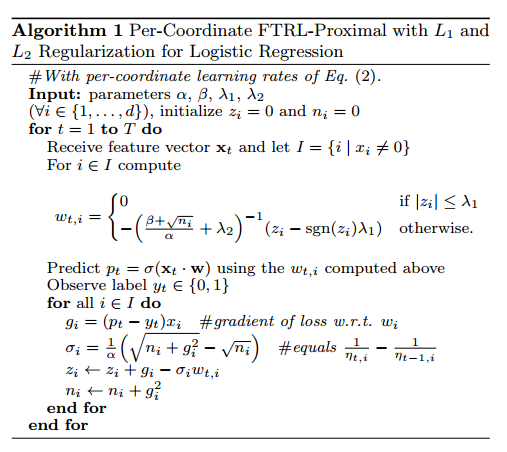
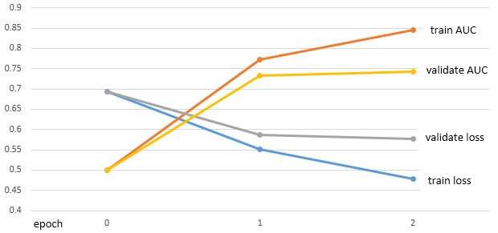

# [Spark on Angel] Sparse LR with FTRL

目前很多CTR预估的业务场景中，不仅训练样本规模达到10亿级别，而且特征的规模也达到十亿、百亿级别。
Google在2013年发表了FTRL（Follow-the-regularized-Leader）算法工程实现方法，FTRL在处理带非光滑正则项（如L1正则）的凸优化问题上表现非常出色，
不仅可以通过L1正则控制模型的稀疏度，而且收敛速度快；超大规模的训练集上有非常强的优势。

## 1. 算法原理

FTRL的理论基础请参考， [FTRL理论篇](../ftrl_lr_spark.md)

论文[1]中给出了FTRL-Proximal实现的伪代码：



## 2. Async mini-batch FTRL
原始的FTRL是针对于online learning的算法优化，属于Stochastic gradient descent(SGD)，
每次只用一个样本的梯度来更新模型。而离线全量规模的模型训练，若每次更新只用一个样本更新模型，会频繁地更新模型。
Spark on Angel中的模型向量是保存在Angel PS上，如频繁地更新PS会导致PS的流量压力。
Spark on Angel中的FTRL用mini-batch的方式更新模型，减少模型的更新次数；同时每个batch之间是异步的，
因此这是Async mini-batch FTRL。

核心代码如下：
```java
for ( epochId <- 0 until epoch) {
  val tempRDD = trainSet.mapPartitions { iter =>
    iter.toArray.sliding(batchSize, batchSize)
      .map { batch =>
        // ftrl.optimize会更新模型参数 Z 和 N
        ftrl.optimize(batch, calcGradientLoss)
      }
    }
  tempRDD.count()
}
```
一次RDD的`mapPartitions`操作完成一个epoch的更新；RDD `mapPartitions`内部分别划分成多个mini-batch同时更新。
因此一个epoch内的不同mini-batch是完全异步的。

Async mini-batch FTRL的优点
- 适用于所有的大规模离线优化场景
- mini-batch的更新方式，在保证收敛性的情况下，减少了模型更新次数
- 异步的更新方式，加快模型训练速度

## 3. 运行和性能评测

- 训练数据说明
  * 原始特征用MurmurHash3的方式，将特征id隐射到(Long.MinValue, Long.MaxValue)范围
  * 保存成One-Hot的数据格式

- 算法参数
  * lambda1：L1正则系数，参考值：10 ~ 15
  * lambda2：L2正则系数，参考值：10 ~ 15
  * alpha：FTRL参数，参考值：0.1
  * beta：FTRL参数，参考值：1.0
  * batchSize: mini-batch的大小，参考值：10000

- 性能评测
  * 数据集规
    - 3.5亿样本，17亿特征
  * 设置参数：
    - lambda1 = 15，lambda2 = 15， alpha = 0.1， beta = 1.0
  * 资源参数：
    - 200个Spark Executors (30G RAM, 2 core)
    - 50个Angel PS (20G RAM, 8 core)
  * 收敛性
  
  `model nnz`是指训练得到模型向量的非零值数目（nnz = number of non-zero），作为评估模型的稀疏度的一个重要指标，
  modelNnz(epoch=1) = 22 million, modelNnz(epoch=2) = 69 million。  
  综合上述所有模型指标，模型训练一个epoch时，模型就达到一个可用的状态。

  * 耗时
    - 每个epoch训练耗时：8.7 min
    - 包括数据加载耗时，整个模型训练只需要20 min

## References
[1] H. Brendan McMahan, Gary Holt, D. Sculley, Michael Young, Dietmar Ebner, Julian Grady, Lan Nie, Todd Phillips, Eugene Davydov, Daniel Golovin, Sharat Chikkerur, Dan Liu, Martin Wattenberg, Arnar Mar Hrafnkelsson, Tom Boulos, Jeremy Kubica, Ad Click Prediction: a View from the Trenches, Proceedings of the 19th ACM SIGKDD International Conference on Knowledge Discovery and Data Mining (KDD) (2013)
