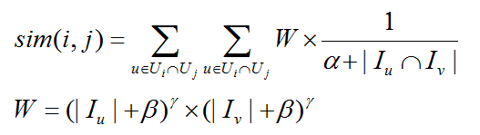

# Swing
## 1. 算法介绍
Swing是一个利用用户行为计算item与item之间的相似度的算法，通常用于推荐召回。其基本原理是，如果两个用户的共同关联item越少，则这些item之间的相似度越高，具体计算公式见下图。其中，其中Ui表示购买了item_i的用户集合，Uj表示购买了item_j的用户集合，Iu表示用户u购买的item集合，Iv表示用户V购买的item集合。gamma通常的取值范围为[-1, 0]，beta和gamma参数是对两条购买记录长度的惩罚。



## 2. 运行
#### 算法IO参数

- input：输入二部图graph，hdfs路径，不带权。每行表示一条边： `userId itemId`，得到的是item之间的相似度
- output: 输出，hdfs路径。每行表示一对item及其相似度：`itemId itemId score`
- sep: 分隔符，输入中每条边的起始顶点、目标顶点之间的分隔符: `tab`, `空格`等

#### 算法参数

- topFrom: 将item按出现次数由大到小排序后，仅计算排名在 [topFrom, topTo)之间的item与其他所有item的相似度，适用于计算尾部商品之间的相似度
- topTo: 参见topFrom解释
- alpha: 参见公式及算法介绍，默认为0
- beta: 参见公式及算法介绍，默认为5
- gamma: 参见公式及算法介绍，默认为-0.3
- partitionNum：数据分区数，spark rdd数据的分区数量
- psPartitionNum：参数服务器上模型的分区数量
- useBalancePartition：参数服务器对输入数据节点存储划分是否均衡分区，如果输入节点的索引不是均匀的话建议选择是
- storageLevel：RDD存储级别，`DISK_ONLY`/`MEMORY_ONLY`/`MEMORY_AND_DISK`

#### 资源参数

- ps个数和内存大小：ps.instance与ps.memory的乘积是ps总的配置内存。对于swing来说，ps上存储的是邻接表，内存大小可以按照边数进行估算。为了保证Angel不挂掉，需要配置ps上数据存储量大小两倍左右的内存。
- Spark的资源配置：num-executors与executor-memory的乘积是executors总的配置内存，最好能存下2倍的输入数据。 如果内存紧张，1倍也是可以接受的，但是相对会慢一点。 比如说100亿的边集大概有160G大小， 20G * 20 的配置是足够的。 在资源实在紧张的情况下， 尝试加大分区数目！

#### 任务提交示例

```
input=hdfs://my-hdfs/data
output=hdfs://my-hdfs/output

source ./spark-on-angel-env.sh
$SPARK_HOME/bin/spark-submit \
  --master yarn-cluster\
  --conf spark.ps.instances=1 \
  --conf spark.ps.cores=1 \
  --conf spark.ps.jars=$SONA_ANGEL_JARS \
  --conf spark.ps.memory=10g \
  --name "swing angel" \
  --jars $SONA_SPARK_JARS  \
  --driver-memory 5g \
  --num-executors 1 \
  --executor-cores 4 \
  --executor-memory 10g \
  --class org.apache.spark.angel.examples.graph.SwingExample \
  ../lib/spark-on-angel-examples-3.2.0.jar
  input:$input output:$output sep:tab storageLevel:MEMORY_ONLY useBalancePartition:true \
  partitionNum:4 psPartitionNum:1
```

#### 常见问题
- 在差不多10min的时候，任务挂掉： 很可能的原因是angel申请不到资源！由于HIndex基于Spark On Angel开发，实际上涉及到Spark和Angel两个系统，在向Yarn申请资源时是独立进行的。 在Spark任务拉起之后，由Spark向Yarn提交Angel的任务，如果不能在给定时间内申请到资源，就会报超时错误，任务挂掉！ 解决方案是： 1）确认资源池有足够的资源 2） 添加spakr conf: spark.hadoop.angel.am.appstate.timeout.ms=xxx 调大超时时间，默认值为600000，也就是10分钟

