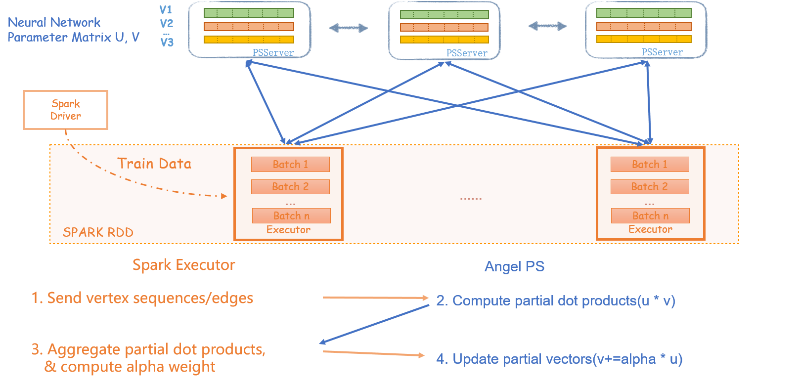

# Word2Vec

>  The Word2Vec algorithm is one of the well-known algorithms in the NLP field. It can learn the vector representation of words from text data and serve as input to other NLP algorithms.

##  Algorithm Introduction

The original intention of developing the Word2Vec module is to implement another commonly used Network Embedding algorithm, the Node2Vec algorithm. The Node2Vec algorithm is divided into two phases:

1. Random walk around the network
2. Use the Word2Vec algorithm

We only provide the implementation of the second phase  here. 

## Distributed Implemention

The  Word2Vec algorithm used for Network Embedding needs to handle network with billion nodes.  We implement  the SkipGram model with negative sampling optimization according to  Yahoo's paper[[1]](https://arxiv.org/abs/1606.08495)

## Running
### Algorithm IO parameters
  - input: hdfs path, random walks out of the sentences, word need to be consecutively numbered from 0, separated by white space or comma, such as:
          0 1 3 5 9
          2 1 5 1 7
          3 1 4 2 8
          3 2 5 1 3
          4 1 2 9 4
  - modelPath: hdfs path, the final model save path is hdfs:///.../epoch_checkpoint_x, where x represents the xth round epoch
  - modelCPInterval: save the model every few rounds of epoch
### Algorithm parameters
  - vectorDim: The embedded vector space dimension, which is the vector dimension of the embedding vector and the context 
  - netSample: the number of negative samples
  - learningRate: The learning rate of the batch gradient decent
  - BatchSize: the size of each mini batch
  - maxEpoch: the number of rounds used by the sample(the samples will be shuffled after each round)
  - window: the size of the trained window