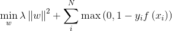
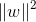
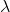
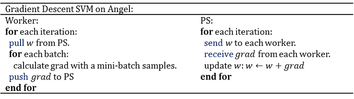

# Support Vector Machine (SVM)

> SVM is used for classification and regression analysis. 

## 1. Introduction
SVM solves the following optimization problem: 

where

is the regularization term;

is the regularization coefficient;
 is the hinge loss as visualized below:  

## 2. Distributed Implementation on Angel
Angel MLLib uses mini-batch gradient descent optimization method for solving SVM's objective; the algorithm is shown below: 

## 3. Execution and Performance
### Input Format

* Data fromat is set in "ml.data.type", supporting "libsvm" and "dummy" types. For details, see [Angel Data Format](data_format_en.md)

* Feature vector's dimension is set in "ml.feature.num"

### Parameters
* Algorithm Parameters
  * ml.epoch.num: number of epochs
  * ml.batch.sample.ratio: sampling rate for each epoch
  * ml.num.update.per.epoch: number of mini-batches in each epoch
  * ml.data.validate.ratio: proportion of data used for validation, no validation when set to 0
  * ml.learn.rate: initial learning rate
  * ml.learn.decay: decay rate of the learning rate
  * ml.svm.reg.l2: coefficient of the L2 penalty

* I/O Parameters
  * angel.train.data.path: input path for train
  * angel.predict.data.path: input path for predict
  * ml.feature.num: number of features
  * ml.data.type: [Angel Data Format](data_format_en.md), supporting "dummy" and "libsvm" 
  * angel.save.model.path: save path for trained model
  * angel.predict.out.path: output path for predict
  * angel.log.path: save path for the log
 
* Resource Parameters
  * angel.workergroup.number: number of workers
  * angel.worker.memory.mb: worker's memory requested in G
  * angel.worker.task.number: number of tasks on each worker, default is 1
  * angel.ps.number: number of PS
  * angel.ps.memory.mb: PS's memory requested in G

### Performance 
