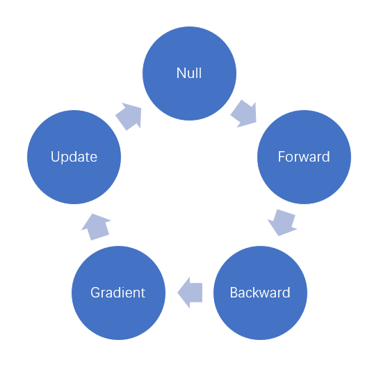

# Computational graph in Angel

## 1. What is a computational graph?
Computational graph are commonly used in mainstream deep learning frameworks, such as Tensorflow, Caffe and Maxnet. In fact, large data processing tools such as Spark also use computational graph to schedule tasks. In order to better support deep learning algorithms, Angel also supports computational graph. Angel's computational graph are lighter than Tensorflow's. The main manifestations are as follows:
- **Coarse Granularity**: The 'node' in Angel's calculation graph is layer, not `operator. Tensorflow and so on use `operation` as the node in the graph, which is very flexible and suitable for secondary development (package), but also It gives the machine learning and development developers a steeper learning curve and a larger workload, so the old version of Tensorflow has also been criticized as "API too low-level, low development efficiency", and later Tensorflow version provides layer-based (layer High-level API. Given this, Angel only provides coarse-grained computational graphs.
- **Feature Intersection**: For recommended system-related algorithms, the characteristics of Embedding often have to pass some crossovers (**Note**: the feature intersection here is different from the artificial intersection in the feature engineering, where the feature intersection is performed by the output of Embedding). Then enter DNN. These feature intersections are more cumbersome on Tensorflow, Caffe, Torch, etc., and this feature cross layer is directly provided on Angel.
- **Automatic Generation Network**: Angel can read the Json file to generate a deep network. This is a reference to Caffe, users can generate their own network without writing code, greatly reducing the workload.

It should be pointed out that Angel does not currently support CNN, RNN, etc., and only focuses on commonly used algorithms in the recommended field.

## 2. Construction of Computational Graph            

### 2.1 Basic Structure of Layer
To understand how a computational graph is constructed, you first need to understand the structure of its constituent element, Layer (for more detailed information on layers, refer to [Layer in Angel](./layers_on_angel.md).) as follows:
```scala
abstract class Layer(val name: String, val outputDim: Int)(implicit val graph: AngelGraph)
  extends Serializable {
  var status: STATUS.Value = STATUS.Null
  val input = new ListBuffer[Layer]()
  val consumer = new ListBuffer[Layer]()

  def addInput(layer: Layer): Unit = {
    input.append(layer)
  }

  def addConsumer(layer: Layer): Unit = {
    consumer.append(layer)
  }

  def calOutput(): Matrix = ???

  def gatherGrad(): Matrix = ???
}
```
This abstract class has a clear description of most of the layers, as follows:
- status: The nodes in the Angel calculation graph are stateful and are processed by a state machine, as described in the next section.
- input: Used to record the input of this node/layer, represented by a ListBuffer, a layer can have multiple input layers, you can call addInput(layer: Layer) multiple times.
- outputDim: There can only be one output in Angel, and outputDim is used to specify the dimension of the output
- consumer: Layer has only one output, but the output node can be consumed many times, so it is represented by ListBuffer. When building a graph, call the addConsumer (layer: Layer) of the input layer to tell which layers of the output layer consume it.

In fact, the specific operation of building a graph has been completed in the base class of inputlayer/linearlayer/joinlayer. User-defined layers need not be concerned, as follows:
```scala
abstract class InputLayer(name: String, outputDim: Int)(implicit graph: AngelGraph)
  extends Layer(name, outputDim)(graph) {
  graph.addInput(this)

  def calBackward(): Matrix
}

abstract class JoinLayer(name: String, outputDim: Int, val inputLayers: Array[Layer])(implicit graph: AngelGraph)
  extends Layer(name, outputDim)(graph) {
  inputLayers.foreach { layer =>
    layer.addConsumer(this)
    this.addInput(layer)
  }

  def calGradOutput(idx: Int): Matrix
}

abstract class LinearLayer(name: String, outputDim: Int, val inputLayer: Layer)(implicit graph: AngelGraph)
  extends Layer(name, outputDim)(graph) {
  inputLayer.addConsumer(this)
  this.addInput(inputLayer)

  def calGradOutput(): Matrix
}
```
Note: LossLayer is a special Linear Layer, so it is not given here.

### 2.2 The Basic Structure of AngelGraph
A complex graph is constructed by input/consumer. Although the graph can be traversed from any node in the graph, verge nodes are stored in AngelGraph for convenience. It is easy to operate the graph as follows:
```scala
class AngelGraph(val placeHolder: PlaceHolder, val conf: SharedConf) extends Serializable {

  def this(placeHolder: PlaceHolder) = this(placeHolder, SharedConf.get())

  private val inputLayers = new ListBuffer[InputLayer]()
  private var lossLayer: LossLayer = _
  private val trainableLayer = new ListBuffer[Trainable]()

  
  def addInput(layer: InputLayer): Unit = {
    inputLayers.append(layer)
  }

  def setOutput(layer: LossLayer): Unit = {
    lossLayer = layer
  }

  def getOutputLayer: LossLayer = {
    lossLayer
  }

  def addTrainable(layer: Trainable): Unit = {
    trainableLayer.append(layer)
  }

  def getTrainable: ListBuffer[Trainable] = {
    trainableLayer
 }
```
Verge has two major categories:
- inputLayer: The input of this type of node is data. The storage of such nodes in AngelGraph is convenient for reverse calculation. Just call the input layer's `calBackward`. In order to add inputLayer, Angel requires all inputLayer to call AngelGraph's addInput method to add itself to AngelGraph. In fact, this has been done in the base class of InputLayer, the user added inputLayer does not have to care about this.
- lossLayer: Angel does not support multitasking at present, so there is only one lossLayer. This kind of node is mainly convenient for forward calculation. Just call its `predict` or `calOutput`. Since losslayer is a subclass of linearlayer, user-defined lossLayer can be used. Manually call `setOutput(layer: LossLayer)`, but there are not many opportunities for users to add a losslayer. More is to add lossfunc.

With inputLayers, lossLayer, it is very convenient to traverse the graph from AngelGraph. The forward calculation only needs to call the losslayer's `predict` method, and the reverse calculation just calls the input layer's `calBackward`. However, the gradient calculation, the parameter update is inconvenient, in order to facilitate the parameters, AngelGraph added a trainableLayer variable to hold the layer with parameters.

## 2.3 Data entry: PlaceHolder
The layer's input/consumer is used to construct the edge of the graph (the relationship of nodes). The special node (inputlayer/losslayer/trainablelayer) is saved in AngelGraph for forward and backward calculation and parameter update. How is the final data input? -- by PlaceHolder

The PlaceHolder in Angel is passed to the Graph in the construction of AngelGraph, and the Graph is passed to the Layer as an implicit parameter, so the placeholder (data) can be accessed in all Layers.

Currently, only one PlaceHolder is allowed in Angel. This restriction will be removed in the future, allowing multiple data inputs. PlaceHolder only stores one mini-batch data. The main methods are as follows:
```scala
class PlaceHolder(val conf: SharedConf) extends Serializable {
    def feedData(data: Array[LabeledData]): Unit
    def getFeats: Matrix
    def getLabel: Matrix
    def getBatchSize: Int
    def getFeatDim: Long
    def getIndices: Vector
}
```
After the data of the Array[LabeledData] type is given to the placeholder by `feedData`, it can be obtained from it:
- feature
- feature dimension
- label
- batchSize
- feature index


## 3. The operation principle of the calculation graph in Angel
The topology of the calculation graph was built in the previous section. This section describes how it works.

### 3.1 Running state machine
Angel's state machine has the following states:
- Null: Initial state, the Graph will be placed in this state after each feedData.
- Forward: This state indicates that the forward calculation is complete.
- Backward: This state indicates that the backward calculation has been completed, but the gradient of the parameter has not yet been calculated.
- Gradient: This state indicates that the gradient has been calculated and the gradient has been pushed onto the PS.
- Update: This state indicates that the model update is complete.

These states are in turn, as shown in the following figure:



The introduction of state machine mainly guarantees the sequential operation and reduces repetitive calculation. For example, multiple layers consume the output of the same layer. When calculating, the state can be judged based on the state, as long as it is calculated once. The state machine is embodied in the code as follows:
```scala
def feedData(data: Array[LabeledData]): Unit = {
    deepFirstDown(lossLayer.asInstanceOf[Layer])(
        (lay: Layer) => lay.status != STATUS.Null,
        (lay: Layer) => lay.status = STATUS.Null
    )

    placeHolder.feedData(data)
}

override def calOutput(): Matrix = {
    status match {
        case STATUS.Null =>
        // do come forward calculation
        status = STATUS.Forward
        case _ =>
    }
    output
}


override def calBackward(): Matrix = {
    status match {
        case STATUS.Forward =>
        val gradTemp = gatherGrad()
        // do backward calculation
        status = STATUS.Backward
        case _ =>
    }

    backward
}

override def pushGradient(): Unit = {
    status match {
        case STATUS.Backward =>
        // calculate gradient and push to PS
        status = STATUS.Gradient
        case _ =>
    }
}

override def update(epoch: Int = 0): Unit = {
    status match {
        case STATUS.Gradient =>
        optimizer.update(weightId, 1, epoch)
        status = STATUS.Update
        case _ => 
        throw new AngelException("STATUS Error, please calculate Gradient frist!")
    }
}
```

### 3.2 The Training Process of Graph in Angel
The specific code is `GraphLearner', which gives the framework.
```scala
def trainOneEpoch(epoch: Int, iter: Iterator[Array[LabeledData]], numBatch: Int): Double = {
    var batchCount: Int = 0
    var loss: Double = 0.0
    while (iter.hasNext) {
      graph.feedData(iter.next())
      graph.pullParams()
      loss = graph.calLoss() // forward
      graph.calBackward() // backward
      graph.pushGradient() // pushgrad
      PSAgentContext.get().barrier(ctx.getTaskId.getIndex)
      if (ctx.getTaskId.getIndex == 0) {
        graph.update(epoch * numBatch + batchCount) // update parameters on PS
      }
      PSAgentContext.get().barrier(ctx.getTaskId.getIndex)
      batchCount += 1

      LOG.info(s"epoch $epoch batch $batchCount is finished!")
    }

    loss
  }
```
Proceed as follows:
- feedData: This process will set the state of the Graph to Null
- Pull parameter: According to the data, only the parameters needed for the current mini-batch calculation are pulled, so Angel can train very high-dimensional models.
- Forward calculation: Starting with Losslayer, the `calOutput'method of its inputlayer is invoked cascadely, and output is calculated in turn. After calculation, its state is set to `forward'. For the case where the state is `forward', the result of the last calculation is returned directly, so as to avoid repeated calculation.
- Backward Computation: Inputlayer of Graph is called sequentially, so that the `CalGradOutput'method of the first layer is cascaded to complete backward calculation. After calculation, the state of Graph is set to `backward'. If the state is `backward', the result of the last calculation is returned directly, thus avoiding repeated calculation.
- Gradient calculation and updating: In this step, the gradient of parameters can be calculated by calling `pushGradient'of `trainable'. This method calculates the gradient first, then pushes the gradient onto PS, and finally sets the state to `gradient'.`
- Gradient Updating: Gradient updates are performed on the PS, as long as a gradient-updated PSF is sent, so only one Workor is required to send it (in Spark on Angel via the Driver). Different optimizers are updated differently, in Angel. The core essence of the optimizer is a PSF. Before the parameter update, a synchronization is required to ensure that all gradients are pushed and completed. The parameter update is also done once, ensuring that all the parameters pulled by the worker are up-to-date and will be set to `update`.