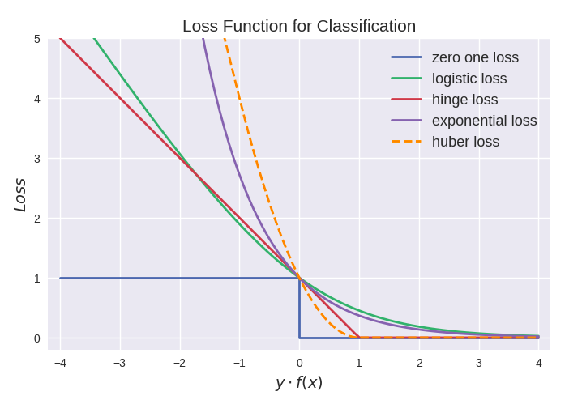
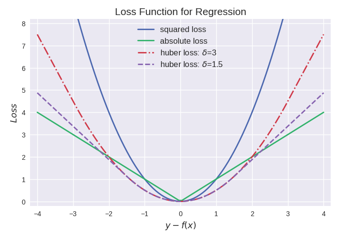

# Loss function in Angel

## 1. Loss function in Angel
There are a lot of loss functons in Angel, which can be classified into two categories
- Classification loss function
- Regression loss function

Classification loss function can be shown in the following table:

name|expression|description
---|---|---
CrossEntoryLoss| }) | is used for classification, logistic regression is a special case and can also be used for multi-class Softmax, which requires input to be a probability.), rather than )
LogLoss| }\)}) |is used fFor classification, it is the loss function of logistic regression, which can be regarded as a special column of CrossEntoryLoss function, which is embodied by Sigmoid)
SoftmaxLoss| \log\frac{x^{x_i}}{\sum_je^{x_j}}) | It is a special form of CrossEntoryLoss, which is embodied in the way of Softmax)
HingeLoss| \)}) | loss function of SVM 

Graphically represented as follows:



The regression loss function is shown in the following table

name|expression|description
---|---|---
L2Loss | \|_2^2) | is used for regression, and is the loss function of least squares regression
HuberLoss | -\frac{\delta}{2}\),&abs(x)>\delta\\\\\frac{1}{2}x^2,&abs(x)\le\delta\end{array}\right.) | is used for regression, and it uses a quadratic function near 0, and uses a function once in other places to solve the problem that the absolute value function is non-differentiable around 0. The model obtained by Huber loss is more robust.

Graphically represented as follows:



## 2. implementation of Loss in Angel
loss in angel all implement LossFunc Trait, as follows:
```scala
trait LossFunc extends Serializable {
  def calLoss(modelOut: Matrix, graph: AngelGraph): Double

  def loss(pred: Double, label: Double): Double

  def calGrad(modelOut: Matrix, graph: AngelGraph): Matrix

  def predict(modelOut: Matrix): Matrix
}
```
It can be seen that the loss in angel not only has the function of calculating loss, but also the functions of `calculating gradient` and `predicting. It is precisely because of the gradient calculation implemented in Loss that the reverse conduction has a starting point. In LossLayer Calculating the gradient is to call the calGrad of lossFunc directly, as follows:
```scala
  override def calGradOutput(): Matrix = {
    val start = System.currentTimeMillis()
    status match {
        gradOutput = lossFunc.calGrad(output, graph)
        status = STATUS.Backward
      case _ =>
    }
    val end = System.currentTimeMillis()
    gradOutput
  }
```
Another function is `prediction`. Calculating the predicted value in LossLayer is directly calling the predict of lossFunc, as follows:
```scala
  override def predict(): Matrix = {
    status match {
      case STATUS.Null =>
        calOutput()
      case _ =>
    }

    lossFunc.predict(output)
  }
```

## 3. Json of Loss Function
### 3.1 Loss function without parameters
In addition to huberloss, the other lossfunc is a lossless function with no parameters. There are two expressions, as follows
```json
"lossfunc": "logloss"

"lossfunc": {
    "type": "logloss"
} 
```

### 3.2 Loss function of parameter 
Only huberloss, as follows:
```json
"lossfunc": {
    "type": "huberloss",
    "delta": 0.1
}
```
