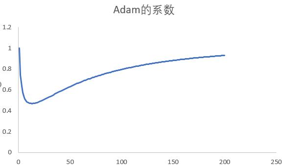

# Optimizer in Angel

There are many optimization methods for machine learning, but in the big data scenario, the most used method is a series of methods based on SGD. In Angel, only a small number of optimization methods are implemented, as follows:
- Methods based on stochastic gradient descent
    - SDG: here is mini-batch SGD (mini-batch Stochastic gradient descent)
    - Momentum: SGD with momentum
    - AdaGrad: SGD with Hessian diagonal approximation
    - AdaDelta: 
    - Adam: SGD with momentum and diagonal Hessian approximation
- Online learning method
    - FTRL: Follow The Regularized Leader, an online learining method


## 1. SGD
The update equation for SGD is as follows:


where, is learning rate. Using SGD can add  Regularization, the actual optimization is based on PGD(proximal gradient descent). 

There are two kinds of json expressions, as follows:
```json
"optimizer": "sgd",

"optimizer": {
    "type": "sgd",
    "reg1": 0.01,
    "reg2": 0.02
}
```

## 2. Momentum
Momentum's update formula is as follows:


where, is momentum factor, is learning rate. Besides, Momentum can be added  regularization. The default optimization method in Angel is Momentum.

There are two types of json expressions, as follows:
```json
"optimizer": "momentum",

"optimizer": {
    "type": "momentum",
    "momentum": 0.9,
    "reg2": 0.01
}
```

## 3. AdaGrad
The update formula for AdaGrad (here is the exponential smoothing version, ie RMSprop) is as follows:

g_{t}^2)


where, is smoothing factor, is learning rate. Besides, AdaGrad can be added regularization.

There are two types of json expressions, as follows:
```json
"optimizer": "adagrad",

"optimizer": {
    "type": "adagrad",
    "beta": 0.9,
    "reg1": 0.01,
    "reg2": 0.01
}
```

## 4. AdaDelta
The update formula for AdaDelta (here is the exponential smoothing version, ie RMSprop) is as follows:

g_{t}^2)


\Delta%20\theta_{t}^2)


where, is smoothing factor. AdaDelta can be added  regularization.

There are two types of json expressions, as follows:
```json
"optimizer": "adadelta",

"optimizer": {
    "type": "adadelta",
    "alpha": 0.9,
    "beta": 0.9,
    "reg1": 0.01,
    "reg2": 0.01
}
```

## 5. Adam
Adam is a good optimization method, update fomula is:

\Delta\bold{x}_t\\\\\\bold{v}_t&=\gamma\bold{v}_{t-1}+(1-\gamma)\Delta\bold{x}^2_t\\\\\bold{x}_t&=\gamma\bold{x}_{t-1}-\eta\frac{\sqrt{1-\gamma^t}}{1-\beta^t}\frac{\bold{m}_t}{\sqrt{\bold{v}_t}+\epsilon}\\%20\end{array})

where, is the exponential smoothing of gradient, which is momentum,  is the exponential smoothing of gradient, Can be seen as a diagonal approximation of Hessian. In default cases , note

=\frac{\sqrt{1-\gamma^t}}{1-\beta^t})

)Is a function with an initial value of 1, and a limit of 1, the intermediate process is first reduced and then increased, as shown below:


That is, in the initial stage of optimization, the gradient is larger, the learning rate is appropriately reduced, and the gradient is reduced and smoothed. In the final stage of optimization, the gradient is small, and appropriately increasing the learning rate helps to jump out of the local optimum.

There are two types of json expressions, as follows:
```json
"optimizer": "adam",

"optimizer": {
    "type": "adam",
    "beta": 0.9,
    "gamma": 0.99,
    "reg2": 0.01
}
```

## 6. FTRL
FTRL is an online learning algorithm whose goal is to optimize the regret bound. It can be proved to be effective under some conditions of learning rate attenuation.

Another feature of FTRL is that it can get very sparse solutions, which is better than PGD (proximal gradient descent) and better than other online learning algorithms, such as FOBOS, RDA, etc.

The algorithm flow of FTRL is as follows:


There are two types of json expressions, as follows:
```json
"optimizer": "ftrl",

"optimizer": {
    "type": "ftrl",
    "alpha": 0.1,
    "beta": 1.0,
    "reg1": 0.01,
    "reg2": 0.01
}
```
ps: are a regularization parameters, corresponding to "reg1, reg2" in json

**some tips:** 

For the deep and wide algorithm, in principle, it is necessary to ensure that the convergence speed of the two sides is not too different.
- The wide part optimizer uses FTRL because FTRL converges relatively slowly, so that it is trained by the depth side.. 
- The deep part optimizer uses Adam because Adam converges relatively quickly. Although the deep side uses the fast convergence optimizer, his parameters are too many.

For the FTRL optimizer, it is designed for online learning. In order to ensure the stability of the model, the amplitude of each update is very small. In the online learning environment, the data is one by one or a small batch and a small batch, in theory, should not Let the small amount of data modify the model too mush. So in the FTRL algorithm, the batch size can not be too large, preferably less than 10000 data..

Different optimizer convergence speed comparison: FTRL < SGD < Momentum < AdaGrad ~ AdaDelta < Adam

Since AdaGrad, AdaDelta, and Adam introduce Hessian diagonal approximations, they can have larger batches to ensure the accuracy of gradients and Hessian diagonal matrices. For simpler first-order optimizers such as FTRL, SGD, and Momentum, they need more iterations, so the batch size can't be too big. So there is: 
BatchSize(FTRL) < BatchSize(SGD) < BatchSize(Momentum) < BatchSize(AdaGrad) ~ BatchSize(AdaDelta) < BatchSize(Adam)

Regarding the learning rate, you can start from 1.0 and increase or decrease in an exponential manner (base 2 or 0.5). You can use the learning curve for early stop. But there are the following principles: SGD, Momentum can use a relatively large learning rate, AdaGrad , AdaDelta, Adam is more sensitive to learning rate, generally speaking less than SGD, Momentum, can start from half of SGD, Momentum learning rate

About Decay, if epoch is less, decay should not be too large. Generally use standard decay, AdaGrad, AdaDelta, Adam use WarnRestarts

About regularization. Currently FTRL, SGD, AdaGrad, AdaDelta support L1/L2 regularity, Momentum, Adam only supports L2 regularity. It is recommended to start from no regularization, then add regularization.


**For the derivation of adding L1 regularization, please refer to**[optimizer](./optimizer.pdf)
