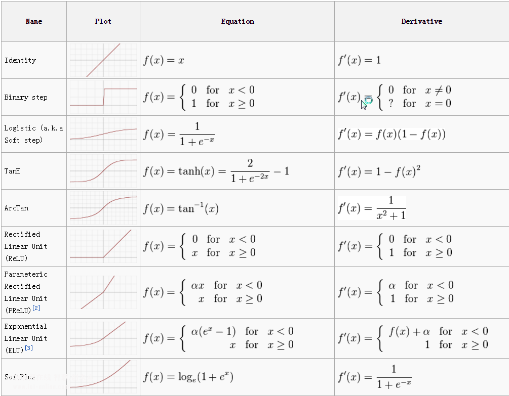

# Transfer function in Angel

## 1. Transfer function in Angel:
name| expression| description
---|---|---
Sigmoid |  | turn any real number into probability
tanh |  | turn any real number into a number between -1 and 1
relu | ) | discard the negative part
dropout | %20<%20\eta) | randomly set to 0
identity|  | original output
The following figure shows some common transfer functions (some not available in Angels):


## 2. The json representation of the transfer function
### 2.1 transfer function without parameters
```json
"transfunc": "sigmoid",

"transfunc": {
    "type": "tanh"
}
```

### 2.2 transfer function with parameters
```json
"transfunc": "dropout",

"transfunc": {
    "type": "dropout",
    "proba": 0.5,
    "actiontype": "train"
}
```

ps: Since the dropout transfer function in training and testing (prediction) is not calculated in the same way, it is necessary to use actiontype to indicate the type of scene, train/inctrain, predict.