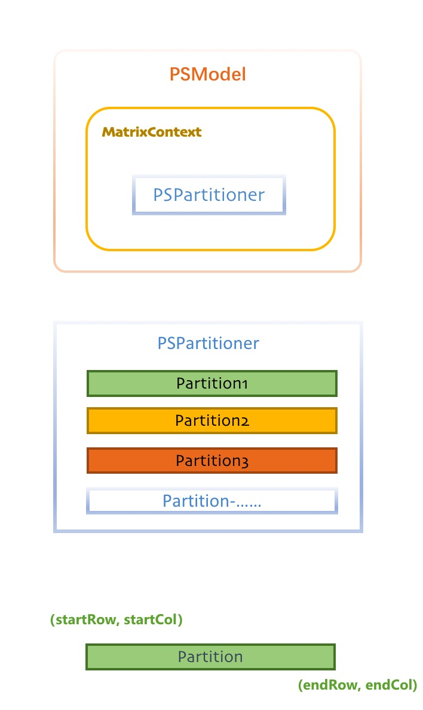

# Model Partitioner

---

In order to support massively complex models (wide or deep), Angel needs to partition the model parameters and store them on multiple PSServer nodes, and provide convenient access to the service. This is the essence, and one fundamental functionality, of Parameter Server.

Model partitioning is a common engineering problem that deserves extra attention in designing a parameter server, as different partitioning methods can result in different computing performance. We believe that a good partitioning should reflect the following aspects:

 * Balancing the PS loads
 * Reducing single-point bottlenecks
 * Keep related data on the same PS

In practice, the specific partitioning method depends on the machine-learning algorithm itself and how it is implemented. Angel provides the default partitioning algorithm to satisfy general requirements, as well as customized partitioning to satisfy special requirements.  

## Overall Design

The following chart shows the overall design of Angel's model partitioner:




Please note that:

1. `PSModel` should be the entry point of your operations
2. Default partitioner class is `PSPartitioner`, but it can be replaced
3. Partition is the smallest unit; each partition corresponds to a specific Model Shard on PSServer

During the model loading stage, PSServer will start up model shard depending on the partitioner that is passed to it. As a result, the design of model partitioner, together with actual runtime data, will affect how the model is distributed and will behave on PSServer. 

## Default Partitioner (RangePartitioner)

`RangePartitioner` partitions the model using model's index range, i.e., divides the index range into non-coincident intervals. With this strategy, Angel can quickly figure out which interval the required part of the model falls in when dividing requests from the application layer.

In Angel, models are represented by Martrix. If the partitioning parameters/method are not configured for the application, Angel will use the default partitioning algorithm, which obeys the following principles to the fullest extent:

- Equal distribution of a model to all PS nodes
- For very small model, allocate the entire matrix on one PS node
- For model (matrix) with multiple rows, allocate the same row on the same PS node
	
## Customized Partitioner 

Some complex algorithms can benefit from customized model partitioning, thus Angel supports user-defined matrix partitioning in two different ways:

1. **Simple method: when defining `PSModel`, passing `blockRow` and `blockCol`**

	```Scala

	val sketch = PSModel[TDoubleVector](modelName, sampleNum, featNum, blockRow, blockCol)

	```

   This method gives user easy control over the partition size, though lacking flexibility. 

2. **Advanced method: user-defined partitioner**


   There will always be various needs in model partitioning to suit complex algorithms, such as: 

	* different request frequencies for different parts of the matrix
	* partitions of unequal sizes
	* store partitions that are considered to be related on the same PS
	* ……

	To satisify these special needs, Angel provides an interface, `Partitioner`, for users to implement customized partitioning methods and inject them into `PSModel`, achieving the desired partitions. Note that `PSPartitioner` is just a default implementation of `Partitioner`. 

	`Partitioner` interface is defined as:

	``` java
	interface Partitioner {
	  /**
	   * Init matrix partitioner
	   * @param mContext matrix context
	   * @param conf
	   */
	  void init(MatrixContext mContext, Configuration conf);

	  /**
	   * Generate the partitions for the matrix
	   * @return the partitions for the matrix
	   */
	  List<MLProtos.Partition> getPartitions();

	  /**
	   * Assign a matrix partition to a parameter server
	   * @param partId matrix partition id
	   * @return parameter server index
	   */
	  int assignPartToServer(int partId);
	}

	```

	Users must implement two interfaces: `getPartitions` and `assignPartToServer`

	* `getPartitions` defines how to get the matrix partition list
	* `assignPartToServer` defines how to assign a partition to a PSServer


	We demonstrate how to customize partitioning through the `Partitioner` interface in the following example. Assuming a use-case where:

	* the model is a `3 * 10,000,000` matrix whose first row is most frequently requested; there are 8 PS

	We take the following partitioning strategy:
	
	* partitioning the first row to 4 pieces and distribute to 4 PS
	* partitioning any other row to 2 pieces and distribute to 2 PS

	The chart below visualizes the strategy:

	![][2]

	The default partitioning method cannot fulfill the request in this example where partitions need to be different in size. We customize a partitioner class, `CustomizedPartitioner`:

	```java
	public class CustomizedPartitioner implements Partitioner {
	   ……
	  @Override public List<MLProtos.Partition> getPartitions() {
	    List<MLProtos.Partition> partitions = new ArrayList<MLProtos.Partition>(6);
	    int row = mContext.getRowNum();
	    int col = mContext.getColNum();

	    int blockCol = col / 4;
	    int partitionId = 0;

	    // Split the first row to 4 partitions
	    for (int i = 0; i < 4; i++) {
	      if (i < 3) {
	        partitions.add(MLProtos.Partition.newBuilder().setMatrixId(mContext.getId())
	          .setPartitionId(partitionId++).setStartRow(0).setEndRow(1).setStartCol(i * blockCol)
	          .setEndCol((i + 1) * blockCol).build());
	      } else {
	        partitions.add(MLProtos.Partition.newBuilder().setMatrixId(mContext.getId())
	          .setPartitionId(partitionId++).setStartRow(0).setEndRow(1).setStartCol(i * blockCol)
	          .setEndCol(col).build());
	      }
	    }

	    blockCol = col / 2;
	    // Split other row to 2 partitions
	    for (int rowIndex = 1; rowIndex < row; rowIndex++) {
	      partitions.add(
	        MLProtos.Partition.newBuilder().setMatrixId(mContext.getId()).setPartitionId(partitionId++)
	          .setStartRow(rowIndex).setEndRow(rowIndex + 1).setStartCol(0).setEndCol(blockCol)
	          .build());
	      partitions.add(
	        MLProtos.Partition.newBuilder().setMatrixId(mContext.getId()).setPartitionId(partitionId++)
	          .setStartRow(rowIndex).setEndRow(rowIndex + 1).setStartCol(blockCol).setEndCol(col)
	          .build());
	    }

	    return partitions;
	  }
	……
	}
	```
	
	We inject the implemented `CustomizedPartitioner` into the `MatrixContext` method of `PSModel`, to complete the steps: 

	```java
		psModel.matrixCtx.setPartitioner(new CustomizedPartitioner());
	```

With the default and customized partitioning strategies, Angel is able to balance the tradeoff between convenience and flexibility, laying a foundation for efficiently running complex algorithms. 


[1]: ../img/matrix_partition.png
[2]: ../img/partitioner_example.png
