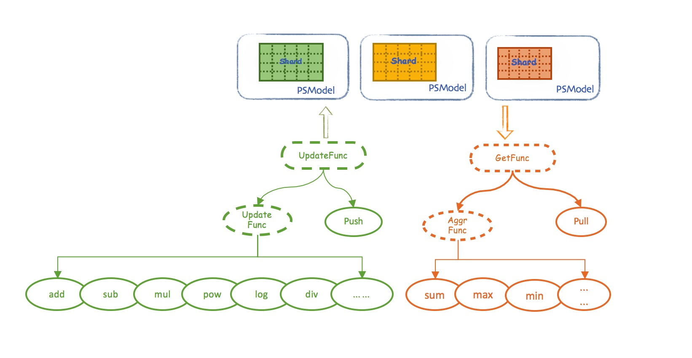

# psFunc (Parameter Server Func)

Normally, a standard parameter server provides the basic **pull** and **push** functions. But in practice it is not that simple, especially when the algorithm needs to implement some specific optimization mechanisms.

> For example, in some situations, an algorithm needs to get the maximum value of a row in the `model matrix`. If the PS system has only the basic pull interface, PSClient has to pull all the columns of this row back from the PS, and the worker calculates the maximum --- this approach generates a lot of network communication cost that will affect the performance. If we have a customized function, on the other hand, each PSServer can calculate a number of local maximums and exchange these values to decide on the overall maximum, returning a single value --- this approach reduces the communication overhead drastically while keeping the computation cost at the same level.

In order to solve these problems, Angel introduces and implements psFunc, which encapsulates and abstracts the process of requesting and updating the remote model. psFunc is one type of user-defined functions (UDF) yet closely related to the PS operations (thus its name **psFunc**, abbreviated as **psf**). The overall architecture is shown below:  

With the introduction of psFunc, some concrete computations can happen on the PSServer side; in another word, PSServer will no longer merely store the model, but also actually be in charge of model computations to certain extent. A sensible design of psFunc can significantly accelerate the algorithm's execution.  

It is worth mentioning that in many complex algorithm implementations, the introduction and strengthen of psFunc has greatly decreased the need of workers pulling back the entire model for overall calculations, indirectly realizing **model parallelization**.

## Types

Overall, there are two types of Angel psFunc:一the `get` type一and the `update` type. 

* [GetFunc](psf_get_en.md)
* [UpdateFunc](psf_update_en.md)

PSF can be either the **Worker-to-PSServer** type or the **PSServer-to-PSServer** type, depending on the interactive parties in data exchanging. 

* Worker-to-PSServer refers to the type where computations are done using data on the worker and the PSServer, such as push, pull, e.g. pushing a local vector on the worker to the PS, or pulling a row on the PS to the worker

* PSServer-to-PSServer refers to the type where computations occur between rows within a matrix on the PSServer, such as add, copy, e.g. adding two rows in the matrix and saving the sum to a new row, or copying a row to a new row.
