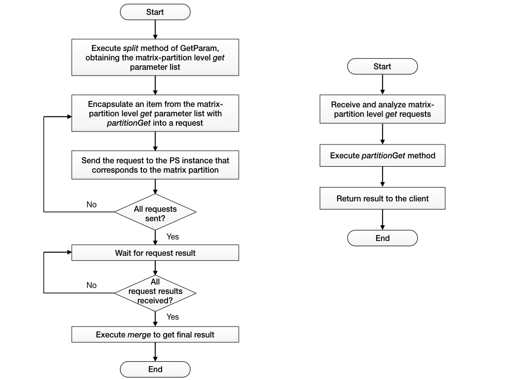

# GetFunc

## Principles

1. **Dividing the Request**

	The parameter server interface manipulates the **entire model parameters**, where the model parameters are divided into multiple partitions stored on different PS instances; therefore, division needs to be done as early as the request stage.

	* PS Client divides the request and generates a request list, where **every request corresponds to a model parameter partition**

2. **Sending the Request**
	* Angel sends every request in the request list to the PSServer with the corresponding model parameter partition
	* Each PSServer gets and updates parameters in units of model parameter partitions and returns the result

3. **Merging the Results**
	* All results at the model partition level are merged to get the final result, which is then returned

## Definition

* **Interface**

	```Java
	GetResult get(GetFunc get) throws AngelException;
	```

* **Parameters**
	* The parameter type of the get type psFunc is a GetFunc object, which encapsulates the parameters and the process of the `get psf` method:

		```Java
		public abstract class GetFunc {
		  protected final GetParam param;
		  public GetFunc(GetParam param) {
		    this.param = param;
		  }
		  public GetParam getParam() {return param;}
		  public abstract PartitionGetResult partitionGet(PartitionGetParam partParam);
		  public abstract GetResult merge(List<PartitionGetResult> partResults);
		}
		```

	* The parameter type of a GetFunc object is GetParam
		* GetParam implements ParamSplit interface. ParamSplit interface defines a split method, which divides the overall parameters that correspond to the entire matrix to a list of parameters corresponding to the matrix partitions
		* GetParam type provides a default split interface implementation: create a parameter for every matrix partition
		* The matrix partition parameter for `get psf` is PartitionGetParam type


## Execution Process

`Get` type psFunc executes in two steps, represented by the `partitionGet` and `merge` methods, respectively.

* `partitionGet` defines the specific process of getting results from a matrix partition; return type is PartitionGetResult
* `merge` defines the process of merging results from all matrix partitions to obtain the final result; return type is GetResult

The two steps above need to be done on the worker side and PSServer side, respectively:

* **Parameter partitioning and `merge`** done on the worker side
* **partitionGet** done on the PS side

The specific process is shown in the following charts. The one on the left shows the worker-side process, and the one on the right shows the PS-side process:





## Code Example

Since the getFunc interface is low-level, we recommend users to inherit AggrFunc in creating psFunc, so as to avoid covering details.

* [com.tencent.angel.ml.matrix.psf.aggr.Sum](https://github.com/Tencent/angel/blob/master/angel-ps/psf/src/main/java/com/tencent/angel/ml/matrix/psf/aggr/Sum.java): get the row sum of a matrix


```Java
public final class Sum extends UnaryAggrFunc {
  ...
  @Override
  public GetResult merge(List<PartitionGetResult> partResults) {
    double sum = 0.0;
    for (PartitionGetResult partResult : partResults) {
      sum += ((ScalarPartitionAggrResult) partResult).result;
    }

    return new ScalarAggrResult(sum);
  }
```


Compile the code and build to create the jar file; when submitting the application, upload the jar using `--angel.lib.jars`, then the new psFunc can be called in the application with the sample code below:

```Java
	Sum sumFunc = new Sum(new SumParam(matrixId, rowIndex));
	double result = ((SumResult)psModel.get(sumFunc)).getResult();
```


## Built-in Library

* **Amax**
	* Purpose: get the maximum of the absolute values of a row of the matrix
	* Parameters: matrix id, row id
	* Return value: maximum absolute value of the specified row

* **Amin**
	* Purpose: get the minimum of the absolute values of a row of the matrix
	* Parameters: matrix id, row id
	* Return value: minimum absolute value of the specified row

* **Asum**
	* Purpose: get the sum of the absolute values of a row of the matrix
	* Parameters: matrix id, row id
	* Return value: sum of the absolute values of the specified row

* **Max**
	* Purpose: get the maximum of a row of the matrix
	* Parameters: matrix id, row id
	* Return value: maximum of the specified row

* **Min**
	* Purpose: get the minimum of a row of the matrix
	* Parameters: matrix id, row id
	* Return value: minimum of the specified row

* **Sum**
	* Purpose: get the sum of a row of the matrix
	* Parameters: matrix id, row id
	* Return value: sum of the specified row

* **Dot**
	* Purpose: get the inner product of two row vectors of the matrix
	* Parameters: matrix id, first row id, second row id
	* Return value: inner product of the specified rows

* **Nnz**
	* Purpose: get the count of non-zero values in a row of the matrix
	* Parameters: matrix id, row id
	* Return value: count of non-zero values in the specified row

* **Nrm2**
	* Purpose: get the L2 norm of a row of the matrix
	* Parameters: matrix id, row id
	* Return value: L2 norm of the specified row
