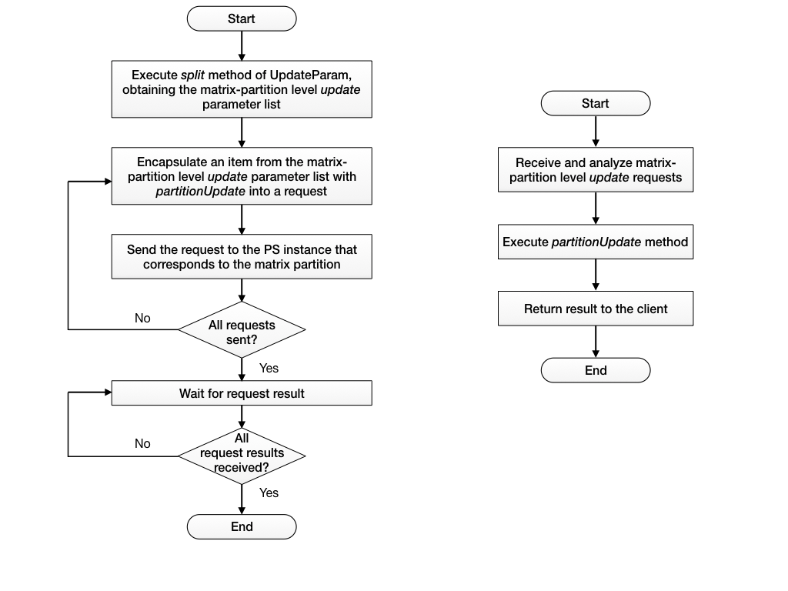

# UpdateFunc


## Principles

1. PS Client divides the requests to generate a request list, where each request corresponds to a model parameter partition.

2. PS Client sends every request in the list to the PS instance that has the corresponding partition. The PS instance gets and updates the parameters in units of model parameter partitions, and returns the result.

3. Wait for all requests to be returned.


## Definitions

* **Interface**

```Java
Future<VoidResult> update(UpdaterFunc update) throws AngelException;
```

* **Parameters**
	* The parameter type is an UpdaterFunc object, which encapsulates the parameters and process of the `update psf` method:

		```Java
		public abstract class UpdaterFunc {
			private final UpdaterParam param;
			public UpdaterFunc(UpdaterParam param) {
		  		this.param = param;
			  }
			public UpdaterParam getParam() {return param;}
			public abstract void partitionUpdate(PartitionUpdaterParam partParam);
		}
		```

	* The parameter type of an UpdateFunc object is UpdateParam
	   * Similar to the GetParam object, UpdateParam defines a `split` method, which divides the overall `update` parameters to a list of `update` parameters for their corresponding model partitions (list of PartitionUpdateParam objects).


## Execution Process

Different from `get psf`, `update psf`'s process consists of only one step:

* `update` in units of model partitions (partitionUpdate)

`update psf` has no specific return value, but returns a Future to the application; the application then decides whether to wait for the operations to complete.

The execution process of update type psFunc requires the PS Client and PS to work together:

* UpdaterParam division execute on the worker
* partitionUpdate method execute on the PSServer

The specific process is shown below, with the chart on the left showing the process on the worker, the chart on the right showing the process on the server:



## Sample Code

* [com.tencent.angel.ml.matrix.psf.update.RandomUniform](https://github.com/Tencent/angel/blob/master/angel-ps/psf/src/main/java/com/tencent/angel/ml/matrix/psf/update/RandomUniform.java): an example that assigns a specified range of random numbers to a row:


	```Java
		public class RandomUniform extends MMUpdateFunc {
			...
		  @Override
		  protected void doUpdate(ServerDenseDoubleRow[] rows, double[] scalars) {
		    Random rand = new Random(System.currentTimeMillis());
		    try {
		      rows[0].getLock().writeLock().lock();
		      double min = scalars[0];
		      double max = scalars[1];
		      double factor = max - min;

		      DoubleBuffer data = rows[0].getData();
		      int size = rows[0].size();
		      for (int i = 0; i < size; i++) {
		        data.put(i, factor * rand.nextDouble() + min);
		      }
		    } finally {
		      rows[0].getLock().writeLock().unlock();
		    }
		  }
		}
	```

Compile the code and create the jar to be uploaded through `angel.lib.jars` when submitting the application; the new UpdateFunc can then be called in the program, for instance:

```Java
	Random randomFunc = new RandomUniform(new RandomParam(matrixId, rowIndex, 0.0, 1.0));
	psModel.update(randomFunc).get();
```

## Built-in Library

* **Abs**
	* Purpose: assign the absolute value of each element of a row to the corresponding element of another row
	* Parameters: matrix id, `from` row id, `to` row id
	* Return value: none

* **Add**
	* Purpose: assign the element-wise sum of two rows to another row
	* Parameters: matrix id, first `from` row id, second `from` row id, `to` row id
	* Return value: none

* **AddS**
	* Purpose: add a scalar to a row and assign to another row
	* Parameters: matrix id, first `from` row id, second `from` row id, `to` row id, scalar value
	* Return value: none

* **Axpy**
	* Purpose: y=Ax+y, where x and y are vectors (rows), A is a scalar
	* Parameters: matrix id, x row id, y row id, A
	* Return value: none

* **Ceil**
	* Purpose: get the ceiling (least integer that is greater than or equal to the element) of each element of a row and assign to the corresponding element of another row
	* Parameters: matrix id, `from` row id, `to` row id
	* Return value: none

* **Copy**
	* Purpose: copy a row to another row 
	* Parameters: matrix id, `from` row id, `to` row id
	* Return value: none
		
* **Div**
	* Purpose: assign the element-wise quotient between two rows to another row
	* Parameters: matrix id, first `from` row id, second `from` row id, `to` row id
	* Return value: none

* **DivS**
	* Purpose: assign the quotient between a row and a scalar to another row
	* Parameters: matrix id, `from` row id, `to` row id, scalar
	* Return value: none

* **Exp**
	* Purpose: calculate exp(x), where exp() is the natural exponential function, for each row element, x, and assign to the corresponding element of another row
	* Parameters: matrix id, `from` row id, `to` row id
	* Return value: none

* **Expm1**
	* Purpose: assign exp(x) - 1 for each element x of a row to the corresponding element of another row
	* Parameters: matrix id, `from` row id, `to` row id
	* Return value: none

* **Fill**
	* Purpose: assign a scalar value to every element of a row
	* Parameters: matrix id, row id, scalar value
	* Returan value: none

* **Floor**
	* Purpose: get the floor (greatest integer that is less than or equal to the element) value of each element of a row and assign to the corresponding element of another row
	* Parameters: matrix id, `from` row id, `to` row id
	* Return value: none

* **Increment**
	* Purpose: add an array of scalars to a row
	* Parameters: matrix id, `from` row id, array (must have same size as the row)
	* Return value: none

* **Log**
	* Purpose: assign the natrual logrithm of each element of a row to the corresponding element of another row
	* Parameters: matrix id, `from` row id, `to` row id
	* Return value: none

* **Log10**
	* Purpose: assign the base 10 logarithm of each element of a row to the corresponding element of another row
	* Parameters: matrix id, `from` row id, `to` row id
	* Return value: none

* **Log1p**
	* Purpose: assign log(1+x), where x is each element of a row, to the corresponding element of another row
	* Parameters: matrix id, `from` row id, `to` row id
	* Return value: none

* **Map**
	* Purpose: apply an function f(x) to each element x of a row and assign the value to the corresponding element of another row
	* Parameters: matrix id, `from` row id, `to` row id, function f(x)
	* Return value: none

* **MapWithIndex**
	* Purpose: apply an function f(i,x) to each element x of a row, where i is the index of x, and assign the value to the corresponding element of another row
	* Parameters: matrix id, `from` row id, `to` row id, function f(i,x)
    	* Return value: none

* **MaxA**
	* Purpose: in an element-by-element fashion, compare a row to a scalar array, and assign the greater value to the row 
	* Parameters: matrix id, row id, array of scalars (must have same size as the row)
	* Return value: none

* **MaxV**
	* Purpose: in an element-by-element fashion, compare two rows and assign the greater value to another row 
	* Parameters: matrix id, first `from` row id, second `from` row id, `to` row id
	* Return value: none

* **MinA**
	* Purpose: in an element-by-element fashion, compare a row to a scalar array, and assign the smaller value to the row
	* Parameters: matrix id, row it, array of scalars (must have same size as the row) 
	* Return value: none

* **MinV**
	* Purpose: in an element-by-element fashion, compare two rows and assign the smaller value to another row
	* Parameters: matrix id, first `from` row id, second `from` row id, `to` row id
	* Return value: none

* **Mul**
	* Purpose: assign the inner product of two rows to another row
	* Parameters: matrix id, first `from` row id, second `from` row id, `to` row id
	* Return value: none

* **MulS**
	* Purpose: multiply a scalar to each element of a row and assign to the corresponding element of another row
	* Parameters: matrix id, `from` row id, `to` row id, scalar
	* Return value: none

* **Pow**
	* Purpose: calculate x raised to the power of a scalar value, where x is each element of a row, and assign to the corresponding element of another row
	* Parameters: matrix id, `from` row id, `to` row id, scalar
	* Return value: none

* **Put**
	* Purpose: assign each element of a scalar array to an element of a row
	* Parameters: matrix id, row id, scalar array (must have the same size as the row)
    	* Return value: none

* **RandomNormal**
	* Purpose: to each element of a row, assign a random number from a normal distribution
	* Parameters: matrix id, row id, mean and standard deviation of the normal distribution
	* Return value: none

* **RandomUniform**
	* Purpose: to each element of a row, assign a random number from a uniform distribution
	* Parameters: matrix id, row id, minimum and maximum of the uniform distribution
	* Return value: none

* **Round**
	* Purpose: round each element of a row to its nearest integer and assign to the corresponding element of another row
	* Parameters: matrix id, `from` row id, `to` row id
	* Return value: none

* **Scale**
	* Purpose: scale a row by multiplying a scalar
	* Parameters: matrix id, row id, scalar
	* Return value: none

* **Signum**
	* Purpose: apply signum(x) to each element x of a row and assign to the corresponding element of another row, where signum(x) returns 1.0 if x>0, -1.0 if x<0, and 0 if x equals 0
	* Parameters: matrix id, `from` row id, `to` row id
	* Return value: none

* **Sqrt**
	* Purpose: assign the square root of each element of a row to the corresponding element of another row
	* Parameters: matrix id, `from` row id, `to` row id
	* Return value: none

* **Sub**
	* Purpose: assign the difference between two rows to another row 
	* Parameters: matrix id, first `from` row id, second `from` row id, `to` row id
	* Return value: none

* **Zip2Map**
	* Purpose: apply a function f(x,y) to each pair of corresponding element x and element y of two rows and assign to the corresponding element of another row
	* Parameters: matrix id, first `from` row id, second `from` row id, `to` row id, function f(x,y) where x and y are the corresponding pair of elements from the two rows
	* Return value: none

* **Zip2MapWithIndex**
	* Purpose: apply a function to each pair of element x and element y from two rows, zip with their index, and assign to the corresponding element of another row
	* Parameters: matrix id, first `from` row id, second `from` row id, `to` row id, function(i,x,y) where i is the index of x and y
	* Return value: none

* **Zip3Map**
	* Purpose: apply a function f(x,y,z) to each tuple of corresponding elements x, y and z of three rows and assign to the corresponding element of another row 
	* Parameters: matrix id, first `from` row id, second `from` row id, third `from` row id, `to` row id, function f(x,y,z)
	* Return value: none

* **Zip3MapWithIndex**
	* Purpose: apply a function to each tuple of corresponding elements x, y, z from three rows, zip with their index, and assign to the corresponding element of another row
	* Parameters: matrix id, first `from` row id, second `from` row id, third `from` row id, `to` row id, function f(i,x,y,z) where i is the index of x, y and z
	* Return value: none
