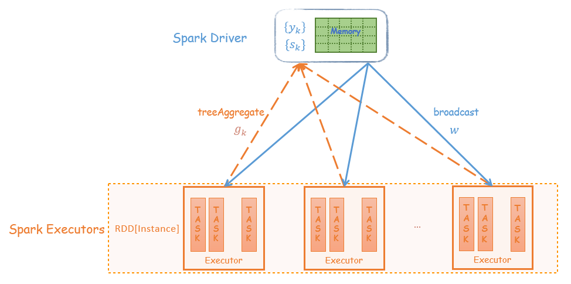
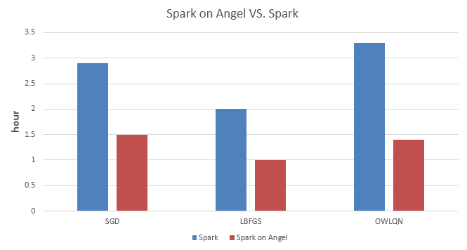

# 【如虎添翼】让Spark的机器学习更强大：Spark on Angel

---

Spark的核心概念是RDD，而RDD的关键特性之一是其不可变性，来规避分布式环境下复杂的各种并行问题。这个抽象，在数据分析的领域是没有问题的，它能最大化的解决分布式问题，简化各种算子的复杂度，并提供高性能的分布式数据处理运算能力。

然而在机器学习领域，RDD的弱点很快也暴露了。机器学习的核心是迭代和参数更新。RDD凭借着逻辑上不落地的内存计算特性，可以很好的解决迭代的问题，然而RDD的不可变性，却非常不适合参数反复多次更新的需求。这本质上的不匹配性，导致了Spark的MLlib库，发展一直非常缓慢，从2015年开始就没有实质性的创新，性能也不好。

为此，Angel在设计生态圈的时候，优先考虑了Spark。在V1.0.0推出的时候，就已经具备了Spark on Angel的功能，基于Angel为Spark加上了PS功能，在不变中加入了变化的因素，可谓如虎添翼。

我们将以L-BFGS为例，来分析Spark在机器学习算法的实现上的问题，以及Spark on Angel是如何解决Spark在机器学习任务中的遇到的瓶颈，让Spark的机器学习更加强大。

## 1. L-BFGS算法说明
L-BFGS模型参数更新过程如下：

$$ w_{k+1} \leftarrow w_{k} - \lambda \cdot p_k $$

其中，$w_k$ 是模型参数， $p_k = H_k^{-1} g_k$ 是搜索方向， $\lambda$ 是通过线性搜索得到的步长。

计算 $p_k=H_k^{-1}g_k$ 伪代码如下所示，这是人们常说的two-loop recursion算法，是Limited-BFGS算法的核心部分。
返回值 $r$ 就是我们说要的 $p_k$.

$$
\begin{align}
& \mathbf{BFGSMultiply}(\mathbf{H}^{-1}_0, \{s_k\}, \{y_k\}, p_k): \\
& \hspace{2em} r \leftarrow p_k \\
& \hspace{2em} \mbox{// Compute right product} \\
& \hspace{2em} \mbox{for $i=n,\ldots,n-m+1$}: \\
& \hspace{2em} \hspace{2em} \alpha_i \leftarrow \rho_{i} s^T_i r \\
& \hspace{2em} \hspace{2em} r \leftarrow r - \alpha_i y_i \\
& \hspace{2em} \mbox{// Compute center} \\
& \hspace{2em} r \leftarrow \mathbf{H}^{-1}_0 r \\
& \hspace{2em} \mbox{// Compute left product} \\
& \hspace{2em} \mbox{for $i=n-m+1,\ldots,n$}: \\
& \hspace{2em} \hspace{2em} \beta \leftarrow \rho_{i} y^T_i r \\
& \hspace{2em} \hspace{2em} r \leftarrow r + (\alpha_{n-i+1}-\beta)s_i \\
& \hspace{2em} \mbox{return $r$}
\end{align}
$$

其中，$H_0^{-1}$ 是单位阵，$y_k=g_{k} - g_{k-1}$ ，$s_k=w^{k}-w^{k-1}$ ，L-BFGS算法将最近 $m$ 轮生成的 $y_k$ 和 $s_k$ 序列，记做 $\{y_k\}$ 和 $\{s_k\}$。基于计算 $\{y_k\}$ 和 $\{s_k\}$ 计算 $p_k$ 。

## 2.L-BFGS的Spark实现

### 2.1 实现框架

Spark中的driver负责协调整个Spark任务执行的同时，需要保存最近 $m$ 轮的 $\{y_k\}$ 和 $\{s_k\}$ 序列，并在driver上执行two-loop recursion算法。而executor负责分布式地计算梯度向量。



迭代过程：
- 每轮迭代，将每个executor计算的梯度Aggregate到driver
- $y_k$ 和 $s_k$ 保存在driver上，在driver端执行two-loop recursion算法
- driver上更新模型 $w$，并将 $w$ 广播到每个Executor

### 2.2 性能分析

基于Spark的L-BFGS实现的算法优点比较明显：

- HDFS I/O   
  Spark可以快速读写HDFS上的训练数据；
- 细粒度的负载均衡  
  并行计算梯度时，Spark具有强大的并行调度机制，保证task快速执行；
- 容错机制  
  当计算节点挂掉、任务失败，Spark会根据RDD的DAG关系链实现数据的重计算。但是对于迭代式算法，每轮迭代要用RDD的action操作，打断RDD的DAG，避免因为重计算引起逻辑的错乱；
- 基于内存的计算
  基于内存的计算过程，可以加速机器学习算法中计算梯度过程的耗时。

该实现的缺点：
- treeAggregate引起的网络瓶颈
  Spark用treeAggregate聚合梯度时，如果模型维度达到亿级，每个梯度向量都可能达到几百兆；此时treeAggregate的shuffle的效率非常低；
- driver单点
  + 保存 $y_k$ 和 $s_k$ 序列需要较大的内存空间；
  + two-loop recursion算法是由driver单点执行，该过程是多个高维度的向量的运算；
  + 每轮迭代，driver都需要和executor完成高维度向量的aggregate和broadcast。

## 3.L-BFGS的Spark on Angel实现
### 3.1 实现框架
Spark on Angel借助Angel PS-Service的功能为Spark引入PS的角色，减轻整个算法流程对driver的依赖。two-loop recursion算法的运算交给PS，而driver只负责任务的调度，大大减轻的对driver性能的依赖。

Angel PS由一组分布式节点组成，每个vector、matrix被切分成多个partition保存到不同的节点上，同时支持vector和matrix之间的运算；

$\{y_k\}$ 和 $\{s_k\}$ 序列分布式地保存到Angel PS上，two-loop recursion算法中高维度的向量计算也是在PS上完成。
Spark executor每轮迭代过程会从PS上`Pull` $w$ 到本地，并将计算的梯度向量`Push`到PS。


迭代过程：
- 每轮迭代，executor 将PS上的模型 $w$ pull 到本地，计算梯度，然后梯度向量push给PS
- $y_k$ 和 $s_k$ 保存在PS上，在PS端执行two-loop recursion算法
- PS上更新模型 $w$

### 3.2 性能分析
整个算法过程，driver只负责任务调度，而复杂的two-loop recursion运算在PS上运行，梯度的Aggregate和模型的同步是executor和PS之间进行，所有运算都变成分布式。在网络传输中，高维度的`PSVector`会被切成小的数据块再发送到目标节点，这种节点之间多对多的传输大大提高了梯度聚合和模型同步的速度。
这样Spark on Angel完全避开了Spark中driver单点的瓶颈，以及网络传输高维度向量的问题。

## 4.“轻易强快”的Spark on Angel
Spark on Angel是Angel为解决Spark在机器学习模型训练中的缺陷而设计的“插件”，没有对Spark做"侵入式"的修改，是一个独立的框架。可以用 **“轻”、“易”、“强”、“快”** 来概括Spark on Angel的特点。

### 4.1 轻 --- "插件式"的框架
Spark on Angel是Angel为解决Spark在机器学习模型训练中的缺陷而设计的“插件”。Spark on Angel没有对Spark中的RDD做侵入式的修改，Spark on Angel是依赖于Spark和Angel的框架，同时其逻辑又独立于Spark和Angel。
因此，Spark用户使用Spark on Angel非常简单，只需在Spark的提交脚本里做三处改动即可，详情可见Angel的[Github Spark on Angel Quick Start文档](https://github.com/Tencent/angel/blob/master/docs/tutorials/spark_on_angel_quick_start.md)

可以看到提交的Spark on Angel任务，其本质上依然是一个Spark任务，整个任务的执行过程与Spark一样的。

```bash
source ${Angel_HOME}/bin/spark-on-angel-env.sh
$SPARK_HOME/bin/spark-submit \
    --master yarn-cluster \
    --conf spark.ps.jars=$SONA_ANGEL_JARS \
    --conf spark.ps.instances=20 \
    --conf spark.ps.cores=4 \
    --conf spark.ps.memory=10g \
    --jars $SONA_SPARK_JARS \
    ....
```

Spark on Angel能够成为如此轻量级的框架，得益于Angel对PS-Service的封装，使Spark的driver和executor可以通过PsAgent、PSClient与Angel PS做数据交互。


### 4.2 强 --- 功能强大，支持breeze库
[breeze](https://github.com/scalanlp/breeze)库是scala实现的面向机器学习的数值运算库。Spark MLlib的大部分数值优化算法都是通过调用breeze来完成的。如下所示，Spark和Spark on Angel两种实现都是通过调用`breeze.optimize.LBFGS`实现的。Spark的实现是传入的类型是breeze库的`DenseVector`，而Spark on Angel的实现是传入`BreezePSVector`。

`BreezePSVector`是指Angel PS上的Vector，该Vector实现了breeze NumericOps下的方法，如常用的 dot，scale，axpy，add等运算，因此在`LBFGS[BreezePSVector]` two-loop recursion算法中的高维度向量运算是`BreezePSVector`之间的运算，而`BreezePSVector`之间全部在Angel PS上分布式完成。

- Spark的L-BFGS实现
  
  ```scala
  import breeze.optimize.LBFGS
  val lbfgs = new LBFGS[DenseVector](maxIter, m, tol)
  val states = lbfgs.iterations(Cost(trainData), initWeight)
  ```
- Spark on Angel的L-BFGS实现
接口调用里的Vector泛型从 `DenseVector` 变成 `BreezePSVector`
 
   ```scala
  import breeze.optimize.LBFGS
  val lbfgs = new LBFGS[BreezePSVector](maxIter, m, tol)
  val states = lbfgs.iterations(PSCost(trainData), initWeightPS)
  ```

### 4.3 易 --- 编程接口简单

Spark能够在大数据领域这么流行的另外一个原因是：其编程方式简单、容易理解，Spark on Angel同样继承了这个特性。
Spark on Angel本质是一个Spark任务，整个代码实现逻辑跟Spark是一致的；当需要与PSVector做运算时，调用相应的接口即可。

如下代码所示，LBFGS在Spark和Spark on Angel上的实现，二者代码的整体思路是一样的，主要的区别是梯度向量的Aggregate和模型 $w$ 的pull/push。
因此，如果将Spark的算法改造成Spark on Angel的任务，只需要修改少量的代码即可。

L-BFGS需要用户实现`DiffFunction`，`DiffFunction`的`calculte`接口输入参数是 $w$ ，遍历训练数据并返回 loss 和 gradient。

其完整代码，请前往[Github SparseLogistic](https://github.com/Tencent/angel/blob/master/spark-on-angel/mllib/src/main/scala/com/tencent/angel/spark/ml/sparse/SparseLogistic.scala)

- Spark的`DiffFunction`实现
  
  ```scala
  case class Cost(trainData: RDD[Instance]) extends DiffFunction[DenseVector] {
    def calculate(w: DenseVector): (Double, DenseVector) = {
      // 广播 w
      val bcW = sc.broadcast(w)

      // 通过treeAggregate的方式计算loss和gradient
      val (cumGradient, cumLoss) = trainData
        .treeAggregate((new DenseVector(x.length), 0.0)) (seqOp, combOp)

      val resGradient = new DenseVector(cumGradient.toArray.map(_ / sampleNum))
      (cumLoss / sampleNum, resGradient)
    }
  }
  ```

- Spark on Angel的`DiffFunction`实现
`calculate`接口输入参数是 $w$ ，遍历训练数据并返回 loss 和 `cumGradient`。其中 $w$ 和 `cumGradient`都是`BreezePSVector`；计算梯度时，需要将 $w$ Pull 到本地，本地的gradient值，需要通过`PSVector`的`incrementAndFlush`方式Push到远程PS上的`cumGradient`向量。
  
  ```scala
  case class PSCost(trainData: RDD[Instance]) extends DiffFunction[BreezePSVector] {

    override def calculate(w: BreezePSVector): (Double, BreezePSVector) = {
      // 初始化gradient向量：cumGradient
      val cumGradient = pool.createZero().mkBreeze()

      // 计算梯度和loss
      val cumLoss = trainData.mapPartitions { iter =>
        // pull模型 w 到 executor 本地
        val localW = w.toRemote.pull()
        val (gradient, loss) = calculateGradAndLoss(iter, localW)
        // incement本地的grad到PS的cumGradient
        cumGradient.toRemote.incrementAndFlush(gradient)
        Iterator.single(loss)
      }.sum()

      cumGradient *= 1.0 / sampleNum
      (cumLoss / sampleNum, cumGradient)
    }
  }
  ```

### 4.4 快 --- 性能强劲
我们分别实现了SGD、LBFGS、OWLQN三种优化方法的LR，并在Spark和Spark on Angel上做了实验对比。
该实验代码请前往[Github SparseLRWithX.scala ](https://github.com/Tencent/angel/tree/master/spark-on-angel/mllib/src/main/scala/com/tencent/angel/spark/ml/classification) .

- 数据集：腾讯内部某业务的一份数据集，2.3亿样本，5千万维度
- 实验设置：
  * 说明1：三组对比实验的资源配置如下，我们尽可能保证所有任务在资源充足的情况下执行，因此配置的资源比实际需要的偏多；
  * 说明2：执行Spark任务时，需要加大spark.driver.maxResultSize参数；而Spark on Angel就不用配置此参数。



如上数据所示，Spark on Angel相较于Spark在训练LR模型时有50%以上的加速；对于越复杂的模型，其加速的比例越大。

## 5.结语
Spark on Angel的出现可以高效、低成本地克服Spark在机器学习领域遇到的瓶颈；我们将继续优化Spark on Angel，并提高其性能。也欢迎大家在Github上一起参与我们的改进。

Angel项目Github：[Angel](https://github.com/Tencent/angel)。喜欢的话记得加个小Star。 对Spark on Angel、Angel有任何疑问或者建议可以联系kevinzwyou(游遵文)、payniexiao(肖品)。 目前Spark on Angel已经和TDW的Spark融合，并可以通过Tesla方便调用，欢迎大家试用。
