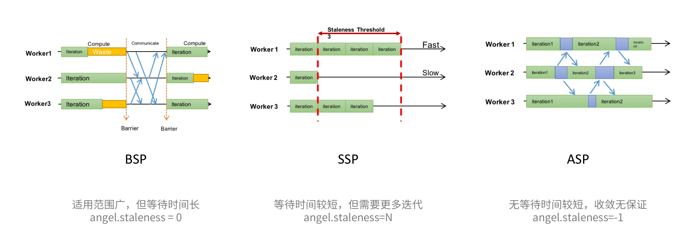
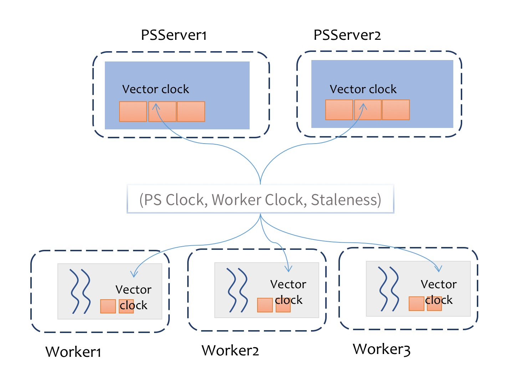

# 异步控制（Sync Controller）

---

## 概述


众所周知，在分布式计算系统中，由于多个计算节点计算进度不可能完全一致，会导致了在汇总结果时需要等待那些计算速度较慢的节点，即慢节点会拖慢整个计算任务的进度，浪费计算资源。

考虑到机器学习的特殊性，系统其实可以适当放宽同步限制，没有必要每一轮都等待所有的计算节点完成计算，部分跑得快的Worker，其实完全可以先把训练好的增量Push上去，然后进行下一轮的训练运行。这样可以减少等待时间，让整个计算任务更快。

因此，**异步控制**在分布式机器学习系统中，是非常重要的功能之一。Angel提供了三个级别的异步控制协议： **BSP（Bulk Synchronous Parallel）**，**SSP（Stalness Synchronous Parallel）** 和 **ASP（Asynchronous Parallel）**， 它们的同步限制依次放宽。为了追求更快的计算速度，算法可以选择更宽松的同步协议。




## 协议介绍

### 1. BSP
默认的同步协议。也是一般的分布式计算采用的同步协议，在每一轮迭代中都需要等待所有的Task计算完成。

 - 优点：适用范围广；每一轮迭代收敛质量高
 - 缺点：但是每一轮迭代都需要等待最慢的Task，整体任务计算时间长
 - 使用方式：默认的同步协议

### 2. SSP

允许一定程度的Task进度不一致，但这个不一致有一个上限，我们称之为 **staleness** 值，即最快的Task最多领先最慢的Task **staleness** 轮迭代。


- 优点：一定程度减少了Task之间的等待时间，计算速度较快
- 缺点：每一轮迭代的收敛质量不如BSP，达到同样的收敛效果可能需要更多轮的迭代；适用性也不如BSP，部分算法不适用
- 使用方式：配置参数`angel.staleness=N`，其中**N**为正整数

### 3. ASP

Task之间完全不用相互等待，先完成的Task，继续下一轮的训练。

- 优点：消除了等待慢Task的时间，计算速度快
- 缺点：适用性差，在一些情况下并不能保证收敛性
- 使用方式：配置参数`angel.staleness=-1`

设置方式非常简单，如上图所示，只要设置不同的staleness，就能以不同的异步模型运行。但是，同步限制放宽之后可能导致收敛质量下降甚至任务不收敛的情况，这需要在实际算法中，需要指标的变化情况，调整同步协议以及相关的参数，以达到收敛性和计算速度的平衡。

## 实现原理——向量时钟

在Angel中，我们是通过**向量时钟**的方式，来实现异步模型控制。




### 步骤如下：

1. 在Server端为每个分区维护一个向量时钟，记录每个worker在该分区的时钟信息
2. 在Worker端维护一个后台同步线程，用于同步所有分区的时钟信息
3. Task在对PSModel进行Get或其他读取操作时，根据本地时钟信息和staleness进行判断，选择是否进行等待操作
4. 每次迭代完，算法调用PSModel的Clock方法，更新向量时钟

对于用户来说，其实默认的调用方法很简单：

```Scala
	psModel.increment(update)
	……
	psModel.clock().get()
	ctx.incIteration()


```


通过这样的方式，Angel实现了灵活多变的**异步控制**模式，为用户的算法，提供了最大化的便利，也解决了在大规模机器学习中，由于个别机器故障，引起严重的性能问题。
