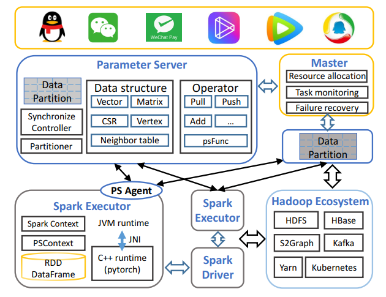

# Angel-Graph

The world today is one with complex networks, where all things, including people and objects, are interconnected and their connections are becoming more and more complicated and diversified. Since many practical problems can be modeled as graphs, with graph technologies like traditional graph mining, graph representation learning and graph neural network, rich information can be mined from massive relational structure data , which mitigates the lack of single point analysis and ultimately bring great benefits  in financial payment, security risk control, advertisement recommendation and many other business scenarios.

## Overview

- Angel graph tasks full advantages of Angel parameter server, spark and pytorch, which provides multiple  graph technologies like traditional graph computing, graph representation learning and graph neural networks. Its nice implementation makes it a large-scale distributed framework for graph computing, with high performance, inherent reliability and easy usability.

  

  Angel graph has the following core capabilities：

  - Complex heterogeneous network. The graph data in industry shows great complexity and diversity, and often consists of billions of vertices, tens of billions or even hundreds of billions of edges. While Angel graph employs Spark on Angel and Pytorch for distributed training, it can easily support graph computing of that scale as mentioned above.
  - End-to-end graph calculation. The ecosystem of big data in industry is mostly about Spark and Hadoop. To embrace that, based on the architecture of Spark on angel, Angel graph can seamlessly works with Spark, especially its ETL features,  and therefore supports end-to-end graph training.
  - Traditional graph mining. It supports traditional graph algorithms regarding billions of vertices and hundreds of billions of edges, such as PageRank, node importance from kcore analysis , fpr community detection from louvain, etc. Besides that, by providing measure analysis and rich features extractions from graph vertices, it also supports applications in business models such as machine learning or recommendation.
  - Graph Embedding. It supports graph embedding algorithms regarding billions of vertices and hundreds of billions of edges, such as line, word2vec, etc.
  - Graph Neural Network. By utilizing the rich attribute information on vertices and edges for deep learning, it supports graph neural network algorithms regarding billions of vertices and tens of billions of edges.

## System Architecture

As shown in the figure below, Angel graph framework employs Spark and Pytorch with the lower layer as spark workers and the upper layer as the Angel parameter server.

The module of Spark on Angel  in the framework serves as a flexible parameter server in a plug-in way embeded into the native spark, which provides high-efficiency services for data storing, updating and sharing on spark, so it fits well in a framework of distributed graph computing. At the same time, since Spark on Angel uses the native spark interface, developing algorithms on the framework can take full advantage of Spark's capabilities.

#### Spark Component 

- Spark Driver：Responsible for controlling the overall logic of algorithms
- Spark Executor：While performing traditional graph calculation and graph representation learning, spark executors take charge of storing immutable data structures such as graph adjacency tables and edge tables , pulling necessary node attributes and other data from PS in each iteration, then pushing the results back to PS after finishing the calculation locally and submiting them to PS for updating. During the training of graph neural network algorithms, Pytorch C++ backend serves as the actual computing engine and runs in the spark executor in a native way.

#### Angel Component 

- Angel Master：Manage the life cycle of the parameter server
- Angel PS(Parameter Server)： Store mutable data such as node attributes in the abstract form of vectors ( customized data structure of element and load balancing partitions are also supported), and update node attributes in place as well as implement flexible calculations tailored to specific algorithms through angel's unique PS functions.
- Angel Agent：Work as  agents for spark executors and the parameter server

#### Pytorch Component 

- Python Client：use torchscript syntax to write algorithm models, submit it to spark executor for loading, and complete distributed training and prediction of the model through angel PS.

## Build-in Graph Algorithms

In order to apply this graph computing framework easily, we have implemented several common graph algorithms, which have been fully tested in the internal business scenarios in Tencent and have proved their efficiency and correctness, so users can get started without too much concerns。

| Algorithm                  | Algorithm Type                   | Algorithm Description                                        |
| -------------------------- | -------------------------------- | ------------------------------------------------------------ |
| PageRank                   | Node importance                  | Classical graph algorithm                                    |
| Hindex                     | Node importance                  | Mixed quantitative index, refer to h index                   |
| Kcore                      | Node importance                  | Extract the key substructures in network                     |
| Louvain                    | Community Detection              | Community division by optimizing the modularity index        |
| Closeness                  | Node Centrality                  | Measure the centrality of vertices                           |
| CommonFriends              | Intimacy calculation             | Compute common friends number                                |
| TriangleCountingUndirected | calculate node's triangle number | Calculate node's triangle number                             |
| LPA                        | Label propagation                | A community discovery or propagation algorithm               |
| ConnectedComponents        | Weak connected components        | Mining weak connected components of Graphs                   |
| LINE                       | Graph Embedding                  | Use the first and second order neighbor information when train representation |
| Word2Vec                   | Graph Embedding                  | A classical representation learning algorithm                |
| GraphSage                  | Graph Neural Network             | Representation learning by aggregating the features of node neighbors |
| GCN                        | Graph Neural Network             | Similar to CNN operation and apply the algorithm to non Euclidean space |
| DGI                        | Graph Neural Network             | Apply  DIM to  complex network                               |

## BenchMark Performance

We compare the performance between graphx and angel graph in two real datasets. The first dataset DS1 contains 0.8 billion vertices and 11 billion edges. The second dataset DS2 contains
2 billion vertices and 140 billion edges.  Performance comparison on traditional graph algorithms：

The detailed introduction to Angel graph, please refer to this paper [PSGraph: How Tencent trains extremely large-scale graphs with Spark?](https://conferences.computer.org/icde/2020/pdfs/ICDE2020-5acyuqhpJ6L9P042wmjY1p/290300b549/290300b549.pdf)

