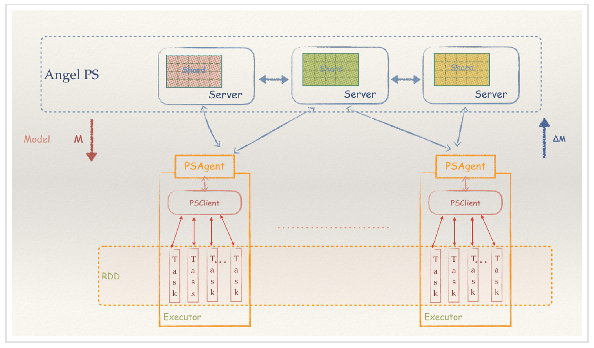
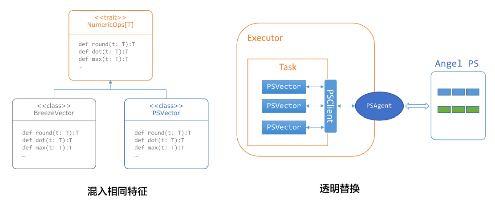

# Spark on Angel

Angel从v1.0.0版本开始，就加入了**PS-Service**的特性，不仅仅可以作为一个完整的PS框架运行，也可以作为一个**PS-Service**，为不具备参数服务器能力的分布式框架，引入PS能力，从而让它们运行得更快，功能更强。而Spark是这个Service设计的第一个获益者。


作为一个比较流行的内存计算框架，**Spark** 的核心概念是`RDD`，而`RDD`的关键特性之一，是其不可变性，来规避分布式环境下复杂的各种并行问题。这个抽象，在数据分析的领域是没有问题的，能最大化的解决分布式问题，简化各种算子的复杂度，并提供高性能的分布式数据处理运算能力。

然而在机器学习领域，`RDD`的弱点很快也暴露了。机器学习的核心是迭代和参数更新。RDD凭借着逻辑上不落地的内存计算特性，可以很好的解决迭代的问题，然而RDD的不可变性，却不适合参数反复多次更新的需求。这个根本的不匹配性，导致了Spark的MLLib库，发展一直非常缓慢，从15年开始就没有实质性的创新，性能也不好，从而给了很多其它产品机会。而Spark社区，一直也不愿意正视和解决这个问题。

现在，由于Angel良好的设计和平台性，提供PS-Service，Spark可以充分利用Angel的参数更新能力，用最小化的修改代价，让Spark也具备高速训练大模型的能力，并写出更加优雅的机器学习代码，而不必绕来绕去。

## 1. 架构设计

**Spark-On-Angel** 的系统架构如下图所示，简单来说：

1. Spark RDD是不可变区，Angel PS是可变区
2. Angel和Spark之间，都是通过PSAgent进行协作和通讯



## 2. 核心实现

得益于Angel的接口设计，Spark-On-Angel非常轻量，其主要核心模块包括

* **PSContext**
	* 利用Spark的Context，和Angel的配置，创建AngelContext，在Driver端负责全局的初始化和启动工作

* **PSClient**
	* PSClient集成了PSVector和PSMatrix的所有初始化、运算、Pull/Push等操作
	* 包括三部分Initializer，VectorOps，MatrixOps；分别对应PS的初始化操作，PSVector运算操作和PSMatrix运算操作

* **PSModel**
	* PSModel是PS server上PSVector/PSMatrix的总称，包含着PSClient对象
	* PSModel是PSVector和PSMatrix的父类

* **PSVector**
	* 包括DensePSVector和SparsePSVector
	* PSVector的申请：通过`PSVector.dense(dim: Int, capacity: Int = 50)`申请PSVector，会创建一个维度为`dim`，容量为`capacity`的VectorPool，同一个VectorPool内的两个PSVector可以做运算。
	通过`PSVector.duplicate(psVector)`，申请一个与`psVector`在同一个VectorPool的PSVector。
	* PSVector有两个装饰类：`BreezePSVector`和`CachedPSVector`，`BreezePSVector`使PSVector可以支持Breeze算法库里的Vector运算。而`CachedPSVector`支持PSVector在Pull/Push过程中的缓存功能。

* **PSMatrix**
	* 包括DensePSMatrix和SparsePSMatrix
	* PSMatrix的创建和销毁：通过`PSMatrix.dense(rows: Int, cols: Int)`创建，当PSMatrix不再使用后，需要手动调用`destory`销毁该Matrix

使用Spark on Angel的简单代码如下：

```Scala

PSContext.getOrCreate(spark.sparkContext)
val psVector = PSVector.dense(dim, capacity)
rdd.map { case (label , feature) =>
  	psVector.increment(feature)
  	...
}
println("feature sum:" + psVector.pull.mkString(" "))
```

## 3. 启动流程
Spark on Angel本质上是一个Spark任务。Spark启动后，driver通过Angel PS的接口启动Angel PS，必要时将部分数据封装成PSVector丢给PS node管理。 因此，整个Spark on Angel的执行过程与Spark差别不多，driver负责启动、管理PS node， executor在需要的时候想PS node发起对PSVector操作的请求。

Spark driver的执行流程
- 启动SparkSession
- 启动PSContext
- 申请PSVector/PSMatrix
- 执行算法逻辑
- 终止PSContext和SparkSession

Spark executor的执行流程
- 启动PSContext
- 执行driver分配的task


## 4. 算法库切换

为了支持Spark中MLLib的现有的大部分算法包轻松跑在Spark on Angel上，项目采用了一种很巧妙的实现方式，这就是：**透明替换**。

Spark中MLlib算法的核心是Breeze库，所有核心算法，最终都是通过混入了NumericOps特征的BreezeVector来实现的。例如，LBFGS算法用到了BreezeVector的dot、scal等操作。

因此，如果我们实现了一个混入相同特征的PSVector，支持了这些操作，我们就可以无缝的，将调用Breeze的LBFGS算法，将其在BreezeVector上的优化求解过程，透明化的迁移到Angel上，让这些计算发生在Angel之上，而无须对RDD进行任何侵入性修改。




下面是两个代码示例，展示了原生的Spark，和Spark on Angel的写法不同：

* **Spark版本**

```Scala

def runOWLQN(trainData: RDD[(Vector, Double)], dim: Int, m: Int, maxIter: Int): Unit = {

    val initWeight = new DenseVector[Double](dim)
    val l1reg = 0.0
    val owlqn = new BrzOWLQN[Int, DenseVector[Double]](maxIter, m, 0.0, 1e-5)

    val states = owlqn.iterations(CostFunc(trainData), initWeight)
    ……

}
```

* **Spark on Angel版本**

```Scala

def runOWLQN(trainData: RDD[(Vector, Double)], dim: Int, m: Int, maxIter: Int): Unit = {

    val initWeightPS = PSVector.dense(dim, 20).toBreeze()
    val l1regPS = PSVector.duplicate(initWeightPS.component).zero().toBreeze

    val owlqn = new OWLQN(maxIter, m, l1regPS, tol)
    val states = owlqn.iterations(PSCostFunc(trainData), initWeightPS)
    ………

｝
```

可以看到，代码的改动量非常小，对原生的RDD也没有任何的侵入，对于整体Spark框架的社区融合和升级，都是非常友好。

但是需要提醒的是，这样的替换方式，性能肯定不如从头按照Angel的特点，按照PS的特性，实现一次来得性能更高的，但是好处是节省工作量，而且具备通用性。建议如果想实现最高性能的算法，可以尝试自己动手。当然了，直接用Angel实现，性能会是最好的，毕竟不用隔了一层PSAgent。
