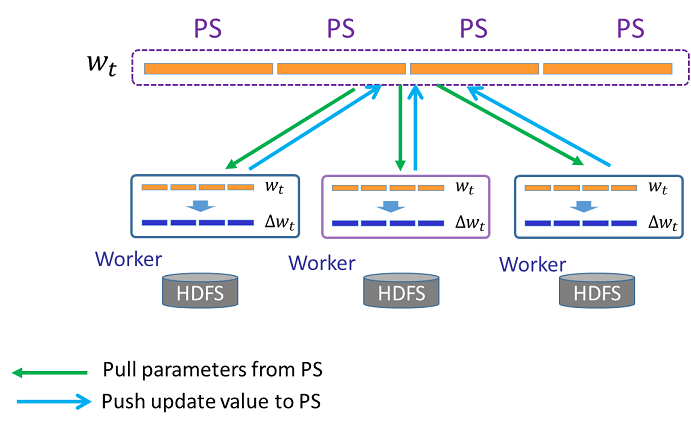

# Angel 快速入门


## 准备知识


这篇文档帮助你快速开始编写运行在Angel-PS架构上的程序，开始之前，最好掌握以下能力：

* 会编写简单的`Scala`或者`Java`代码；
* 掌握`向量、矩阵和张量`的基础知识，了解其定义和基础计算；
* 对常用机器学习算法有一定了解；

如果没有学习过机器学习算法，也没有关系，你可以从这篇文档开始学习；在开始编程前，我们先来了解一些基础知识。


* 大多数的机器学习算法都可以抽象成`向量（Vector）、矩阵(Martix)、张量（Tensor）`间的运算，因此常用向量、矩阵、张量来表示学习数据和算法模型。

* Angel-PS实现了基于参数服务器的矩阵计算，将分布在多台PS Server上的参数矩阵抽象为`PSModel`，你只需要完成`PSModel`的定义、实现其计算过程，就可以快速实现一个运行在参数服务器上的简单算法。

  

### Angel-PS架构

简单的Angel-PS架构如下图所示

* PS（参数服务器层）由存储矩阵参数的多台机器组成，在机器学习过程中向计算节点提供矩阵参数的拉取、更新服务
* 每个worker是一个逻辑计算节点，一个worker可以运行一或多个task

机器学习的算法，一般训练过程需要多次迭代，在每次迭代过程中worker从PS拉取最新的参数，计算一个更新值，然后推送给PS。  




## 开始你的第一个Angel算法: LR

下面将以最简单的Logistic Regression算法为例，帮助你完成第一个Angel算法；具体代码可以在example.quickStart里找到。   

逻辑回归算法是机器学习中最简单的一个算法，它可以抽象为如下步骤：

1. 一个维度为1×N的矩阵，即一个N维向量，记为w
2. 用梯度下降法训练LR模型，每次迭代
	* worker上的task从PS拉取最新的模型w,
	* 计算得到变化梯度△w
	* 将△w推送给PS

为了实现该算法，我们需要如下3个步骤：

1. **定义一个PS端的模型([LRModel](../apis/MLModel.md))**

	实现QSLRModel类继承MLModel，通过addPSModel添加一个N维的[PSModel](../apis/PSModel.md)给QSLRModel，在setSavePath方法中，设置运算结束后LR模型的保存路径。
	
	 N的值、保存路径都可以通过conf配置。
	
	
	```Scala
	class QSLRModel(ctx: TaskContext, conf: Configuration) extends MLModel(ctx){
		
		  val N = conf.getInt(MLConf.ML_FEATURE_NUM, MLConf.DEFAULT_ML_FEATURE_NUM)

		  val weight = PSModel[DenseDoubleVector]("qs.lr.weight", 1, N).setAverage(true)
		  addPSModel(weight)

		  setSavePath(conf)
		  setLoadPath(conf)
	}
	```
2. **定义一个Task([TrainTask](../apis/Task.md))**

	Angel的模型的训练是在worker端的task中完成，所以我们需要定义一个LRTrainTask来完成LR的模型的训练过程。

	LRTrainTask需要继承TrainTask类并实现如下2个方法：

	* **解析数据**    

	在模型开始训练前，输入的每一行文本被解析为一条训练数据，解析方法在parse方法里实现，此处我们使用DataParser解析dummy格式的数据。

	```
	  override
	  def parse(key: LongWritable, value: Text): LabeledData = {
	    DataParser.parseVector(key, value, feaNum, "dummy", negY = true)
	  }
	```

	可以通过task的dataBlock访问预处理后的数据。

	* **训练**

	Angel会自动执行TrainTask子类的train方法，我们在LRTrainTask的train方法中完成模型训练过程。

	在这个简易的LR算法例子中，我们

	* 先实例化QSLRModel模型对象model，然后开始迭代计算。
	* 每次迭代
		* task从PS拉取模型的参数weight
		* 训练数据计算得到梯度grad，把grad推送给PS，PS上weight的更新会自动完成。
		* 推送grad后，需要clock()、incIteration()。

		```Scala
		def train(ctx: TaskContext): Unit = {
		    // A simple logistic regression model
		    val lrModel = new QSLRModel(conf, ctx)
		    val weightOnPS = lrModel.weight
		    // Apply batch gradient descent LR iteratively
		    while (ctx.getIteration < epochNum) {
		      // Get model and calculate gradient
		      val weight = weightOnPS.getRow(0)
		      val grad = batchGradientDescent(weight)

		      // Push gradient vector to PS Server and clock
		      weightOnPS.increment(grad.timesBy(-1.0 * lr))
		      weightOnPS.clock.get

		      // Increase iteration number
		      ctx.incIteration()
		    }
		}
		```
  
3. **定义一个Runner([MLRunner](../apis/MLRunner.md))**

	前面，我们定义了LR模型，实现了它的训练过程。现在，还需要实现Runner类将训练这个模型的任务提交到集群。  

	
```Scala

	class LRRunner extends MLRunner{
	  ……
	  override
	  def train(conf: Configuration): Unit = {
	    train(conf, QSLRModel(conf), classOf[QSLRTrainTask])
	   }
	}
	
```

### 运行任务

可以通过以下命令向Yarn集群提交刚刚完成的算法任务

```
./bin/angel-submit \
--action.type train \
--angel.app.submit.class com.tencent.angel.example.quickStart.QSLRRunner  \
--angel.train.data.path $input_path \
--angel.save.model.path $model_path \
--ml.epoch.num 10 \
--ml.feature.num 10000 \
--ml.data.type dummy \
--ml.learn.rate 0.001 \
--angel.workergroup.number 3 \
--angel.worker.memory.mb 8000  \
--angel.worker.task.number 3 \
--angel.ps.number 1 \
--angel.ps.memory.mb 5000 \
--angel.job.name QSLR
```

如果你不熟悉Yarn的话，提交完毕后，可以按照这个指引查看作业日志[《查看到Yarn上的作业》](../deploy/run_on_yarn.md)，。

----

OK。至此，你已经完成了一个简单的Angel作业。想写出更加复杂的机器学习算法吗？请看完整的[《Angel编程指南》](../programmers_guide/angel_programing_guide.md)吧，欢迎来到Angel的世界。


